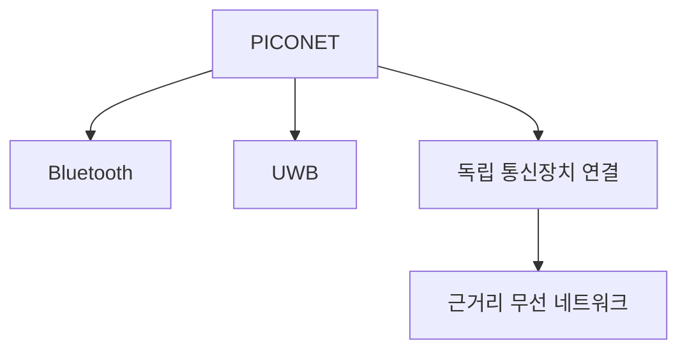
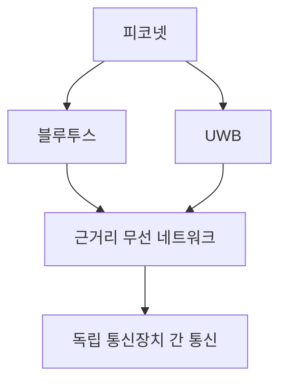

# 253 피코넷(PICONET)

작성 기준일: 2026-06-01
검색/보강일: 2026-06-04
기준 PDF: `/Users/nes0903/Documents/study/정보처리기사/핵심요약집_2026_정보처리기사필기핵심요약.pdf`
PDF 확인 위치: 37페이지 `253 피코넷(PICONET)`

## 한 줄 요약

- 피코넷은 Bluetooth나 UWB 같은 근거리 무선 기술로 여러 독립 통신장치가 형성하는 소규모 무선 네트워크이다.

## 한눈에 보는 구조

## PDF 기준 핵심

- 여러 개의 독립된 통신장치가 블루투스 기술이나 UWB(Ultra Wide Band) 통신 기술을 사용한다.
- 통신망을 형성하는 무선 네트워크 기술이다.
- `Bluetooth`, `UWB`, `독립 통신장치`, `무선 네트워크`가 핵심 단서이다.

## 개념 설명

- 피코넷은 근거리에서 개인 장치들이 임의로 구성하는 작은 네트워크로 이해하면 쉽다.
- Bluetooth 환경에서는 한 장치가 중심 역할을 하고 주변 장치들이 연결되는 구조로 설명된다.
- 여러 피코넷이 연결되면 스캐터넷(Scatternet)이라는 개념으로 확장될 수 있다.
- 정보처리기사에서는 세부 Bluetooth 역할보다 `피코넷 = Bluetooth/UWB 기반 소규모 무선망` 구분이 중요하다.

## 시험 포인트

- 피코넷은 메시 네트워크보다 작고 근거리 장치 연결에 초점이 있다.
- `Pico`는 작다는 느낌으로 기억하면 좋다.
- Bluetooth와 UWB가 PDF 핵심 키워드이다.
- 무선 센서 수천 개가 그물망으로 연결되는 설명은 메시 네트워크 쪽이다.

## 헷갈리는 비교

| 구분 | 피코넷 | 메시 네트워크 |
|---|---|---|
| 대표 기술 | Bluetooth, UWB | Bluetooth mesh, Wi-Fi mesh 등 |
| 규모 | 소규모 근거리 | 대규모 가능 |
| 구조 | 장치 간 근거리 연결 | 그물망 다중 경로 |
| 시험 단서 | PICONET | Mesh |

## 예시 또는 암기 포인트

- 스마트폰과 무선 이어폰, 노트북 주변 장치가 근거리 무선으로 연결되는 구조를 피코넷 예로 볼 수 있다.
- 암기식: `Pico는 작고, Bluetooth와 묶인다`.

## 빠른 복습

- 피코넷에 쓰이는 대표 기술은? Bluetooth, UWB.
- 피코넷의 규모 느낌은? 소규모 근거리 무선망.
- 메시 네트워크와 다른 점은? 대규모 그물망보다는 독립 장치 간 근거리 연결이다.

## 상세 보강

- 피코넷은 매우 작은 범위의 개인 영역 무선 네트워크로, 블루투스 네트워크를 설명할 때 자주 쓰인다.
- 여러 독립 통신장치가 짧은 거리에서 단기 또는 소규모 네트워크를 구성한다.
- PDF는 블루투스와 UWB를 모두 언급하므로 특정 기술 하나에만 한정하지 않는다.
- 메시 네트워크가 다수 노드를 그물망으로 연결하는 넓은 구조라면, 피코넷은 근거리 소규모 장치 네트워크에 가깝다.
- 시험에서는 `블루투스`, `UWB`, `무선 네트워크`, `독립된 통신장치`가 단서이다.

| 구분 | 피코넷 | 메시 네트워크 |
|---|---|---|
| 범위 | 근거리 소규모 | 수십~수천 노드 가능 |
| 대표 기술 | 블루투스, UWB | 무선 메시 |
| 핵심 | 장치 간 소규모 연결 | 그물망 다중 경로 |

## 참고 링크

- [Bluetooth SIG - What is Bluetooth Mesh?](https://support.bluetooth.com/hc/en-us/articles/360049491971-What-is-Bluetooth-mesh)
