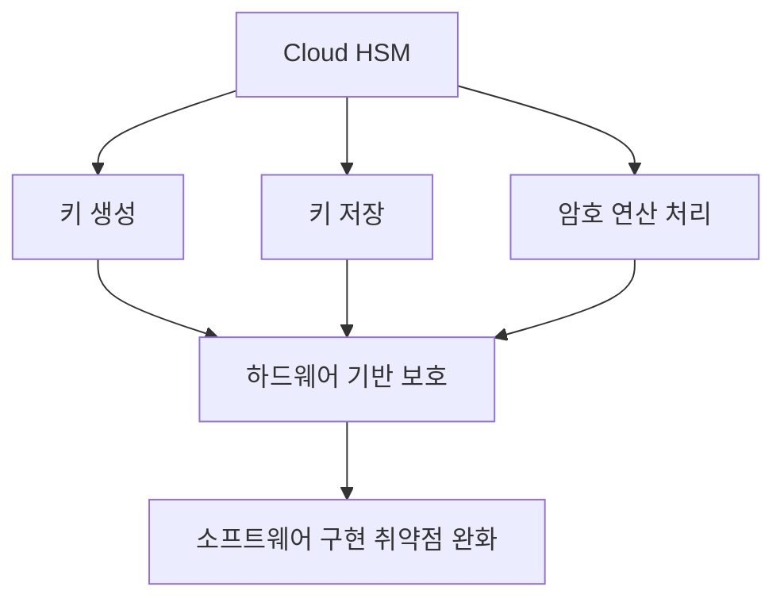
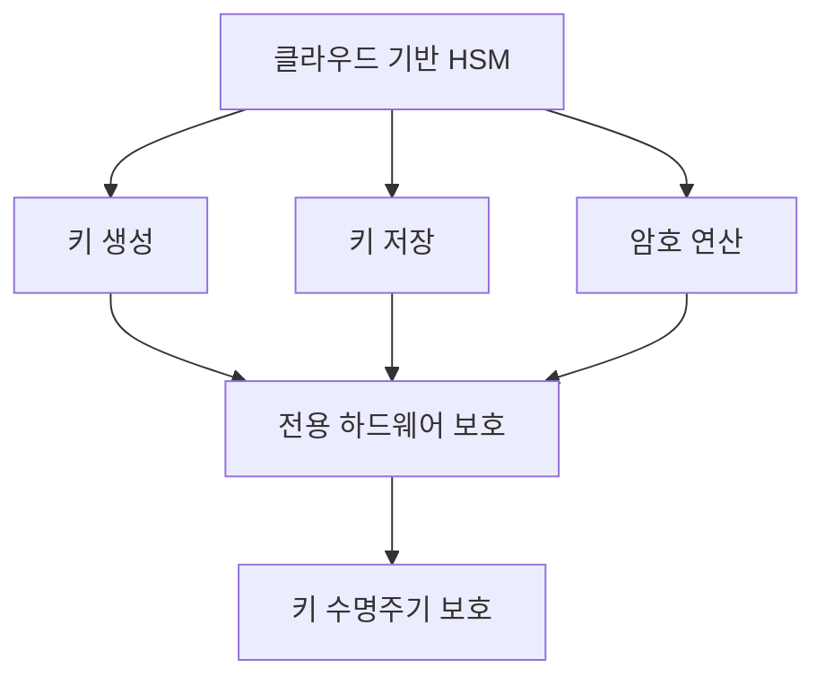

# 254 클라우드 기반 HSM

작성 기준일: 2026-06-01
검색/보강일: 2026-06-04
기준 PDF: `/Users/nes0903/Documents/study/정보처리기사/핵심요약집_2026_정보처리기사필기핵심요약.pdf`
PDF 확인 위치: 37페이지 `254 클라우드 기반 HSM`

## 한 줄 요약

- 클라우드 기반 HSM은 클라우드에서 암호화 키의 생성·저장·처리 작업을 하드웨어 보안 모듈로 수행하는 보안 서비스이다.

## 한눈에 보는 구조

## PDF 기준 핵심

- 클라우드를 기반으로 암호화 키의 생성·저장·처리 등의 작업을 수행하는 보안기기를 가리키는 용어이다.
- 암호화 키 생성이 하드웨어적으로 구현되기 때문에 소프트웨어적으로 구현된 암호 기술이 가지는 보안 취약점을 무시할 수 있다.
- `암호화 키`, `하드웨어`, `클라우드`, `보안기기`가 핵심 단서이다.

## 개념 설명

- HSM(Hardware Security Module)은 암호 키를 안전하게 생성하고 보관하며 암호 연산을 수행하는 전용 보안 장치이다.
- Cloud HSM은 이러한 HSM 기능을 클라우드 환경에서 사용할 수 있게 제공한다.
- AWS CloudHSM 문서도 HSM을 암호 작업 처리와 키 보안 저장을 제공하는 컴퓨팅 장치로 설명한다.
- 키가 일반 애플리케이션 메모리나 파일에 노출되지 않도록 하드웨어 경계 안에서 보호하는 것이 핵심이다.

## 시험 포인트

- HSM은 `Hardware Security Module`이다.
- 클라우드 기반 HSM은 소프트웨어 암호 라이브러리 자체가 아니라 키 관리와 암호 연산을 보호하는 장치/서비스이다.
- 키 생성·저장·처리 세 동사를 PDF 문구 그대로 기억한다.
- 보안 강점은 하드웨어 기반 키 보호와 암호 연산 격리이다.

## 헷갈리는 비교

| 구분 | 소프트웨어 키 저장 | 클라우드 기반 HSM |
|---|---|---|
| 키 보호 위치 | 파일, DB, 메모리 등 | HSM 하드웨어 |
| 암호 연산 | 애플리케이션/라이브러리 | HSM 내부 |
| 장점 | 구현 쉬움 | 키 노출 위험 감소 |
| 시험 단서 | 소프트웨어 구현 | 하드웨어 보안기기 |

## 예시 또는 암기 포인트

- 전자서명용 개인키를 Cloud HSM에 보관하고 서명 연산을 HSM 안에서 수행하면 키 노출 위험을 줄일 수 있다.
- 암기식: `HSM = Hardware가 Secret Key를 지킨다`.

## 빠른 복습

- HSM의 대상은? 암호화 키와 암호 연산.
- Cloud HSM이 하는 작업 3가지는? 키 생성, 저장, 처리.
- 보안 강점은? 하드웨어 기반 보호.

## 상세 보강

- HSM은 Hardware Security Module로, 암호 키를 안전하게 생성·저장·처리하는 전용 보안 장비이다.
- 클라우드 기반 HSM은 이런 장비를 클라우드 서비스 형태로 제공해 키 관리와 암호 연산을 수행하게 한다.
- PDF의 `하드웨어적으로 구현`은 소프트웨어 키 저장보다 물리적 보호와 변조 저항성을 강조한다.
- 클라우드 HSM은 인증서, 전자서명, 결제, 데이터 암호화 키 보호 같은 고신뢰 환경에서 쓰인다.
- 시험에서는 `암호화 키`, `생성·저장·처리`, `하드웨어 보안기기`, `소프트웨어 취약점 보완`을 연결한다.

| 구분 | 소프트웨어 키 관리 | HSM |
|---|---|---|
| 키 저장 | 애플리케이션/서버 파일 가능 | 전용 하드웨어 내부 |
| 보안성 | 서버 침해 시 노출 위험 큼 | 변조 저항 장비로 보호 |
| 용도 | 일반 암호화 | 고신뢰 키 보호, 서명, PKI |

## 참고 링크

- [AWS CloudHSM](https://aws.amazon.com/cloudhsm/)
- [AWS Docs - What is AWS CloudHSM?](https://docs.aws.amazon.com/cloudhsm/latest/userguide/w20aac23c15c13b7.html)

<!-- study-links:start -->
## 관련 문서

- `aws`: [[AWS/aws-sam|AWS SAM(Serverless Application Model) 상세 정리]]
- `물리적`: [[정보처리기사/5과목 정보시스템 구축 관리/320 관리적 물리적 기술적 보안/320 관리적 물리적 기술적 보안|320 관리적/물리적/기술적 보안]]
<!-- study-links:end -->
