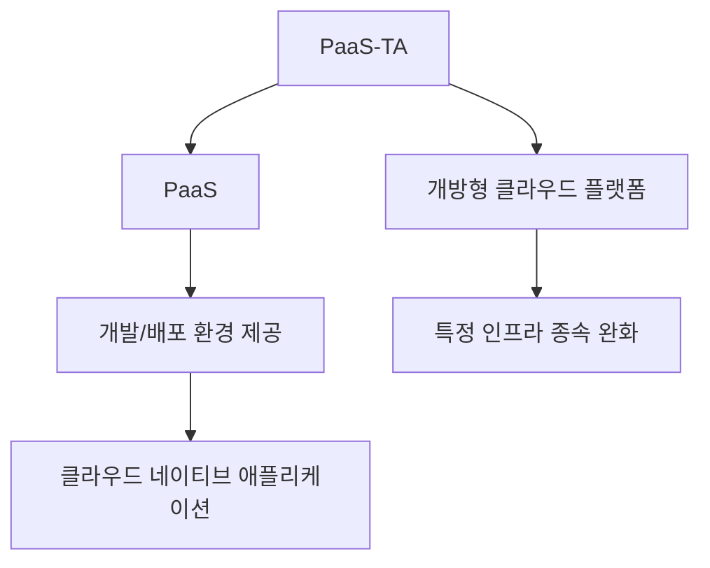
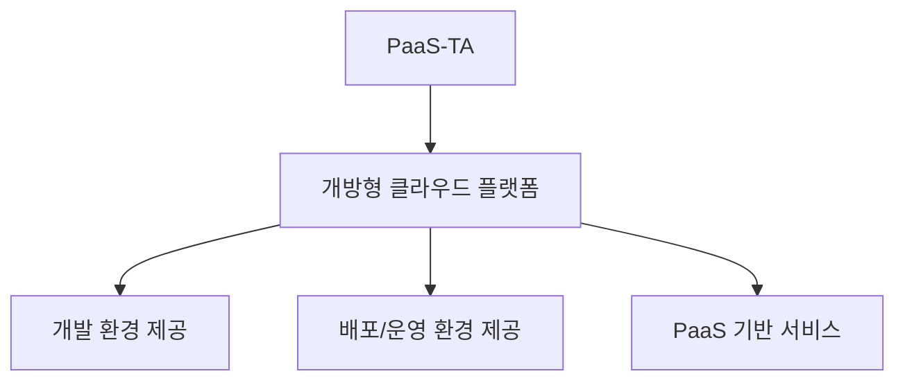

# 255 파스-타(PaaS-TA)

작성 기준일: 2026-06-01
검색/보강일: 2026-06-04
기준 PDF: `/Users/nes0903/Documents/study/정보처리기사/핵심요약집_2026_정보처리기사필기핵심요약.pdf`
PDF 확인 위치: 37페이지 `255 파스-타(PaaS-TA)`

## 한 줄 요약

- 파스-타는 소프트웨어 개발 환경을 제공하기 위해 개발된 개방형 클라우드 컴퓨팅 플랫폼이다.

## 한눈에 보는 구조

## PDF 기준 핵심

- 소프트웨어 개발 환경을 제공하기 위해 개발한 개방형 클라우드 컴퓨팅 플랫폼이다.
- `PaaS`, `개방형`, `클라우드`, `개발 환경 제공`이 핵심 단서이다.

## 개념 설명

- PaaS(Platform as a Service)는 개발자가 인프라를 직접 구축하지 않고 애플리케이션 개발·배포 환경을 이용하게 해 주는 클라우드 서비스 모델이다.
- 파스-타(PaaS-TA)는 국내에서 공공·민간 클라우드 플랫폼 생태계 조성을 위해 개발된 개방형 PaaS 플랫폼으로 소개된다.
- Google Cloud는 PaaS를 클라우드 기반 애플리케이션 개발과 배포에 필요한 환경을 제공하는 서비스 모델로 설명한다.
- 시험에서는 파스-타가 특정 기업 제품명이라기보다 `개방형 클라우드 플랫폼`이라는 점이 중요하다.

## 시험 포인트

- `파스-타 = 개방형 클라우드 컴퓨팅 플랫폼`으로 외운다.
- PaaS는 IaaS보다 위에서 개발·배포 환경을 제공한다.
- 클라우드 기반 개발 환경 제공이라는 PDF 문구를 그대로 기억한다.
- SDDC가 데이터센터 인프라 운영 개념이면, PaaS-TA는 개발 플랫폼 제공 개념이다.

## 헷갈리는 비교

| 구분 | IaaS | PaaS/PaaS-TA | SaaS |
|---|---|---|---|
| 제공 대상 | 서버, 네트워크, 스토리지 | 개발·배포 플랫폼 | 완성된 애플리케이션 |
| 사용자 관심 | 인프라 구성 | 코드와 서비스 배포 | 기능 사용 |
| 시험 단서 | Infrastructure | Platform | Software |

## 예시 또는 암기 포인트

- 개발자가 애플리케이션 코드를 올리면 플랫폼이 실행 환경과 배포를 지원하는 구조가 PaaS이다.
- 암기식: `파스-타 = PaaS + Open Platform`.

## 빠른 복습

- 파스-타의 성격은? 개방형 클라우드 컴퓨팅 플랫폼.
- 제공하는 것은? 소프트웨어 개발 환경.
- PaaS는 무엇의 약자인가? Platform as a Service.

## 상세 보강

- 파스-타는 국내에서 개발된 개방형 클라우드 컴퓨팅 플랫폼으로, 애플리케이션 개발·배포·운영 환경을 제공하는 PaaS 성격의 플랫폼이다.
- PaaS는 사용자가 서버와 미들웨어를 직접 일일이 구성하지 않고 애플리케이션 개발과 실행에 집중하게 해 주는 서비스 모델이다.
- PDF의 핵심은 `소프트웨어 개발 환경 제공`과 `개방형 클라우드 컴퓨팅 플랫폼`이다.
- IaaS가 서버·스토리지 같은 인프라 제공에 가깝다면, PaaS-TA는 개발 플랫폼 제공에 초점을 둔다.
- 시험에서는 `PaaS`, `개방형`, `클라우드`, `개발 환경`이 함께 나오면 파스-타로 판단한다.

| 구분 | IaaS | PaaS | SaaS |
|---|---|---|---|
| 제공 대상 | 인프라 | 개발/실행 플랫폼 | 완성 애플리케이션 |
| 사용자 초점 | 서버 운영 | 앱 개발·배포 | 서비스 사용 |
| 파스-타 위치 | 아님 | 해당 | 아님 |

## 참고 링크

- [Google Cloud - What is PaaS?](https://cloud.google.com/learn/what-is-paas)
- [전자신문 - 파스타(PaaS-TA)](https://www.etnews.com/20180719000156)
