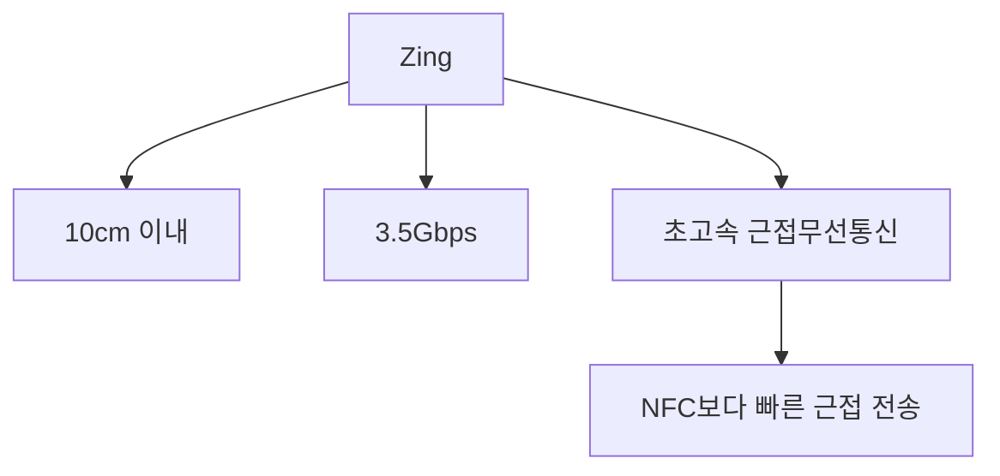
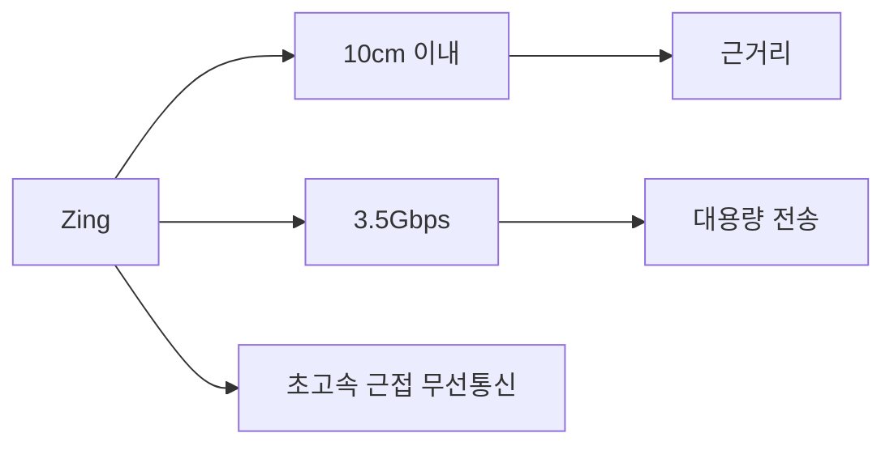

# 256 징(Zing)

작성 기준일: 2026-06-01
검색/보강일: 2026-06-04
기준 PDF: `/Users/nes0903/Documents/study/정보처리기사/핵심요약집_2026_정보처리기사필기핵심요약.pdf`
PDF 확인 위치: 37페이지 `256 징(Zing)`

## 한 줄 요약

- Zing은 10cm 이내 근거리에서 최대 3.5Gbps급 전송을 목표로 하는 초고속 근접무선통신 기술이다.

## 한눈에 보는 구조

## PDF 기준 핵심

- 10cm 이내 거리에서 3.5Gbps 속도의 데이터 전송이 가능하다.
- 초고속 근접무선통신(NFC)이다.
- `10cm`, `3.5Gbps`, `초고속 근접무선통신`이 핵심 숫자 단서이다.

## 개념 설명

- Zing은 매우 가까운 거리에서 큰 데이터를 빠르게 전송하기 위한 근접 통신 기술로 소개된다.
- NFC처럼 가까이 대는 사용 경험을 가지면서도 더 높은 전송 속도를 목표로 한다.
- 시험에서는 구현 세부보다 거리와 속도 수치를 묻는 암기형으로 나올 가능성이 크다.
- 다른 무선 기술과 비교할 때 `초근거리 + 고속` 조합을 기억한다.

## 시험 포인트

- `10cm 이내`와 `3.5Gbps` 숫자를 반드시 외운다.
- Bluetooth나 Wi-Fi처럼 넓은 근거리 네트워크가 아니라 NFC 계열의 근접무선통신으로 구분한다.
- 피코넷은 Bluetooth/UWB 네트워크, Zing은 초고속 근접통신이라는 차이를 본다.
- 보기에서 `ZigBee`와 혼동하지 않는다. Zing은 초고속 NFC로 출제된다.

## 헷갈리는 비교

| 구분 | Zing | Bluetooth | NFC |
|---|---|---|---|
| 거리 | 10cm 이내 | 수 m 이상 가능 | 수 cm 수준 |
| 핵심 | 3.5Gbps급 초고속 근접통신 | 개인 근거리 무선 | 근접 인식/소액 데이터 |
| 시험 단서 | Zing, 3.5Gbps | Piconet | NFC |

## 예시 또는 암기 포인트

- 단말기를 아주 가까이 대고 대용량 데이터를 빠르게 주고받는 시나리오로 떠올린다.
- 암기식: `Zing = 짧게 붙여서 빠르게`.

## 빠른 복습

- Zing의 거리 단서는? 10cm 이내.
- Zing의 속도 단서는? 3.5Gbps.
- 통신 성격은? 초고속 근접무선통신.

## 상세 보강

- 징은 PDF 기준으로 `10cm 이내`, `3.5Gbps`, `초고속 근접무선통신`을 핵심으로 암기한다.
- NFC처럼 매우 가까운 거리에서 통신하지만, 시험 단서에서는 높은 전송 속도와 짧은 거리가 같이 나온다.
- 근접 통신이므로 사용자가 의도적으로 기기를 가까이 두는 상황에 적합하다.
- 블루투스나 Wi-Fi처럼 넓은 범위 연결을 목표로 하는 기술과 구분한다.
- 시험에서는 숫자 단서가 강하다. `10cm`, `3.5Gbps`가 보이면 징이다.

| 기술 | 거리/단서 | 구분 포인트 |
|---|---|---|
| Zing | 10cm 이내, 3.5Gbps | 초고속 근접무선통신 |
| NFC | 매우 근거리 | 결제, 태그 인식 |
| Bluetooth | 근거리 개인 통신 | 피코넷과 연결 |

## 참고 링크

- [TechBiz Korea - 초고속근접통신기술 Zing](https://www.techbizkorea.com/down/Conference_S01-1_Tech-Biz_2016.pdf)
