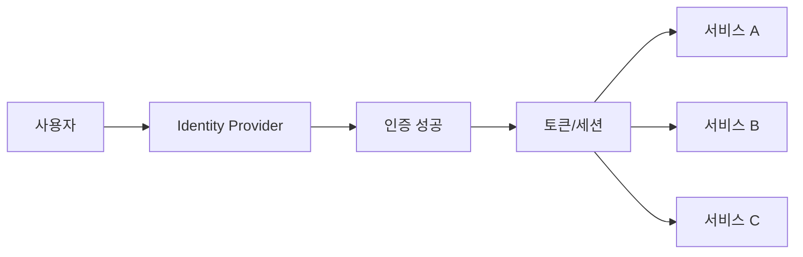
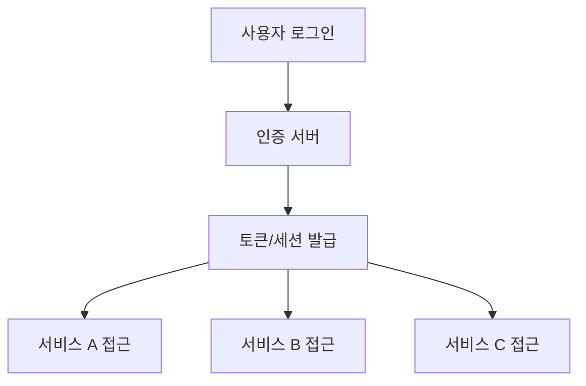

# 257 SSO(Single Sign On)

작성 기준일: 2026-06-01
검색/보강일: 2026-06-04
기준 PDF: `/Users/nes0903/Documents/study/정보처리기사/핵심요약집_2026_정보처리기사필기핵심요약.pdf`
PDF 확인 위치: 38페이지 `257 SSO(Single Sign On)`

## 한 줄 요약

- SSO는 한 번의 로그인 인증으로 여러 사이트나 서비스를 이용할 수 있게 하는 통합 인증 방식이다.

## 한눈에 보는 구조

## PDF 기준 핵심

- 한 번의 로그인으로 개인이 가입한 모든 사이트를 이용할 수 있게 해주는 시스템이다.
- `한 번의 로그인`, `여러 사이트 이용`, `통합 인증`이 핵심 단서이다.

## 개념 설명

- SSO는 사용자가 여러 서비스마다 별도 로그인을 반복하지 않게 하는 인증 구조이다.
- 중앙 인증 서버나 Identity Provider가 사용자를 인증하고, 서비스들은 인증 결과를 신뢰한다.
- SAML, OpenID Connect 같은 표준 프로토콜이 SSO 구현에 사용될 수 있다.
- 편의성과 계정 관리 효율은 높아지지만, 중앙 인증 계정이 탈취되면 영향 범위가 커질 수 있어 MFA와 접근 제어가 중요하다.

## 시험 포인트

- SSO는 `Single Sign On`, 즉 한 번 로그인으로 여러 서비스 접근이다.
- 같은 ID/비밀번호를 여러 사이트에서 쓰는 것과 SSO를 혼동하지 않는다.
- 인증(Authentication)과 권한 부여(Authorization)를 구분한다. SSO는 주로 인증 경험을 통합한다.
- 보안상 중앙 인증 체계와 토큰 관리가 중요하다.

## 헷갈리는 비교

| 구분 | SSO | 같은 비밀번호 재사용 |
|---|---|---|
| 인증 방식 | 한 번 인증 후 여러 서비스 접근 | 서비스마다 개별 로그인 |
| 중심 | IdP, 토큰, 세션 | 사용자 기억 |
| 장점 | 편의성, 중앙 관리 | 설정은 쉬우나 위험 |
| 시험 단서 | Single Sign On | password reuse |

## 예시 또는 암기 포인트

- 회사 포털에 로그인한 뒤 메일, 문서, 인사 시스템을 추가 로그인 없이 이용하면 SSO이다.
- 암기식: `SSO = Single login, Several services`.

## 빠른 복습

- SSO의 뜻은? Single Sign On.
- 핵심 효과는? 한 번 로그인으로 여러 서비스 이용.
- 구현에서 중요한 주체는? Identity Provider.

## 상세 보강

- SSO는 한 번 인증한 사용자가 여러 시스템이나 서비스에 반복 로그인 없이 접근하게 하는 인증 구조이다.
- 사용자는 편의성이 높아지고, 조직은 중앙 인증·정책 적용·계정 관리를 쉽게 할 수 있다.
- 단점은 SSO 계정이나 인증 서버가 침해되면 여러 서비스 접근 권한이 한꺼번에 위험해질 수 있다는 점이다.
- PDF의 `한 번의 로그인`, `모든 사이트 이용`이 핵심 단서이다.
- 시험에서는 SSO를 인증 방식으로 보고, 권한 부여 자체를 뜻하는 접근 제어와 구분한다.

| 구분 | 의미 |
|---|---|
| 인증(Authentication) | 사용자가 누구인지 확인 |
| SSO | 한 번 인증으로 여러 서비스 이용 |
| 접근 제어(Authorization) | 인증 후 무엇을 할 수 있는지 결정 |

## 참고 링크

- [NIST CSRC Glossary - SSO](https://csrc.nist.gov/glossary/term/sso)
- [Microsoft Learn - What is single sign-on?](https://learn.microsoft.com/en-us/entra/identity/enterprise-apps/what-is-single-sign-on)
