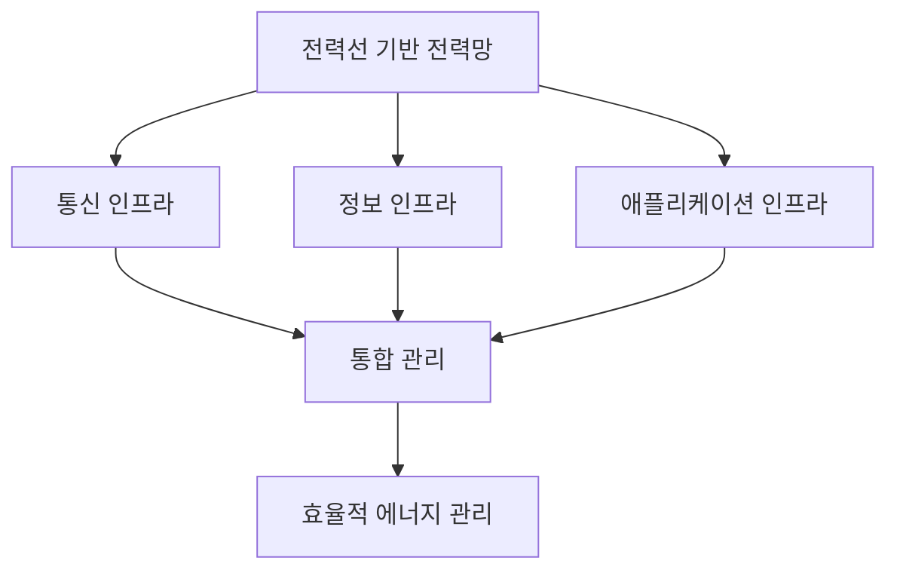
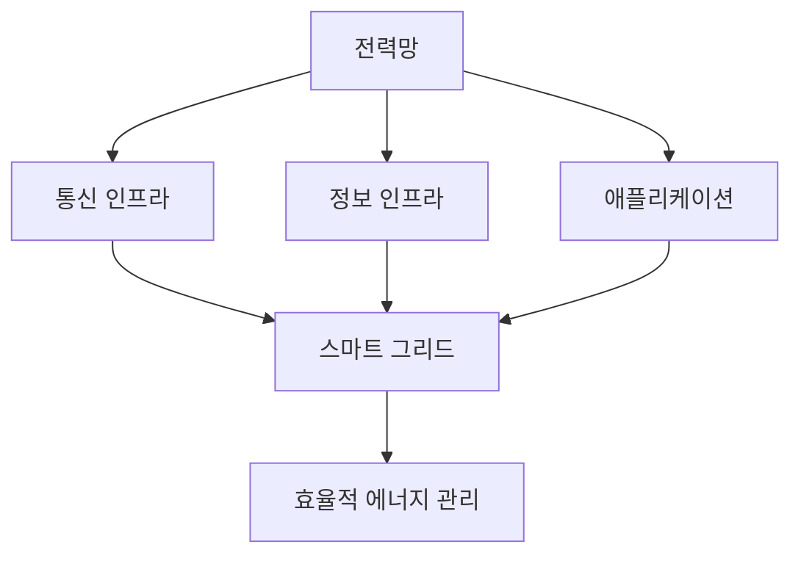

# 258 스마트 그리드(Smart Grid)

작성 기준일: 2026-06-01
검색/보강일: 2026-06-04
기준 PDF: `/Users/nes0903/Documents/study/정보처리기사/핵심요약집_2026_정보처리기사필기핵심요약.pdf`
PDF 확인 위치: 38페이지 `258 스마트 그리드(Smart Grid)`

## 한 줄 요약

- 스마트 그리드는 전력망에 통신·정보·제어 기술을 결합해 에너지를 효율적으로 관리하는 지능형 전력망이다.

## 한눈에 보는 구조

## PDF 기준 핵심

- 전력선을 기반으로 모든 통신, 정보, 관련 애플리케이션 인프라를 하나의 시스템으로 통합하여 관리한다.
- 이를 통해 효율적인 에너지 관리가 가능하다.
- `전력선`, `통신·정보·애플리케이션 인프라 통합`, `에너지 관리`가 핵심 단서이다.

## 개념 설명

- 스마트 그리드는 전력 공급자와 소비자 사이에 양방향 정보 흐름을 만들어 전력 생산·분배·소비를 효율화한다.
- NIST는 스마트 그리드를 양방향 에너지 흐름과 양방향 통신·제어 능력을 갖춘 현대화된 전력망으로 설명한다.
- 전력 사용량 계측, 수요 반응, 분산 전원, 장애 감지, 전력 품질 관리와 연결된다.
- 보안, 상호운용성, 표준화가 중요하다.

## 시험 포인트

- `전력 + ICT`가 스마트 그리드의 핵심이다.
- 스마트 미터, 수요 반응, 양방향 통신, 에너지 효율 단서가 함께 나올 수 있다.
- 단순 전력망이 아니라 통신·정보 인프라와 통합된 지능형 전력망이다.
- IoT, 보안, 데이터 분석과 융합되는 신기술 용어로 출제된다.

## 헷갈리는 비교

| 구분 | 기존 전력망 | 스마트 그리드 |
|---|---|---|
| 정보 흐름 | 단방향 중심 | 양방향 |
| 관리 | 수동/분산 | 통합·지능형 |
| 핵심 기술 | 전력 설비 | 전력 + 통신 + 정보 |
| 목표 | 전력 공급 | 효율적 에너지 관리 |

## 예시 또는 암기 포인트

- 전력 사용량을 실시간으로 수집하고 피크 시간대에 수요를 조절하면 스마트 그리드의 예이다.
- 암기식: `Smart Grid = 전력망에 ICT를 붙인 것`.

## 빠른 복습

- 스마트 그리드의 기반은? 전력선과 통신·정보 인프라.
- 목표는? 효율적인 에너지 관리.
- NIST식 핵심은? 양방향 에너지 흐름과 통신·제어.

## 상세 보강

- 스마트 그리드는 전력망에 정보통신 기술을 결합해 전력 생산, 전달, 소비를 지능적으로 관리하는 체계이다.
- PDF는 전력선을 기반으로 통신, 정보, 애플리케이션 인프라를 통합 관리한다고 설명한다.
- 전력 사용량 모니터링, 수요 반응, 분산 전원 관리, 장애 탐지 같은 개념과 연결된다.
- 일반 전력망이 단방향 공급 중심이라면, 스마트 그리드는 정보가 오가며 최적화를 수행한다.
- 시험에서는 `전력선`, `통신·정보·애플리케이션 통합`, `에너지 관리`를 연결한다.

| 구분 | 기존 전력망 | 스마트 그리드 |
|---|---|---|
| 흐름 | 공급자 중심 | 양방향 정보 흐름 |
| 관리 | 수동/분산 | 통합·지능형 |
| 목적 | 전력 공급 | 효율적 에너지 관리 |

## 참고 링크

- [NIST - Smart Grid Beginner's Guide](https://www.nist.gov/engineering-laboratory/smart-grid/about-smart-grid/smart-grid-beginners-guide)
- [NIST - Smart Grid FAQs](https://www.nist.gov/ctl/smartsystems/smart-grid-faqs)
