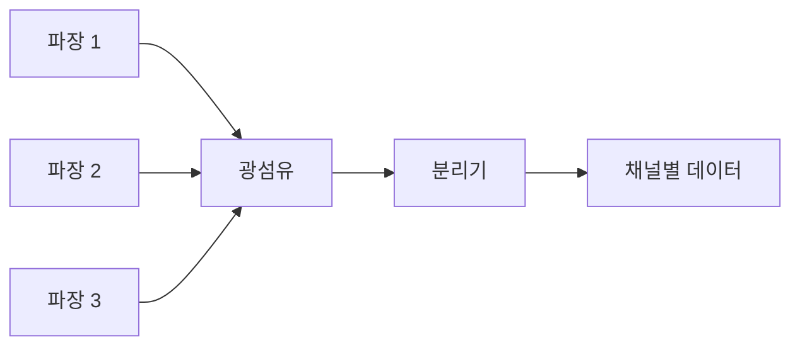
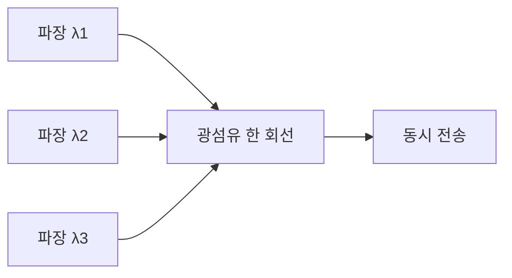

# 259 WDM(Wavelength Division Multiplexing)

작성 기준일: 2026-06-01
검색/보강일: 2026-06-04
기준 PDF: `/Users/nes0903/Documents/study/정보처리기사/핵심요약집_2026_정보처리기사필기핵심요약.pdf`
PDF 확인 위치: 38페이지 `259 WDM(Wavelength Division Multiplexing)`

## 한 줄 요약

- WDM은 서로 다른 파장의 광신호를 하나의 광섬유에 동시에 실어 여러 통신 회선을 함께 사용하는 다중화 기술이다.

## 한눈에 보는 구조

## PDF 기준 핵심

- 파장이 다른 광선끼리는 서로 간섭을 일으키지 않는 성질을 이용한다.
- 여러 대의 단말기가 동시에 통신 회선을 사용할 수 있도록 하는 기술이다.
- `파장`, `광선`, `동시 사용`, `다중화`가 핵심 단서이다.

## 개념 설명

- WDM은 Wavelength Division Multiplexing, 즉 파장 분할 다중화이다.
- 광통신에서 각 데이터 채널을 서로 다른 파장의 빛에 실어 하나의 광섬유로 보낸다.
- 수신 측에서는 파장별로 신호를 다시 분리한다.
- ITU-T의 WDM PON 권고처럼 WDM은 광 네트워크에서 여러 파장 채널을 다루는 핵심 기술로 쓰인다.

## 시험 포인트

- 주파수 분할이 아니라 `파장 분할`이라는 표현을 잡는다.
- 광섬유, 광선, 파장, 간섭 없음이 WDM 단서이다.
- TDM은 시간 분할, FDM은 주파수 분할, WDM은 파장 분할로 구분한다.
- 여러 단말기가 동시에 회선을 쓴다는 PDF 문구를 기억한다.

## 헷갈리는 비교

| 구분 | TDM | FDM | WDM |
|---|---|---|---|
| 분할 기준 | 시간 | 주파수 | 파장 |
| 대표 매체 | 디지털 회선 | 무선/아날로그 회선 | 광섬유 |
| 시험 단서 | time slot | frequency | wavelength |

## 예시 또는 암기 포인트

- 빨간색, 파란색, 초록색 빛을 한 광섬유에 동시에 보낸 뒤 수신 측에서 색별로 분리한다고 생각하면 쉽다.
- 암기식: `WDM = 빛의 파장을 나눠 Multiplexing`.

## 빠른 복습

- WDM의 분할 기준은? 파장.
- 주로 쓰이는 매체는? 광섬유.
- PDF의 핵심 원리는? 파장이 다른 광선은 서로 간섭하지 않는 성질.

## 상세 보강

- WDM은 서로 다른 파장의 빛을 하나의 광섬유에 함께 실어 여러 신호를 동시에 전송하는 다중화 기술이다.
- 파장이 다르면 간섭이 적다는 광학적 성질을 이용한다.
- 회선을 새로 늘리지 않고도 전송 용량을 크게 높일 수 있어 광통신망에서 중요하다.
- PDF의 `파장이 다른 광선`, `서로 간섭을 일으키지 않음`, `동시에 통신 회선 사용`이 핵심이다.
- 시험에서는 TDM이 시간 분할, FDM이 주파수 분할, WDM이 파장 분할이라는 차이를 구분한다.

| 다중화 | 기준 | 대표 단서 |
|---|---|---|
| TDM | 시간 | 시간 슬롯 |
| FDM | 주파수 | 주파수 대역 |
| WDM | 광 파장 | 광섬유, 서로 다른 파장 |

## 참고 링크

- [ITU-T G.9802.1 - WDM PON](https://www.itu.int/rec/T-REC-G.9802.1/en)
- [Ciena - What is WDM?](https://www.ciena.com/insights/what-is/What-Is-WDM.html)

<!-- study-links:start -->
## 관련 문서

- `division`: [[정보처리기사/3과목 데이터베이스 구축/120 순수 관계 연산자 - Division/120 순수 관계 연산자 - Division|120 순수 관계 연산자 - Division]]
<!-- study-links:end -->
