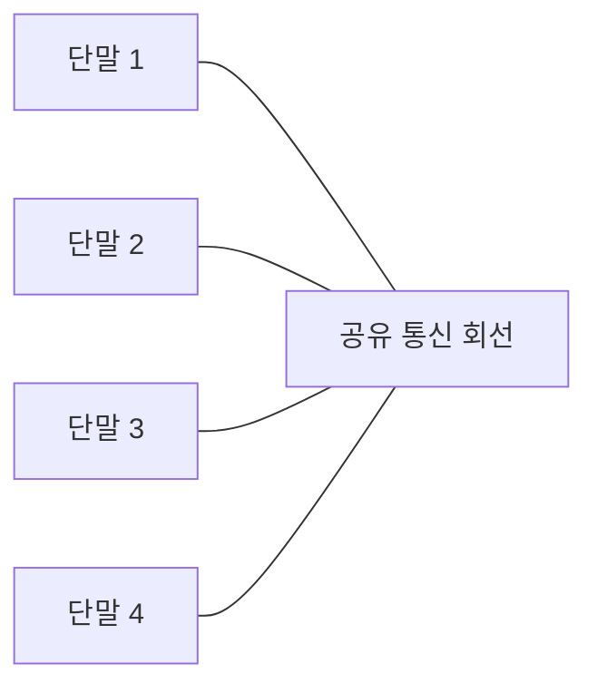

# 260 버스형(Bus)

작성 기준일: 2026-06-01
검색/보강일: 2026-06-04
기준 PDF: `/Users/nes0903/Documents/study/정보처리기사/핵심요약집_2026_정보처리기사필기핵심요약.pdf`
PDF 확인 위치: 38페이지 `260 버스형(Bus)`

## 한 줄 요약

- 버스형 토폴로지는 하나의 통신 회선에 여러 단말장치를 연결하는 네트워크 구성 형태이다.

## 한눈에 보는 구조

## PDF 기준 핵심

- 한 개의 통신 회선에 여러 대의 단말장치가 연결된 형태이다.
- PDF 그림은 단말들이 하나의 선에 붙어 있고 데이터가 회선 방향으로 전달되는 형태를 보여 준다.

## 개념 설명

- 버스형은 모든 장치가 하나의 공통 전송 매체를 공유한다.
- 구조가 단순하고 케이블 사용량이 적지만, 주 회선에 문제가 생기면 전체 통신에 영향을 줄 수 있다.
- 여러 장치가 같은 매체를 공유하므로 충돌과 접근 제어 문제가 생길 수 있다.
- 네트워크 토폴로지 문제에서는 성형, 링형, 망형과 비교해 출제된다.

## 시험 포인트

- `한 개의 통신 회선`이 버스형의 핵심 단서이다.
- 중앙 장비가 중심이면 성형, 노드가 원형으로 연결되면 링형, 여러 경로가 얽히면 망형이다.
- 버스형은 설치가 간단하지만 장애 영향 범위와 충돌 가능성을 함께 이해한다.
- CSMA/CD가 공유 매체 Ethernet과 연결될 수 있음을 떠올린다.

## 헷갈리는 비교

| 토폴로지 | 구조 | 시험 단서 |
|---|---|---|
| 버스형 | 하나의 회선 공유 | Bus, backbone |
| 성형 | 중앙 장비 중심 | Hub, Switch |
| 링형 | 원형 연결 | Token, ring |
| 망형 | 다중 경로 | Mesh |

## 예시 또는 암기 포인트

- 하나의 긴 케이블에 여러 컴퓨터가 가지처럼 연결된 옛 Ethernet 구조를 떠올리면 된다.
- 암기식: `버스는 한 줄에 모두 탄다`.

## 빠른 복습

- 버스형의 핵심 구조는? 한 개의 통신 회선에 여러 단말 연결.
- 중앙 장비 중심 구조는? 성형.
- 버스형의 약점은? 회선 장애와 충돌 영향.

## 상세 보강

- 버스형 토폴로지는 하나의 공통 통신 회선에 여러 단말을 연결하는 구조이다.
- 구조가 단순하고 설치 비용이 비교적 낮지만, 공통 회선 장애가 전체 통신에 영향을 줄 수 있다.
- 여러 단말이 같은 매체를 공유하므로 충돌 제어나 접근 제어가 중요하다.
- PDF의 `한 개의 통신 회선`, `여러 단말장치 연결`이 핵심이다.
- 시험에서는 스타형의 중앙 장치, 링형의 순환 연결, 버스형의 공통 회선을 구분한다.

| 토폴로지 | 핵심 구조 | 장애 특징 |
|---|---|---|
| 버스형 | 하나의 공통 회선 | 회선 장애 영향 큼 |
| 스타형 | 중앙 장치 | 중앙 장치 장애 영향 큼 |
| 링형 | 순환 연결 | 한 구간 장애에 취약할 수 있음 |

## 참고 링크

- [IBM - What is network topology?](https://www.ibm.com/think/topics/network-topology)

<!-- study-links:start -->
## 관련 문서

- `csma`: [[정보처리기사/4과목 프로그래밍 언어 활용/218 CSMA CD/218 CSMA CD|218 CSMA/CD]]
<!-- study-links:end -->
