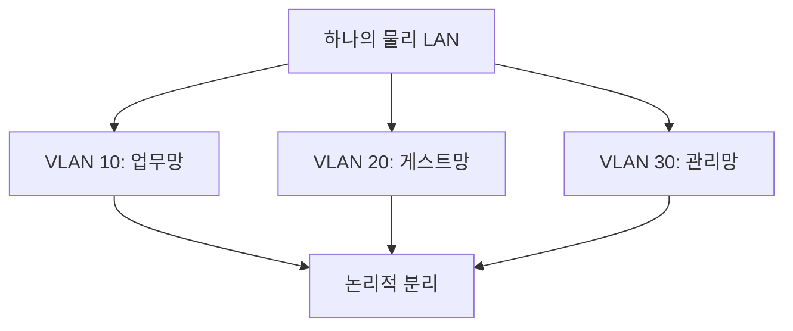
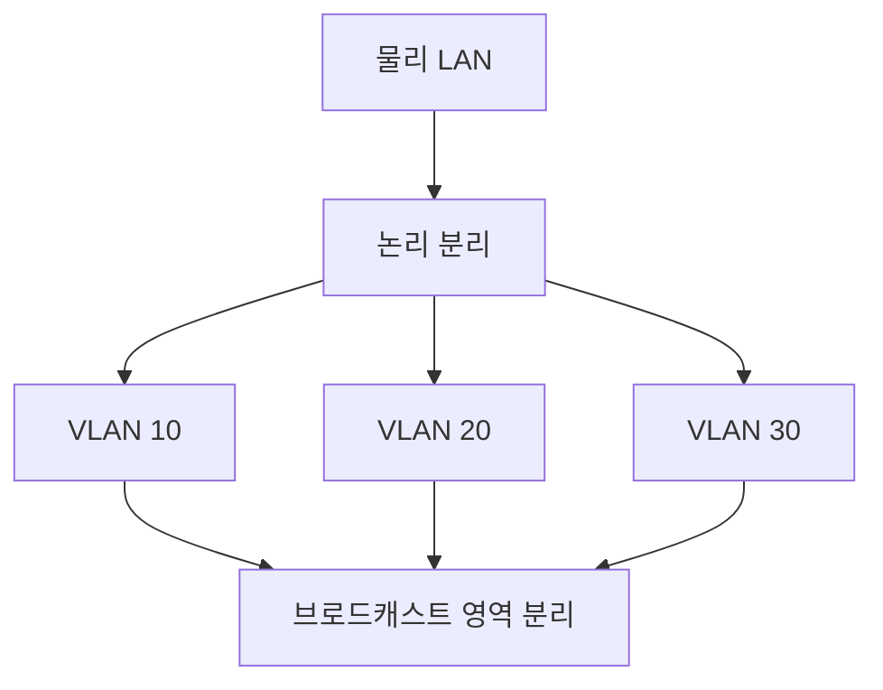

# 261 VLAN(Virtual Local Area Network)

작성 기준일: 2026-06-01
검색/보강일: 2026-06-04
기준 PDF: `/Users/nes0903/Documents/study/정보처리기사/핵심요약집_2026_정보처리기사필기핵심요약.pdf`
PDF 확인 위치: 38페이지 `261 VLAN(Virtual Local Area Network)`

## 한 줄 요약

- VLAN은 물리적 배치와 관계없이 LAN을 논리적으로 분리해 성능과 보안성을 높이는 기술이다.

## 한눈에 보는 구조

## PDF 기준 핵심

- LAN의 물리적인 배치와 상관없이 논리적으로 분리하는 기술이다.
- 접속된 장비들의 성능 및 보안성을 향상시킬 수 있다.
- `논리적 분리`, `성능`, `보안성`이 핵심 단서이다.

## 개념 설명

- VLAN은 같은 스위치에 연결된 장치라도 논리적으로 다른 네트워크처럼 나눌 수 있게 한다.
- IEEE 802.1Q는 VLAN 태그를 Ethernet 프레임에 넣어 VLAN을 구분하는 표준이다.
- VLAN을 나누면 브로드캐스트 범위를 줄이고, 부서·용도별 접근 통제를 적용하기 쉬워진다.
- 서로 다른 VLAN 간 통신은 일반적으로 라우터나 L3 스위치의 라우팅이 필요하다.

## 시험 포인트

- `Virtual Local Area Network`의 V는 가상, 즉 논리적 분리이다.
- 물리적으로 가까워도 VLAN이 다르면 논리적으로 분리될 수 있다.
- VLAN은 성능과 보안성 향상 단서로 출제된다.
- VPN과 혼동하지 않는다. VLAN은 LAN 분리, VPN은 공중망 위 가상 사설망이다.

## 헷갈리는 비교

| 구분 | VLAN | VPN |
|---|---|---|
| 대상 | LAN 내부 논리 분리 | 공중망 위 사설 통신 |
| 계층 느낌 | L2/L3 네트워크 분리 | 터널링/암호화 |
| 시험 단서 | 802.1Q, 가상 LAN | Virtual Private Network |
| 효과 | 성능, 보안성 향상 | 안전한 원격 접속 |

## 예시 또는 암기 포인트

- 같은 사무실 스위치에 꽂힌 PC들을 인사팀 VLAN과 개발팀 VLAN으로 나누면 VLAN이다.
- 암기식: `VLAN = 물리는 하나, 논리는 여럿`.

## 빠른 복습

- VLAN의 핵심은? LAN의 논리적 분리.
- VLAN 표준과 연결되는 것은? IEEE 802.1Q.
- VLAN의 효과는? 성능 및 보안성 향상.

## 상세 보강

- VLAN은 같은 물리 네트워크에 있어도 논리적으로 네트워크를 분리하는 기술이다.
- 부서, 보안 등급, 서비스 유형에 따라 브로드캐스트 영역을 나눌 수 있어 성능과 보안 관리에 유리하다.
- IEEE 802.1Q는 VLAN 태그를 이용해 이더넷 프레임이 어느 VLAN에 속하는지 표시하는 표준으로 연결된다.
- VLAN은 물리 배선을 바꾸지 않고도 논리 구성을 바꿀 수 있다는 점이 중요하다.
- 시험에서는 `물리 배치와 무관`, `논리적 분리`, `성능 및 보안성 향상`을 연결한다.

| 구분 | 물리 LAN | VLAN |
|---|---|---|
| 분리 기준 | 케이블/장비 위치 | 논리 그룹 |
| 변경 방식 | 배선 변경 필요 | 스위치 설정으로 변경 |
| 효과 | 단일 브로드캐스트 영역 | 영역 분리, 보안성 향상 |

## 참고 링크

- [IEEE 802.1Q - Virtual LANs](https://www.ieee802.org/1/pages/802.1Q.html)
- [IBM - Virtual local area networks](https://www.ibm.com/docs/HW4M4/p8hb1/p8hb1_vios_concepts_network_vlan.htm)

<!-- study-links:start -->
## 관련 문서

- `lan`: [[정보처리기사/5과목 정보시스템 구축 관리/264 LAN의 표준 규격 - 802.11e/264 LAN의 표준 규격 - 802.11e|264 LAN의 표준 규격 - 802.11e]]
- `물리적`: [[정보처리기사/5과목 정보시스템 구축 관리/320 관리적 물리적 기술적 보안/320 관리적 물리적 기술적 보안|320 관리적/물리적/기술적 보안]]
- `vpn`: [[정보처리기사/5과목 정보시스템 구축 관리/323 VPN(Virtual Private Network, 가상 사설 통신망)/323 VPN(Virtual Private Network, 가상 사설 통신망)|323 VPN(Virtual Private Network, 가상 사설 통신망)]]
<!-- study-links:end -->
