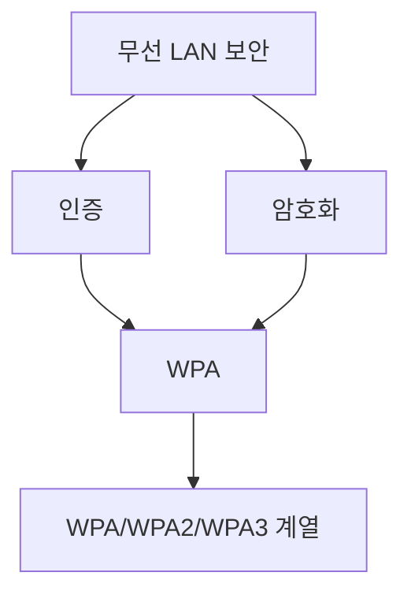
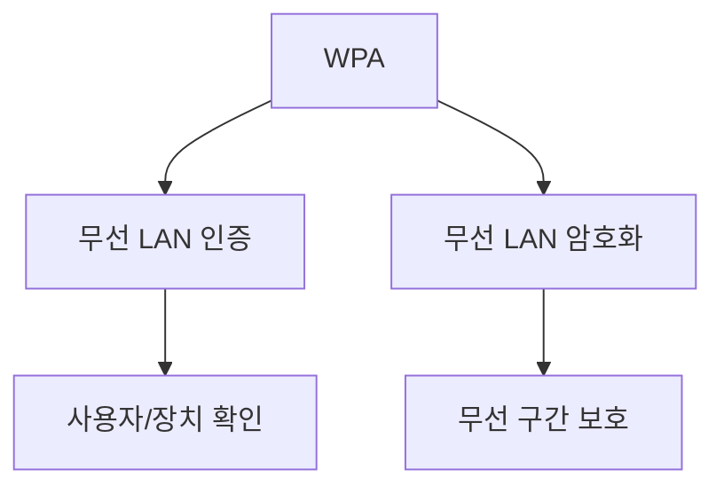

# 262 WPA(Wi-Fi Protected Access)

작성 기준일: 2026-06-01
검색/보강일: 2026-06-04
기준 PDF: `/Users/nes0903/Documents/study/정보처리기사/핵심요약집_2026_정보처리기사필기핵심요약.pdf`
PDF 확인 위치: 38페이지 `262 WPA(Wi-Fi Protected Access)`

## 한 줄 요약

- WPA는 Wi-Fi Alliance가 제정한 무선 LAN 인증 및 암호화 관련 보안 표준 계열이다.

## 한눈에 보는 구조

## PDF 기준 핵심

- Wi-Fi에서 제정한 무선 랜(WLAN) 인증 및 암호화 관련 표준이다.
- `Wi-Fi`, `WLAN`, `인증`, `암호화`가 핵심 단서이다.

## 개념 설명

- WPA(Wi-Fi Protected Access)는 무선 LAN에서 사용자 인증과 데이터 보호를 위해 사용되는 보안 방식이다.
- WEP의 취약점을 보완하기 위해 등장했고, 이후 WPA2, WPA3로 발전했다.
- Wi-Fi Alliance는 WPA3를 최신 Wi-Fi 보안 세대로 설명하며, WPA 계열은 인증과 암호화를 통해 무선 통신을 보호한다.
- 정보처리기사에서는 버전별 세부 암호 알고리즘보다 `무선 LAN 보안 표준`이라는 성격이 중요하다.

## 시험 포인트

- `WPA = Wi-Fi Protected Access`를 기억한다.
- 무선 LAN 인증 및 암호화 표준이라는 PDF 문구가 핵심이다.
- 유선 LAN의 CSMA/CD, 무선 LAN의 CSMA/CA와 구분한다.
- WPA는 접근 제어와 암호화를 다루고, 802.11e는 QoS를 다룬다.

## 헷갈리는 비교

| 구분 | WPA | 802.11e | CSMA/CA |
|---|---|---|---|
| 초점 | 보안 | QoS | 매체 접근 제어 |
| 단서 | 인증, 암호화 | MAC 수정, QoS | 충돌 회피 |
| 영역 | WLAN 보안 | WLAN 품질 | WLAN 전송 방식 |

## 예시 또는 암기 포인트

- 공유기 설정에서 WPA2/WPA3 보안을 선택하고 비밀번호를 설정하는 것은 WPA 계열 보안 설정이다.
- 암기식: `WPA = Wi-Fi를 Protect`.

## 빠른 복습

- WPA의 전체 이름은? Wi-Fi Protected Access.
- WPA가 다루는 것은? 무선 LAN 인증 및 암호화.
- WPA와 802.11e의 차이는? WPA는 보안, 802.11e는 QoS.

## 상세 보강

- WPA는 Wi-Fi 환경에서 무선 LAN 통신을 보호하기 위한 인증 및 암호화 관련 보안 표준이다.
- WEP의 취약점을 보완하기 위해 등장했고, 이후 WPA2, WPA3로 발전했다.
- 개인 모드에서는 사전 공유 키를 사용하고, 기업 환경에서는 802.1X/EAP 기반 인증과 연결될 수 있다.
- PDF는 시험용으로 `Wi-Fi`, `WLAN`, `인증 및 암호화`를 핵심으로 제시한다.
- 시험에서는 WPA를 단순 암호 알고리즘이 아니라 무선 LAN 보안 표준으로 본다.

| 구분 | WEP | WPA/WPA2/WPA3 |
|---|---|---|
| 성격 | 초기 무선 보안 | 개선된 Wi-Fi 보안 |
| 보안성 | 취약 | 인증·암호화 강화 |
| 시험 단서 | 오래된 무선 보안 | Wi-Fi Protected Access |

## 참고 링크

- [Wi-Fi Alliance - Wi-Fi Security](https://www.wi-fi.org/discover-wi-fi/security)
