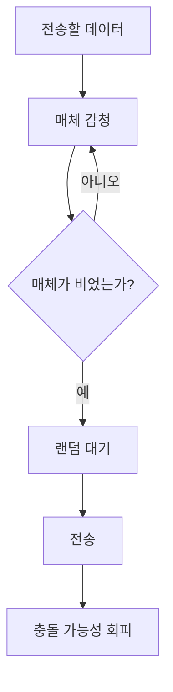
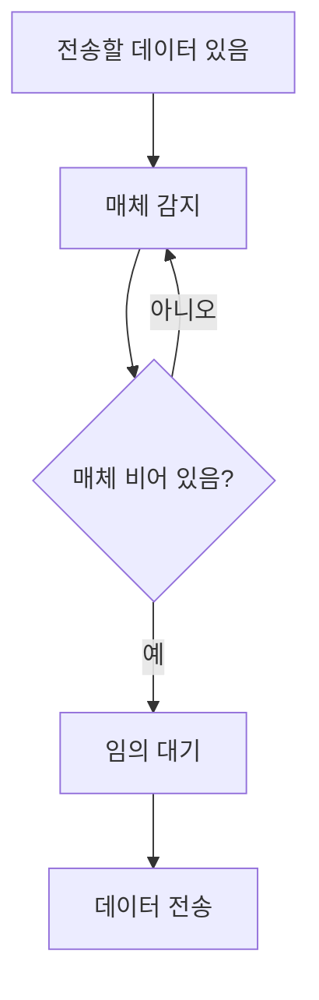

# 263 CSMA/CA

작성 기준일: 2026-06-01
검색/보강일: 2026-06-04
기준 PDF: `/Users/nes0903/Documents/study/정보처리기사/핵심요약집_2026_정보처리기사필기핵심요약.pdf`
PDF 확인 위치: 38페이지 `263 CSMA/CA`

## 한 줄 요약

- CSMA/CA는 무선 LAN에서 전송 전 매체가 비어 있는지 확인하고 일정 시간 기다려 충돌을 회피하는 방식이다.

## 한눈에 보는 구조

## PDF 기준 핵심

- 무선 랜에서 데이터 전송 시 매체가 비어 있음을 확인한다.
- 충돌을 피하기 위해 일정한 시간을 기다린 후 데이터를 전송하는 방법이다.
- `무선 LAN`, `매체 확인`, `일정 시간 대기`, `충돌 회피`가 핵심 단서이다.

## 개념 설명

- CSMA/CA는 Carrier Sense Multiple Access with Collision Avoidance의 약자이다.
- 무선 환경에서는 전송 중 충돌을 정확히 감지하기 어렵기 때문에 사전에 회피하는 방식이 중요하다.
- IEEE 802.11 기반 WLAN의 매체 접근 방식과 연결된다.
- RTS/CTS, 랜덤 백오프 같은 절차가 충돌 가능성을 줄이는 데 쓰일 수 있다.

## 시험 포인트

- CSMA/CD는 충돌 감지, CSMA/CA는 충돌 회피이다.
- 유선 Ethernet은 CSMA/CD, 무선 LAN은 CSMA/CA로 주로 연결한다.
- `일정 시간 기다린 후 전송`이라는 PDF 문장이 CA의 핵심이다.
- CSMA/CA는 충돌을 완전히 없애는 것이 아니라 가능성을 줄이는 방식이다.

## 헷갈리는 비교

| 구분 | CSMA/CD | CSMA/CA |
|---|---|---|
| 의미 | Collision Detection | Collision Avoidance |
| 대표 환경 | 유선 LAN, IEEE 802.3 | 무선 LAN, IEEE 802.11 |
| 처리 | 충돌 감지 후 재전송 | 전송 전 대기·회피 |
| 시험 단서 | Detect | Avoid |

## 예시 또는 암기 포인트

- 와이파이 단말이 바로 말하지 않고 채널 상태를 듣고 랜덤 시간 대기한 뒤 전송하는 과정을 떠올린다.
- 암기식: `CA는 Avoid, 먼저 피한다`.

## 빠른 복습

- CSMA/CA의 대표 환경은? 무선 LAN.
- CA의 뜻은? Collision Avoidance.
- CSMA/CD와 차이는? CD는 감지, CA는 회피.

## 상세 보강

- CSMA/CA는 무선 LAN에서 충돌을 직접 감지하기 어렵기 때문에 충돌을 피하도록 설계된 매체 접근 방식이다.
- 먼저 채널이 비어 있는지 확인하고, 비어 있어도 일정 시간 대기한 뒤 전송한다.
- CSMA/CD는 유선 LAN에서 충돌을 감지하는 방식이고, CSMA/CA는 무선 LAN에서 충돌을 회피하는 방식이다.
- PDF의 `매체가 비어있음을 확인`, `충돌을 피하기 위해 일정 시간 기다림`, `무선 LAN`이 핵심이다.
- 시험에서는 `/CA = Collision Avoidance`, `/CD = Collision Detection`으로 구분하면 빠르다.

| 구분 | CSMA/CA | CSMA/CD |
|---|---|---|
| 의미 | 충돌 회피 | 충돌 감지 |
| 주 사용 | 무선 LAN | 유선 Ethernet |
| 동작 | 기다렸다 전송 | 충돌 감지 후 재전송 |

## 참고 링크

- [IEEE 802.11 Working Group](https://www.ieee802.org/11/)
