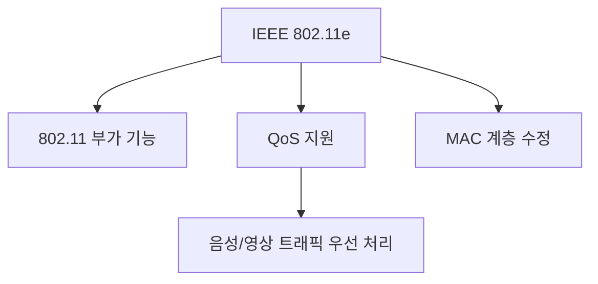
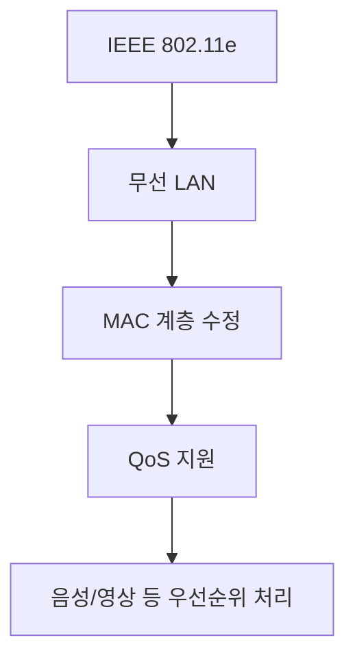

# 264 LAN의 표준 규격 - 802.11e

작성 기준일: 2026-06-01
검색/보강일: 2026-06-04
기준 PDF: `/Users/nes0903/Documents/study/정보처리기사/핵심요약집_2026_정보처리기사필기핵심요약.pdf`
PDF 확인 위치: 38페이지 `264 LAN의 표준 규격 - 802.11e`

## 한 줄 요약

- 802.11e는 무선 LAN에서 QoS 기능을 지원하기 위해 MAC 계층을 수정한 IEEE 802.11 부가 표준이다.

## 한눈에 보는 구조

## PDF 기준 핵심

- 802.11의 부가 기능 표준이다.
- QoS 기능이 지원되도록 하기 위해 매체 접근 제어(MAC) 계층에 해당하는 부분을 수정하였다.
- `802.11`, `QoS`, `MAC 계층 수정`이 핵심 단서이다.

## 개념 설명

- IEEE 802.11e는 무선 LAN에서 지연에 민감한 트래픽을 더 잘 처리하기 위한 QoS 확장이다.
- 음성, 영상, 실시간 트래픽은 일반 데이터보다 지연과 지터에 민감하므로 우선순위 처리가 필요하다.
- Wi-Fi Alliance의 WMM은 802.11e 기반 QoS 기능의 일부를 제품 인증 형태로 제공한다.
- 시험에서는 세부 EDCA/HCCA보다 `QoS와 MAC 계층 수정`을 우선한다.

## 시험 포인트

- 802.11e는 보안 표준이 아니라 QoS 표준이다.
- WPA는 인증·암호화, 802.11e는 QoS로 구분한다.
- MAC 계층 수정이라는 표현이 매우 중요하다.
- CSMA/CA는 무선 LAN 매체 접근 방식, 802.11e는 QoS 지원을 위한 확장이다.

## 헷갈리는 비교

| 표준/기술 | 핵심 | 시험 단서 |
|---|---|---|
| 802.11e | QoS | MAC 계층 수정 |
| WPA | 보안 | 인증, 암호화 |
| CSMA/CA | 충돌 회피 | 일정 시간 대기 |
| 802.1Q | VLAN | 태그, 가상 LAN |

## 예시 또는 암기 포인트

- 무선 LAN에서 영상 통화 트래픽을 일반 다운로드보다 우선 처리하려는 기능을 802.11e와 연결한다.
- 암기식: `e는 enhanced QoS`.

## 빠른 복습

- 802.11e의 목적은? QoS 지원.
- 수정되는 계층은? MAC 계층.
- WPA와의 차이는? WPA는 보안 표준이다.

## 상세 보강

- 802.11e는 무선 LAN 표준 802.11에 QoS 기능을 지원하기 위한 확장으로 이해한다.
- QoS는 트래픽의 중요도나 지연 민감도에 따라 우선순위를 다르게 처리하는 개념이다.
- 음성, 영상, 실시간 서비스는 지연과 지터에 민감하므로 QoS가 중요하다.
- PDF의 `부가 기능 표준`, `QoS 기능`, `MAC 계층 수정`이 핵심 단서이다.
- 시험에서는 802.11e를 단순 무선 속도 규격이 아니라 QoS 지원 규격으로 구분한다.

| 규격 단서 | 의미 |
|---|---|
| 802.11 | 무선 LAN 계열 |
| 802.11e | QoS 지원 |
| MAC 계층 | 매체 접근 제어 계층 |
| 실시간 트래픽 | QoS 필요성이 큰 예 |

## 참고 링크

- [IEEE 802.11 Working Group](https://www.ieee802.org/11/)
- [LANCOM - QoS for WLANs according to IEEE 802.11e](https://www.lancom-systems.com/docs/LCOS/Refmanual/EN/topics/aa1206951.html)

<!-- study-links:start -->
## 관련 문서

- `csma`: [[정보처리기사/4과목 프로그래밍 언어 활용/218 CSMA CD/218 CSMA CD|218 CSMA/CD]]
- `vlan`: [[정보처리기사/5과목 정보시스템 구축 관리/261 VLAN(Virtual Local Area Network)/261 VLAN(Virtual Local Area Network)|261 VLAN(Virtual Local Area Network)]]
- `wpa`: [[정보처리기사/5과목 정보시스템 구축 관리/262 WPA(Wi-Fi Protected Access)/262 WPA(Wi-Fi Protected Access)|262 WPA(Wi-Fi Protected Access)]]
<!-- study-links:end -->
