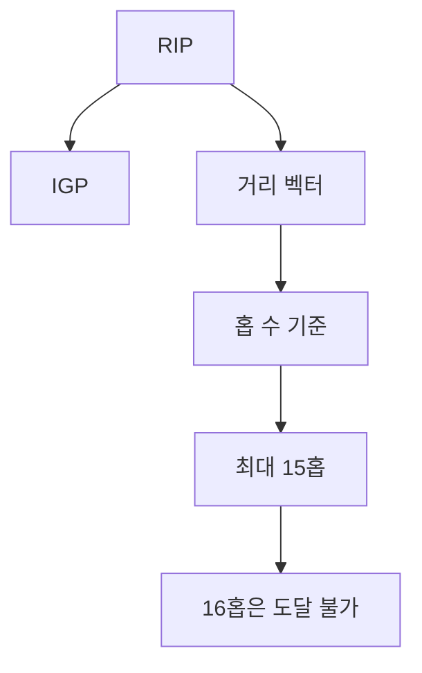
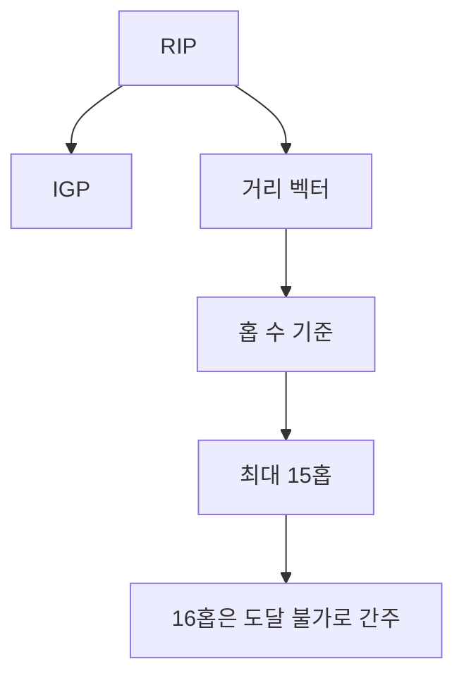

# 265 RIP(Routing Information Protocol)

작성 기준일: 2026-06-01
검색/보강일: 2026-06-04
기준 PDF: `/Users/nes0903/Documents/study/정보처리기사/핵심요약집_2026_정보처리기사필기핵심요약.pdf`
PDF 확인 위치: 38페이지 `265 RIP(Routing Information Protocol)`

## 한 줄 요약

- RIP은 IGP에 속하는 거리 벡터 라우팅 프로토콜로, 최대 홉 수를 15로 제한한다.

## 한눈에 보는 구조

## PDF 기준 핵심

- IGP에 속하는 라우팅 프로토콜이다.
- 거리 벡터 라우팅 프로토콜이라고도 불린다.
- 최대 홉(Hop) 수를 15로 제한한다.

## 개념 설명

- RIP은 라우터들이 목적지까지의 거리 정보를 이웃 라우터와 교환해 경로를 선택하는 프로토콜이다.
- 거리 기준은 주로 홉 수이며, 홉 수가 적은 경로를 선호한다.
- RFC 2453은 RIPv2를 정의하며 RIP 네트워크의 최대 직경을 15홉으로 제한한다.
- 구조가 단순하지만 큰 네트워크나 빠른 수렴이 필요한 환경에는 한계가 있다.

## 시험 포인트

- `RIP = 거리 벡터 + 최대 15홉`을 고정한다.
- IGP는 하나의 자율 시스템 내부에서 쓰이는 라우팅 프로토콜이다.
- OSPF는 링크 상태, RIP은 거리 벡터이다.
- 16홉은 도달 불가로 보는 RIP 한계를 함께 기억한다.

## 헷갈리는 비교

| 구분 | RIP | OSPF |
|---|---|---|
| 분류 | 거리 벡터 | 링크 상태 |
| 기준 | 홉 수 | 비용/링크 상태 |
| 제한 | 15홉 | 대규모 네트워크 적합 |
| 시험 단서 | IGP, Hop 15 | Shortest Path First |

## 예시 또는 암기 포인트

- 목적지까지 3개 라우터를 거치는 경로와 5개 라우터를 거치는 경로가 있으면 RIP은 3홉 경로를 선호한다.
- 암기식: `RIP은 15홉에서 Rest`.

## 빠른 복습

- RIP의 라우팅 방식은? 거리 벡터.
- 최대 홉 수는? 15.
- OSPF와의 차이는? OSPF는 링크 상태 기반이다.

## 상세 보강

- RIP는 자율 시스템 내부에서 사용하는 IGP이며 거리 벡터 라우팅 프로토콜이다.
- 라우팅 비용을 주로 홉 수로 계산하고, 최대 홉 수가 15로 제한된다.
- 16홉은 도달 불가능으로 간주되므로 큰 네트워크에는 적합하지 않다.
- OSPF가 링크 상태 기반으로 최단 경로를 계산하는 것과 구분한다.
- 시험에서는 `거리 벡터`, `IGP`, `최대 홉 수 15`가 나오면 RIP이다.

| 구분 | RIP | OSPF |
|---|---|---|
| 유형 | 거리 벡터 | 링크 상태 |
| 기준 | 홉 수 | 비용/링크 상태 |
| 규모 | 소규모에 적합 | 큰 네트워크에 적합 |
| 핵심 숫자 | 15홉 | 숫자보다 SPF |

## 참고 링크

- [RFC 2453 - RIP Version 2](https://datatracker.ietf.org/doc/rfc2453/)

<!-- study-links:start -->
## 관련 문서

- `ospf`: [[정보처리기사/5과목 정보시스템 구축 관리/266 OSPF(Open Shortest Path First protocol)/266 OSPF(Open Shortest Path First protocol)|266 OSPF(Open Shortest Path First protocol)]]
<!-- study-links:end -->
