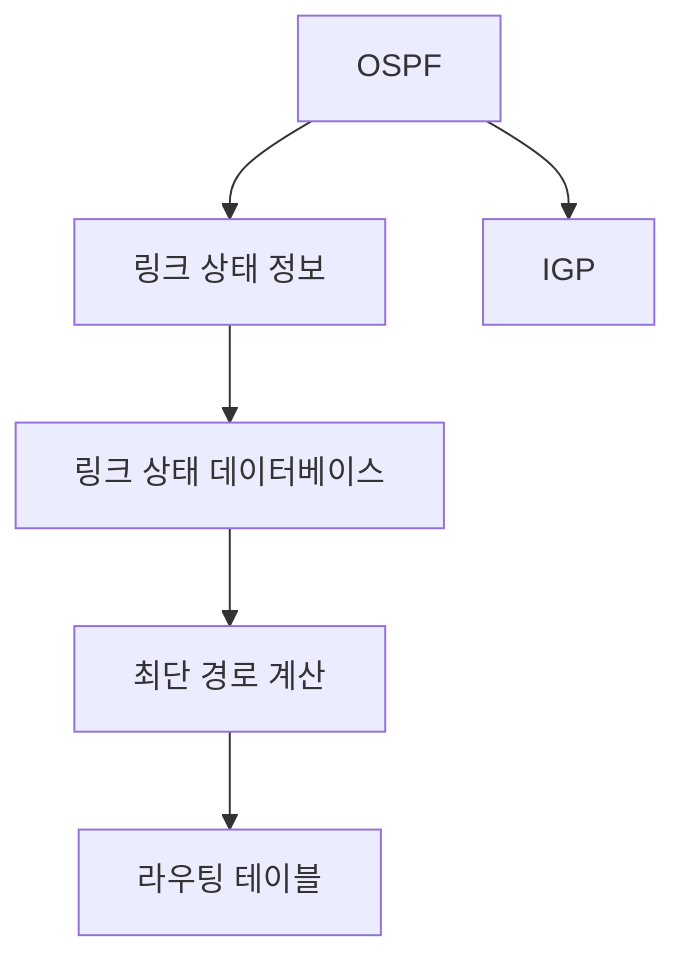
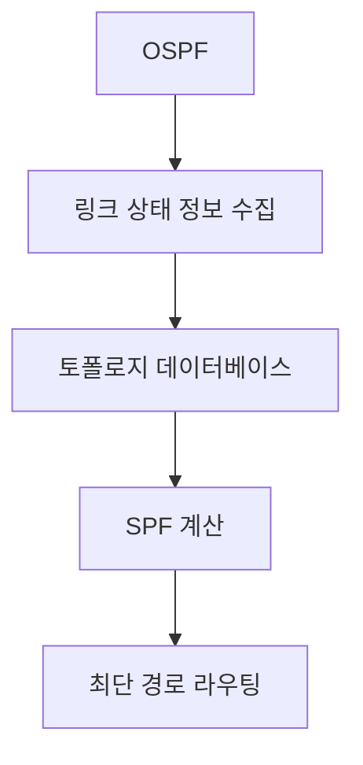

# 266 OSPF(Open Shortest Path First protocol)

작성 기준일: 2026-06-01
검색/보강일: 2026-06-04
기준 PDF: `/Users/nes0903/Documents/study/정보처리기사/핵심요약집_2026_정보처리기사필기핵심요약.pdf`
PDF 확인 위치: 38페이지 `266 OSPF(Open Shortest Path First protocol)`

## 한 줄 요약

- OSPF는 링크 상태 정보를 실시간으로 반영해 최단 경로 라우팅을 지원하는 IGP 라우팅 프로토콜이다.

## 한눈에 보는 구조

## PDF 기준 핵심

- 라우팅 정보에 노드 간의 거리 정보, 링크 상태 정보를 실시간으로 반영한다.
- 최단 경로로 라우팅을 지원하는 프로토콜이다.
- `링크 상태`, `실시간 반영`, `최단 경로`가 핵심 단서이다.

## 개념 설명

- OSPF는 Open Shortest Path First의 약자이다.
- 각 라우터가 링크 상태 정보를 광고하고, 모든 라우터가 네트워크 토폴로지 정보를 바탕으로 최단 경로 트리를 계산한다.
- RFC 2328은 OSPFv2를 링크 상태 또는 SPF 기술 기반 프로토콜로 정의한다.
- RIP보다 대규모 네트워크에 적합하고 빠른 수렴을 목표로 한다.

## 시험 포인트

- `OSPF = 링크 상태 + 최단 경로`로 외운다.
- RIP의 거리 벡터와 확실히 구분한다.
- OSPF는 IGP에 속한다.
- 노드 간 거리와 링크 상태 정보를 실시간 반영한다는 PDF 문구가 중요하다.

## 헷갈리는 비교

| 구분 | OSPF | RIP |
|---|---|---|
| 방식 | 링크 상태 | 거리 벡터 |
| 핵심 알고리즘 | SPF, Dijkstra 계열 | 홉 수 기반 |
| 규모 | 대규모에 유리 | 소규모에 적합 |
| 시험 단서 | Open Shortest Path First | Hop 15 |

## 예시 또는 암기 포인트

- 링크 비용이 낮은 경로를 계산해 최단 경로 트리를 만들고 라우팅 테이블을 갱신하는 흐름을 떠올린다.
- 암기식: `OSPF = Open Shortest Path First, 최단 경로 먼저`.

## 빠른 복습

- OSPF의 방식은? 링크 상태 라우팅.
- OSPF가 지원하는 경로는? 최단 경로.
- RIP과의 대표 차이는? RIP은 거리 벡터와 15홉 제한이다.

## 상세 보강

- OSPF는 링크 상태 라우팅 프로토콜로, 노드 간 거리와 링크 상태를 반영해 최단 경로를 계산한다.
- RIP가 홉 수 중심이라면 OSPF는 링크 비용과 네트워크 상태를 더 정교하게 반영한다.
- 토폴로지 변경이 발생하면 링크 상태 정보를 갱신하고 최단 경로를 다시 계산한다.
- PDF의 `노드 간 거리 정보`, `링크 상태 정보`, `실시간 반영`, `최단 경로`가 핵심이다.
- 시험에서는 OSPF를 RIP의 거리 벡터와 구분해 `Link State`, `Shortest Path First`로 외운다.

| 구분 | OSPF |
|---|---|
| 라우팅 방식 | 링크 상태 |
| 알고리즘 단서 | SPF, 최단 경로 |
| 정보 | 거리 정보 + 링크 상태 정보 |
| 비교 대상 | RIP는 거리 벡터, 15홉 제한 |

## 참고 링크

- [RFC 2328 - OSPF Version 2](https://www.rfc-editor.org/info/rfc2328/)

<!-- study-links:start -->
## 관련 문서

- `rip`: [[정보처리기사/5과목 정보시스템 구축 관리/265 RIP(Routing Information Protocol)/265 RIP(Routing Information Protocol)|265 RIP(Routing Information Protocol)]]
<!-- study-links:end -->
