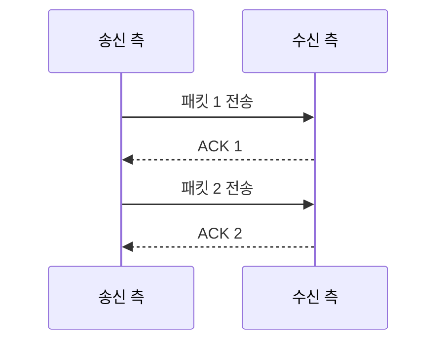
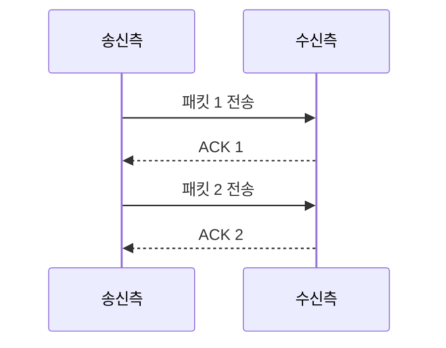

# 267 흐름 제어 - 정지-대기(Stop-and-Wait)

작성 기준일: 2026-06-01
검색/보강일: 2026-06-04
기준 PDF: `/Users/nes0903/Documents/study/정보처리기사/핵심요약집_2026_정보처리기사필기핵심요약.pdf`
PDF 확인 위치: 39페이지 `267 흐름 제어 - 정지-대기(Stop-and-Wait)`

## 한 줄 요약

- 정지-대기 방식은 한 번에 하나의 패킷만 보내고 ACK를 받은 뒤 다음 패킷을 보내는 가장 단순한 흐름 제어 방식이다.

## 한눈에 보는 구조

## PDF 기준 핵심

- 수신 측의 확인 신호(ACK)를 받은 후에 다음 패킷을 전송하는 방식이다.
- 한 번에 하나의 패킷만을 전송할 수 있다.
- `ACK`, `다음 패킷`, `한 번에 하나`가 핵심 단서이다.

## 개념 설명

- 송신자는 패킷 하나를 보내고 수신자의 확인 응답을 기다린다.
- ACK를 받기 전에는 다음 패킷을 보내지 않으므로 수신자가 감당할 수 있는 속도로 전송된다.
- 구조가 단순해 이해하기 쉽지만, 왕복 지연 시간이 큰 네트워크에서는 회선 이용률이 낮아진다.
- 슬라이딩 윈도우는 여러 프레임을 연속 전송할 수 있어 정지-대기보다 효율을 높인다.

## 시험 포인트

- `ACK 받은 후 다음 전송`이 정지-대기의 핵심이다.
- 한 번에 하나만 보내므로 효율이 낮다는 특징을 기억한다.
- 슬라이딩 윈도우와 비교해 출제될 수 있다.
- 흐름 제어와 오류 제어 문맥 모두에서 등장할 수 있지만, PDF에서는 흐름 제어로 제시한다.

## 헷갈리는 비교

| 구분 | 정지-대기 | 슬라이딩 윈도우 |
|---|---|---|
| 전송량 | 한 번에 하나 | 윈도우 크기만큼 여러 개 |
| ACK 대기 | 매 패킷마다 대기 | 누적/연속 전송 가능 |
| 효율 | 낮음 | 높음 |
| 시험 단서 | Stop-and-Wait | Window |

## 예시 또는 암기 포인트

- `보내고 멈춤 → ACK 확인 → 다음 전송` 순서로 외운다.
- 암기식: `Stop은 보내고 멈추는 것`.

## 빠른 복습

- 다음 패킷은 언제 보내는가? ACK를 받은 후.
- 한 번에 몇 개를 보내는가? 하나.
- 효율이 낮은 이유는? 매번 응답을 기다리기 때문이다.

## 상세 보강

- 정지-대기 방식은 송신자가 한 번에 하나의 패킷만 보내고, 수신자의 ACK를 받은 뒤 다음 패킷을 보내는 흐름 제어 방식이다.
- 구현이 단순하고 오류 제어와 결합하기 쉽지만, 전송 지연이 큰 환경에서는 회선 이용률이 낮다.
- ACK를 기다리는 동안 송신자는 다음 패킷을 보내지 못한다.
- 슬라이딩 윈도우는 여러 패킷을 연속 전송할 수 있어 정지-대기의 비효율을 줄인다.
- 시험에서는 `ACK 받은 후 다음 패킷`, `한 번에 하나의 패킷`이 핵심 단서이다.

| 구분 | 정지-대기 | 슬라이딩 윈도우 |
|---|---|---|
| 전송량 | 1개 패킷 후 대기 | 여러 패킷 연속 전송 |
| 장점 | 단순 | 효율 높음 |
| 단점 | 대기 시간 큼 | 제어 복잡 |

## 참고 링크

- [GeeksforGeeks - Stop and Wait ARQ](https://www.geeksforgeeks.org/computer-networks/stop-and-wait-arq/)
