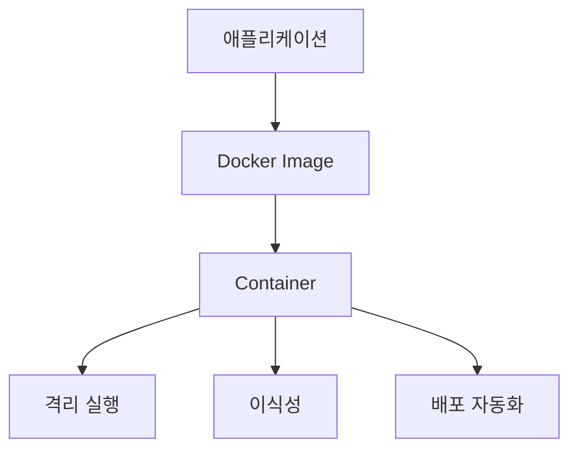
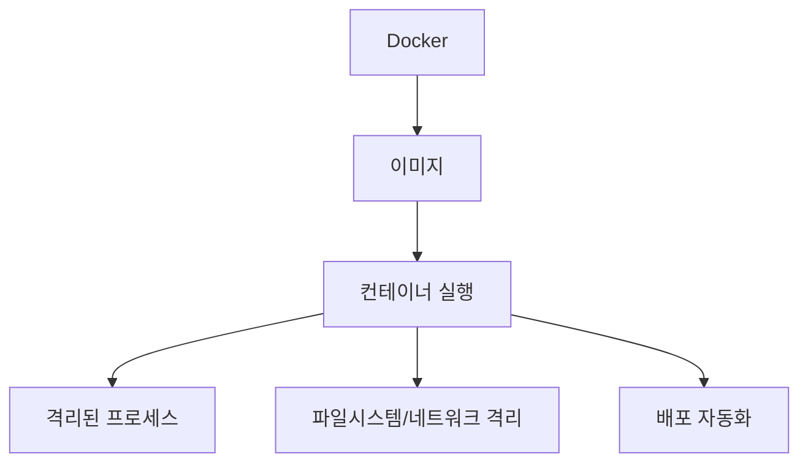

# 268 도커(Docker)

작성 기준일: 2026-06-01
검색/보강일: 2026-06-04
기준 PDF: `/Users/nes0903/Documents/study/정보처리기사/핵심요약집_2026_정보처리기사필기핵심요약.pdf`
PDF 확인 위치: 39페이지 `268 도커(Docker)`

## 한 줄 요약

- Docker는 컨테이너 기술을 자동화해 애플리케이션을 쉽게 빌드, 배포, 실행할 수 있게 하는 오픈소스 프로젝트이다.

## 한눈에 보는 구조

## PDF 기준 핵심

- 컨테이너 기술을 자동화하여 쉽게 사용할 수 있게 하는 오픈소스 프로젝트이다.
- `컨테이너`, `자동화`, `오픈소스`가 핵심 단서이다.

## 개념 설명

- 컨테이너는 애플리케이션과 실행에 필요한 파일, 라이브러리, 설정을 함께 묶어 격리된 환경에서 실행한다.
- Docker Engine은 애플리케이션을 빌드하고 컨테이너화하는 오픈소스 컨테이너화 기술로 설명된다.
- 이미지(Image)는 실행 템플릿이고, 컨테이너(Container)는 이미지가 실제 실행된 인스턴스이다.
- 가상머신보다 운영체제 커널을 공유하는 구조라 상대적으로 가볍게 실행될 수 있다.

## 시험 포인트

- Docker는 컨테이너 기술과 연결한다.
- `이미지`와 `컨테이너`를 구분한다.
- 가상머신은 하드웨어 가상화에 가깝고, 컨테이너는 OS 수준 격리에 가깝다.
- Docker는 배포 환경 차이를 줄이는 데 도움이 된다.

## 헷갈리는 비교

| 구분 | 컨테이너 | 가상머신 |
|---|---|---|
| 격리 수준 | OS 수준 | 하드웨어/OS 전체 |
| 실행 단위 | 이미지 기반 컨테이너 | 게스트 OS |
| 특징 | 가볍고 빠른 배포 | 강한 격리, 무거움 |
| 시험 단서 | Docker | Hypervisor |

## 예시 또는 암기 포인트

- 개발 PC와 운영 서버에서 같은 Docker 이미지를 실행하면 환경 차이를 줄일 수 있다.
- 암기식: `Docker = 앱을 컨테이너에 담아 운반`.

## 빠른 복습

- Docker의 핵심 기술은? 컨테이너.
- PDF에서 Docker의 성격은? 컨테이너 기술 자동화 오픈소스 프로젝트.
- 이미지와 컨테이너의 차이는? 이미지는 템플릿, 컨테이너는 실행 인스턴스.

## 상세 보강

- 도커는 컨테이너 기반 애플리케이션 실행과 배포를 쉽게 해 주는 오픈소스 플랫폼이다.
- 이미지는 애플리케이션과 실행 환경을 묶은 템플릿이고, 컨테이너는 이미지를 실행한 인스턴스이다.
- 가상머신은 하드웨어 가상화와 게스트 OS를 포함하는 경우가 많지만, 컨테이너는 호스트 OS 커널을 공유하며 프로세스를 격리한다.
- PDF의 핵심은 `컨테이너 기술 자동화`, `쉽게 사용`, `오픈소스 프로젝트`이다.
- 시험에서는 Docker를 Kubernetes와 구분한다. Docker는 컨테이너 실행/관리 도구, Kubernetes는 컨테이너 오케스트레이션 플랫폼이다.

| 구분 | Docker | VM |
|---|---|---|
| 격리 방식 | OS 수준 컨테이너 | 하드웨어/OS 가상화 |
| 구성 | 이미지와 컨테이너 | 게스트 OS 포함 |
| 장점 | 가볍고 배포가 빠름 | 강한 격리와 독립 OS |

## 참고 링크

- [Docker Docs - Docker Engine](https://docs.docker.com/engine/)
- [Docker - What is a Container?](https://www.docker.com/resources/what-container)
