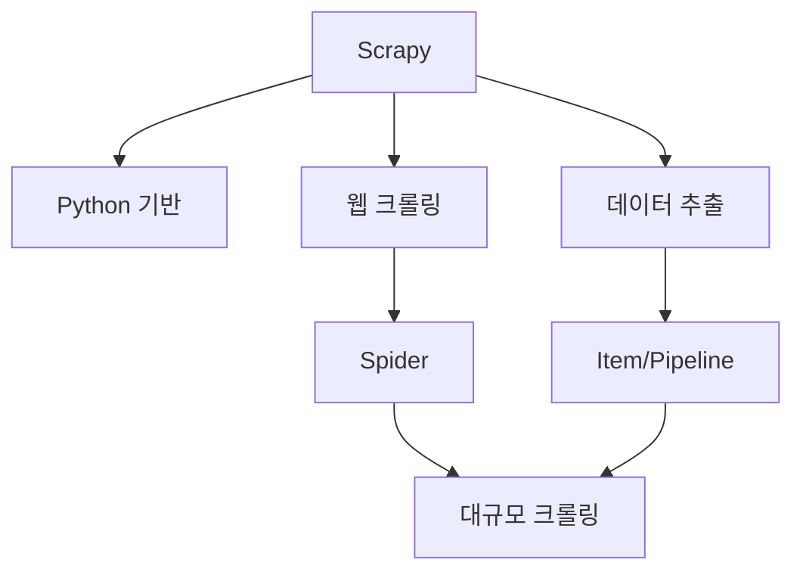
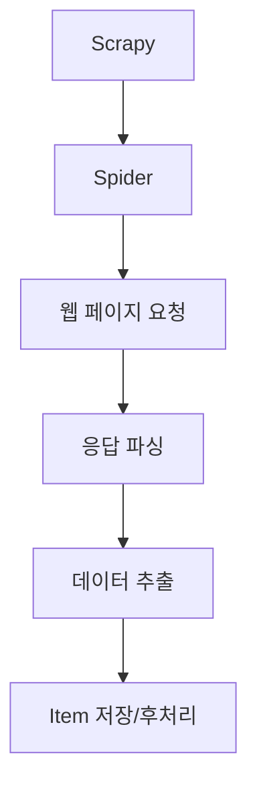

# 269 스크래피(Scrapy)

작성 기준일: 2026-06-01
검색/보강일: 2026-06-04
기준 PDF: `/Users/nes0903/Documents/study/정보처리기사/핵심요약집_2026_정보처리기사필기핵심요약.pdf`
PDF 확인 위치: 39페이지 `269 스크래피(Scrapy)`

## 한 줄 요약

- Scrapy는 Python 기반의 웹 크롤링 프레임워크로, 재사용성과 대규모 크롤링 프로젝트에 강점이 있다.

## 한눈에 보는 구조

## PDF 기준 핵심

- Python 기반의 웹 크롤링 프레임워크이다.
- 코드 재사용성을 높이는 데 도움이 된다.
- 대규모의 크롤링 프로젝트에 적합하다.

## 개념 설명

- Scrapy는 웹 사이트를 순회하며 구조화된 데이터를 추출하는 애플리케이션 프레임워크이다.
- Spider는 어떤 URL을 방문하고 어떤 데이터를 추출할지 정의한다.
- Pipeline은 추출한 데이터를 정제, 저장, 검증하는 흐름을 담당한다.
- Scrapy 공식 문서도 데이터 마이닝, 정보 처리, 아카이빙 등 다양한 목적의 구조화 데이터 추출에 사용할 수 있다고 설명한다.

## 시험 포인트

- `Python`, `웹 크롤링`, `프레임워크`, `대규모 크롤링`을 묶어 외운다.
- 단순 HTTP 라이브러리가 아니라 크롤링 구조를 제공하는 프레임워크이다.
- 웹 크롤링은 웹 페이지를 탐색하며 데이터를 수집하는 활동이고, 스크래핑은 필요한 데이터를 추출하는 활동으로 구분할 수 있다.
- 코드 재사용성 향상이라는 PDF 문구를 놓치지 않는다.

## 헷갈리는 비교

| 구분 | Scrapy | 일반 requests 스크립트 |
|---|---|---|
| 성격 | 크롤링 프레임워크 | HTTP 요청 라이브러리 사용 코드 |
| 강점 | 재사용 구조, 대규모 처리 | 단순 작업에 빠름 |
| 구성 | Spider, Pipeline 등 | 개발자가 직접 구성 |
| 시험 단서 | Python 기반 웹 크롤링 프레임워크 | 단순 요청 |

## 예시 또는 암기 포인트

- 여러 사이트의 뉴스 제목과 날짜를 주기적으로 수집해 저장하는 크롤러를 만들 때 Scrapy를 사용할 수 있다.
- 암기식: `Scrapy = Python 크롤링 프레임워크`.

## 빠른 복습

- Scrapy의 언어 기반은? Python.
- Scrapy가 적합한 프로젝트는? 대규모 웹 크롤링.
- PDF의 장점은? 코드 재사용성 향상.

## 상세 보강

- 스크래피는 Python 기반의 웹 크롤링·웹 스크래핑 프레임워크이다.
- 크롤링은 페이지를 따라가며 수집하는 활동, 스크래핑은 페이지에서 필요한 구조화 데이터를 추출하는 활동으로 이해한다.
- 코드 재사용성이 높고, 요청 처리·파싱·파이프라인·동시성 처리 같은 대규모 수집 기능을 프레임워크로 제공한다.
- PDF의 `Python 기반`, `웹 크롤링 프레임워크`, `코드 재사용성`, `대규모 크롤링 프로젝트`가 핵심이다.
- 시험에서는 Scrapy를 검색 엔진이나 데이터베이스가 아니라 웹 수집 프레임워크로 구분한다.

| 구분 | 의미 |
|---|---|
| Spider | 어떤 URL을 방문하고 무엇을 추출할지 정의 |
| Selector | HTML/XML에서 데이터 선택 |
| Item | 추출한 데이터 구조 |
| Pipeline | 저장, 정제, 후처리 |

## 참고 링크

- [Scrapy official site](https://www.scrapy.org/)
- [Scrapy at a glance](https://docs.scrapy.org/en/master/intro/overview.html)
