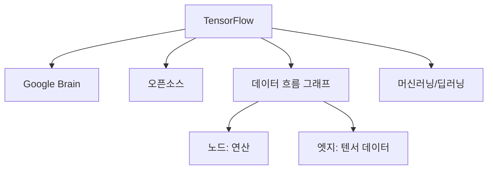
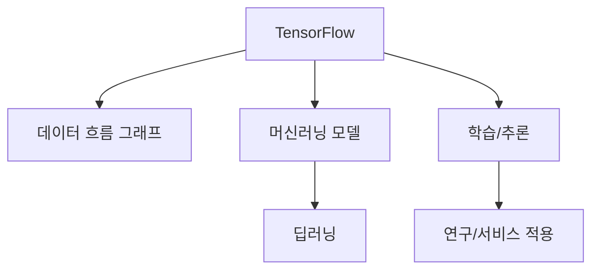

# 270 텐서플로(TensorFlow)

작성 기준일: 2026-06-01
검색/보강일: 2026-06-04
기준 PDF: `/Users/nes0903/Documents/study/정보처리기사/핵심요약집_2026_정보처리기사필기핵심요약.pdf`
PDF 확인 위치: 39페이지 `270 텐서플로(TensorFlow)`

## 한 줄 요약

- TensorFlow는 Google Brain 팀이 만든 데이터 흐름 프로그래밍 기반의 오픈소스 머신러닝 라이브러리이다.

## 한눈에 보는 구조

## PDF 기준 핵심

- 구글의 구글 브레인(Google Brain) 팀이 만들었다.
- 다양한 작업에 대해 데이터 흐름 프로그래밍을 위한 오픈소스 소프트웨어 라이브러리이다.
- `Google Brain`, `데이터 흐름`, `오픈소스 라이브러리`가 핵심 단서이다.

## 개념 설명

- TensorFlow는 머신러닝 모델을 정의하고 학습·추론을 수행하기 위한 플랫폼이다.
- 이름의 Tensor는 다차원 배열 데이터를 의미하며, Flow는 연산 그래프를 따라 데이터가 흐르는 구조를 뜻한다.
- Google Open Source 페이지는 TensorFlow를 머신러닝을 위한 end-to-end 오픈소스 플랫폼으로 설명한다.
- CPU, GPU, TPU 등 다양한 실행 환경을 지원한다.

## 시험 포인트

- `Google Brain`과 `TensorFlow`를 연결한다.
- 데이터 흐름 프로그래밍이라는 표현을 기억한다.
- TensorFlow는 일반 웹 프레임워크가 아니라 머신러닝/데이터 흐름 연산 라이브러리이다.
- 딥러닝 프레임워크 예시로 PyTorch와 비교될 수 있지만, PDF 핵심은 TensorFlow의 출처와 성격이다.

## 헷갈리는 비교

| 구분 | TensorFlow | Scrapy |
|---|---|---|
| 분야 | 머신러닝/딥러닝 | 웹 크롤링 |
| 기반 | 데이터 흐름 그래프 | Spider/Pipeline |
| 만든 곳 | Google Brain | Scrapy 커뮤니티 |
| 시험 단서 | 텐서, 데이터 흐름 | Python 크롤링 |

## 예시 또는 암기 포인트

- 이미지 분류 모델을 학습시키거나 텍스트 모델을 배포할 때 TensorFlow를 사용할 수 있다.
- 암기식: `TensorFlow = 텐서가 그래프를 흐른다`.

## 빠른 복습

- TensorFlow를 만든 팀은? Google Brain.
- TensorFlow의 성격은? 오픈소스 소프트웨어 라이브러리/플랫폼.
- PDF의 핵심 프로그래밍 방식은? 데이터 흐름 프로그래밍.

## 상세 보강

- 텐서플로는 Google Brain 팀에서 만든 오픈소스 머신러닝 라이브러리·플랫폼이다.
- 이름의 Tensor는 다차원 배열 데이터를, Flow는 연산 흐름을 떠올리면 된다.
- 다양한 머신러닝·딥러닝 모델을 만들고 학습시키며, 연구와 실제 서비스 배포에 모두 사용된다.
- PDF의 `데이터 흐름 프로그래밍`, `오픈소스 소프트웨어 라이브러리`, `구글 브레인`이 핵심이다.
- 시험에서는 TensorFlow를 하둡/맵리듀스 같은 분산 데이터 처리 프레임워크와 구분한다. TensorFlow는 AI/ML 모델 구현에 초점이 있다.

| 구분 | TensorFlow | Hadoop |
|---|---|---|
| 초점 | 머신러닝 모델 개발 | 대용량 분산 저장/처리 |
| 핵심 단서 | Tensor, Google Brain, ML | HDFS, MapReduce |
| 산출물 | 학습된 모델 | 분산 처리 결과 |

## 참고 링크

- [TensorFlow - Google Open Source](https://opensource.google/projects/tensorflow)
- [TensorFlow: A system for large-scale machine learning](https://arxiv.org/abs/1605.08695)
