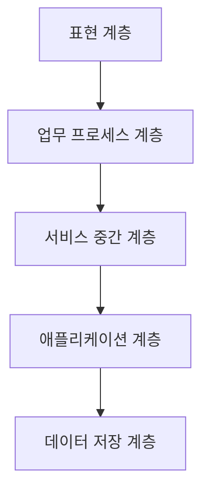

# 271 서비스 지향 아키텍처(SOA) 기반 애플리케이션 구성 계층

작성 기준일: 2026-06-01
검색/보강일: 2026-06-04
기준 PDF: `/Users/nes0903/Documents/study/정보처리기사/핵심요약집_2026_정보처리기사필기핵심요약.pdf`
PDF 확인 위치: 39페이지 `271 서비스 지향 아키텍처(SOA) 기반 애플리케이션 구성 계층`

## 한 줄 요약

- SOA 기반 애플리케이션은 표현, 업무 프로세스, 서비스 중간, 애플리케이션, 데이터 저장 계층으로 구성된다.

## 한눈에 보는 구조

## PDF 기준 핵심

- 표현(Presentation) 계층.
- 업무 프로세스(Biz-Process) 계층.
- 서비스 중간(Service Intermediary) 계층.
- 애플리케이션(Application) 계층.
- 데이터 저장(Persistency) 계층.

## 개념 설명

- SOA(Service-Oriented Architecture)는 기능을 서비스 단위로 분리하고, 표준 인터페이스로 조합해 업무를 구성하는 아키텍처이다.
- 표현 계층은 사용자와 직접 만나는 화면이나 인터페이스를 담당한다.
- 업무 프로세스 계층은 여러 서비스를 조합해 업무 흐름을 구성한다.
- 서비스 중간 계층은 서비스 호출, 변환, 라우팅, 중재 역할을 담당한다.
- 애플리케이션 계층은 실제 비즈니스 기능을 수행하고, 데이터 저장 계층은 영속 데이터를 관리한다.

## 시험 포인트

- PDF에 나온 5개 계층 이름을 순서와 함께 외운다.
- `서비스 중간 계층`은 서비스 호출과 중재 역할로 이해한다.
- SOA는 서비스 재사용과 느슨한 결합을 목표로 한다.
- 단순 3계층 구조와 섞이지 않도록 PDF 계층명을 그대로 기억한다.

## 헷갈리는 비교

| 계층 | 핵심 역할 | 시험 단서 |
|---|---|---|
| 표현 | 사용자 인터페이스 | Presentation |
| 업무 프로세스 | 서비스 조합 업무 흐름 | Biz-Process |
| 서비스 중간 | 중재, 라우팅, 변환 | Intermediary |
| 애플리케이션 | 비즈니스 기능 | Application |
| 데이터 저장 | 영속 데이터 | Persistency |

## 예시 또는 암기 포인트

- 주문 화면은 표현 계층, 주문 승인 흐름은 업무 프로세스 계층, 재고/결제 서비스 중재는 서비스 중간 계층으로 볼 수 있다.
- 암기식: `표-업-중-앱-데`.

## 빠른 복습

- SOA 구성 계층은 몇 개인가? 5개.
- 서비스 호출 중재와 연결되는 계층은? 서비스 중간 계층.
- 데이터 저장과 연결되는 계층은? Persistency 계층.

## 상세 보강

- SOA는 기능을 독립적인 서비스로 구성하고, 서비스 간 조합으로 업무 프로세스를 구현하는 아키텍처 사고이다.
- 표현 계층은 사용자 화면과 인터페이스를 담당한다.
- 업무 프로세스 계층은 여러 서비스를 조합해 실제 업무 흐름을 만든다.
- 서비스 중간 계층은 서비스 호출, 중개, 변환, 라우팅 같은 역할을 수행한다.
- 애플리케이션 계층은 실제 비즈니스 기능을 제공하고, 데이터 저장 계층은 데이터베이스와 영속성을 담당한다.

| 계층 | 역할 | 시험 단서 |
|---|---|---|
| 표현 | 사용자 접점 | UI, 화면 |
| 업무 프로세스 | 업무 흐름 조합 | Biz-Process |
| 서비스 중간 | 서비스 중개 | Intermediary |
| 애플리케이션 | 업무 기능 구현 | Application |
| 데이터 저장 | 데이터 보관 | Persistency |

## 참고 링크

- [CMU SEI - Architecting Service-Oriented Systems](https://www.sei.cmu.edu/documents/2206/2011_004_001_15353.pdf)
