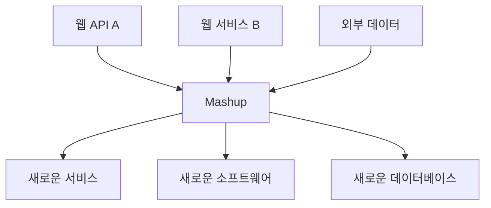
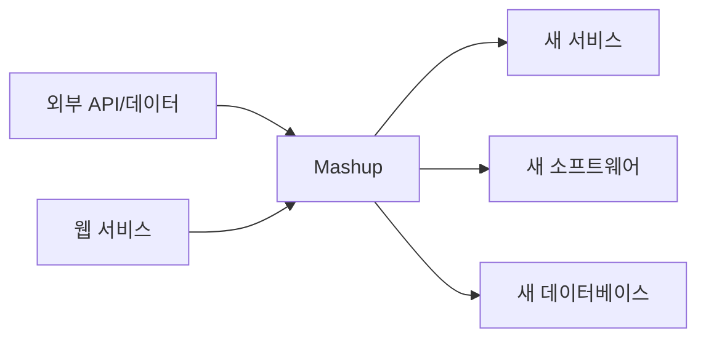

# 272 매시업(Mashup)

작성 기준일: 2026-06-01
검색/보강일: 2026-06-04
기준 PDF: `/Users/nes0903/Documents/study/정보처리기사/핵심요약집_2026_정보처리기사필기핵심요약.pdf`
PDF 확인 위치: 39페이지 `272 매시업(Mashup)`

## 한 줄 요약

- 매시업은 웹에서 제공되는 정보와 서비스를 결합해 새로운 소프트웨어, 서비스, 데이터베이스를 만드는 기술이다.

## 한눈에 보는 구조

## PDF 기준 핵심

- 웹에서 제공하는 정보 및 서비스를 이용한다.
- 새로운 소프트웨어나 서비스, 데이터베이스 등을 만드는 기술이다.
- `웹 정보`, `서비스 결합`, `새로운 서비스 생성`이 핵심 단서이다.

## 개념 설명

- 매시업은 여러 출처의 데이터, API, 서비스를 조합해 원래 없던 기능이나 화면을 만든다.
- 지도 API와 부동산 매물 데이터를 결합해 지도 기반 매물 서비스를 만드는 것이 대표적인 예이다.
- Webopedia는 매시업을 서로 다른 웹 사이트의 서비스와 데이터를 섞어 새로운 웹 기반 애플리케이션을 만드는 개념으로 설명한다.
- API, RSS, REST, 웹 서비스 같은 공개 인터페이스가 매시업을 가능하게 한다.

## 시험 포인트

- `이미 존재하는 웹 정보/서비스 + 새로운 서비스`가 매시업의 핵심이다.
- SOA가 서비스 중심 아키텍처라면, 매시업은 외부 서비스와 데이터를 조합해 새 결과물을 만드는 응용 기술이다.
- 단순 링크 모음이 아니라 기능적으로 결합된 결과물을 만든다.
- 데이터베이스까지 만들 수 있다는 PDF 표현을 기억한다.

## 헷갈리는 비교

| 구분 | 매시업 | SOA |
|---|---|---|
| 초점 | 웹 정보와 서비스 조합 | 서비스 단위 아키텍처 |
| 결과 | 새 소프트웨어/서비스/DB | 재사용 가능한 서비스 구조 |
| 단서 | API 결합, 웹 데이터 | 느슨한 결합, 서비스 계층 |

## 예시 또는 암기 포인트

- 날씨 API와 지도 API를 결합해 지역별 날씨 지도를 만드는 것이 매시업이다.
- 암기식: `Mashup = 섞어서 새 서비스`.

## 빠른 복습

- 매시업의 재료는? 웹 정보와 웹 서비스.
- 결과물은? 새로운 소프트웨어, 서비스, 데이터베이스 등.
- 단순 복사와 다른 점은? 여러 자원을 결합해 새로운 기능을 만든다.

## 상세 보강

- 매시업은 웹에서 제공되는 정보, API, 서비스, 데이터를 조합해 새로운 서비스를 만드는 기술이다.
- 지도 API와 교통 정보, 날씨 정보, 매장 데이터를 합쳐 새로운 위치 기반 서비스를 만드는 예가 전형적이다.
- 핵심은 직접 모든 데이터를 만들지 않고 기존 공개 정보와 서비스를 결합한다는 점이다.
- PDF의 `웹에서 제공하는 정보 및 서비스`, `새로운 소프트웨어나 서비스, 데이터베이스`가 핵심이다.
- 시험에서는 매시업을 SOA와 비교할 수 있다. SOA는 서비스 지향 구조, 매시업은 기존 웹 자원의 조합으로 새 서비스를 만드는 기술이다.

| 구분 | 매시업 | SOA |
|---|---|---|
| 초점 | 외부 정보/서비스 조합 | 서비스 기반 아키텍처 |
| 결과 | 새 웹 서비스/소프트웨어 | 느슨한 결합 구조 |
| 단서 | API 조합, 지도+데이터 | 서비스 계층, 프로세스 |

## 참고 링크

- [Webopedia - Mash-Up](https://www.webopedia.com/definitions/mash-up/)
