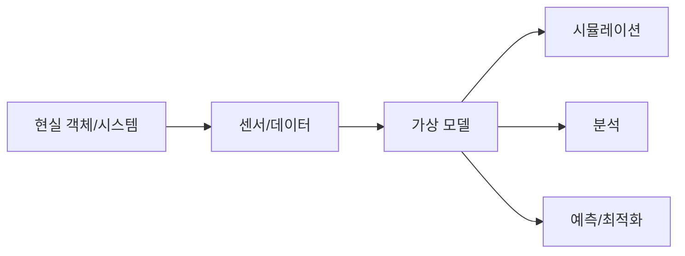
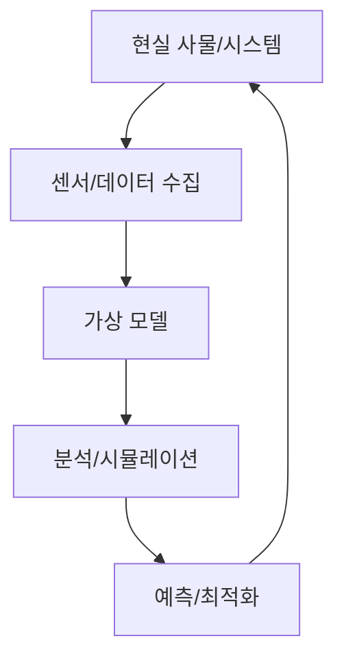

# 273 디지털 트윈(Digital Twin)

작성 기준일: 2026-06-01
검색/보강일: 2026-06-04
기준 PDF: `/Users/nes0903/Documents/study/정보처리기사/핵심요약집_2026_정보처리기사필기핵심요약.pdf`
PDF 확인 위치: 39페이지 `273 디지털 트윈(Digital Twin)`

## 한 줄 요약

- 디지털 트윈은 현실의 사물이나 시스템을 소프트웨어로 가상화한 모델이다.

## 한눈에 보는 구조

## PDF 기준 핵심

- 현실 속의 사물을 소프트웨어로 가상화한 모델이다.
- `현실 사물`, `소프트웨어`, `가상화 모델`이 핵심 단서이다.

## 개념 설명

- 디지털 트윈은 물리 객체나 시스템의 상태, 구조, 동작을 디지털 모델로 표현한다.
- 센서 데이터와 운영 데이터를 연결하면 실제 대상의 현재 상태를 가상 공간에서 관찰하고 분석할 수 있다.
- IBM은 디지털 트윈을 실제 물체를 정확히 반영하도록 설계된 가상 표현으로 설명한다.
- 제조, 스마트시티, 에너지, 설비 예지보전, 시뮬레이션 분야에서 사용된다.

## 시험 포인트

- `현실 사물의 가상화 모델`이라는 짧은 정의를 먼저 외운다.
- 단순 3D 모델과 달리 실제 데이터와 연결되어 분석·예측에 쓰일 수 있다.
- IoT, 센서, 시뮬레이션, 예측 유지보수 단서와 함께 나올 수 있다.
- 메타버스와 혼동하지 말고 현실 객체의 디지털 복제/모델이라는 점을 본다.

## 헷갈리는 비교

| 구분 | 디지털 트윈 | 일반 시뮬레이션 |
|---|---|---|
| 대상 | 실제 사물/시스템의 디지털 모델 | 가정된 모델 |
| 데이터 | 실제 운영 데이터와 연결 가능 | 입력값 중심 |
| 목적 | 모니터링, 분석, 예측 | 실험, 검증 |
| 시험 단서 | 현실 사물 가상화 | 모델 실험 |

## 예시 또는 암기 포인트

- 공장 설비의 센서 데이터를 기반으로 가상 설비 모델을 만들고 고장을 예측하면 디지털 트윈이다.
- 암기식: `현실의 쌍둥이를 디지털로`.

## 빠른 복습

- 디지털 트윈이란? 현실 속 사물을 소프트웨어로 가상화한 모델.
- 어떤 데이터와 연결될 수 있는가? 센서와 운영 데이터.
- 활용 예는? 예지보전, 시뮬레이션, 최적화.

## 상세 보강

- 디지털 트윈은 현실 세계의 사물, 공정, 설비, 도시 등을 소프트웨어 모델로 가상화한 것이다.
- 단순 3D 모델과 달리 실제 상태 데이터, 시뮬레이션, 예측, 최적화와 연결될 수 있다.
- 제조 설비의 고장 예측, 공장 운영 최적화, 도시 교통 분석 같은 분야에 활용된다.
- PDF의 핵심은 짧다: `현실 속의 사물을 소프트웨어로 가상화한 모델`.
- 시험에서는 디지털 트윈을 VR/AR과 혼동하지 않는다. VR/AR은 사용자 경험 기술이고, 디지털 트윈은 실제 대상의 가상 모델이다.

| 구분 | 디지털 트윈 | 시뮬레이션 |
|---|---|---|
| 대상 | 현실 사물의 가상 모델 | 가정 기반 모델 |
| 데이터 | 실제 상태 데이터와 연결 가능 | 독립 데이터 가능 |
| 목적 | 모니터링, 예측, 최적화 | 실험, 분석 |

## 참고 링크

- [IBM - What is a Digital Twin?](https://www.ibm.com/think/topics/digital-twin1)
- [Microsoft Learn - Azure Digital Twins](https://learn.microsoft.com/en-us/azure/digital-twins/overview)
