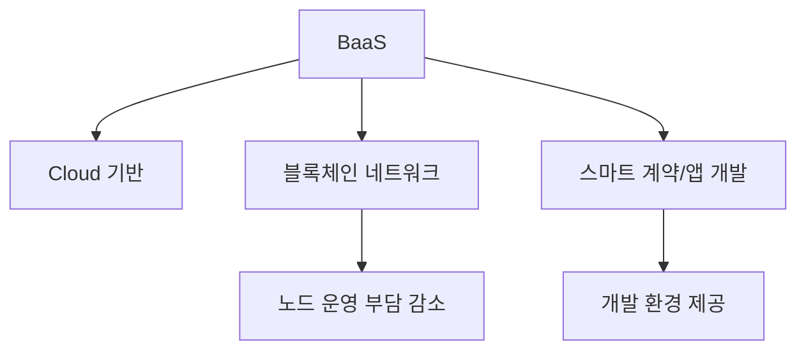
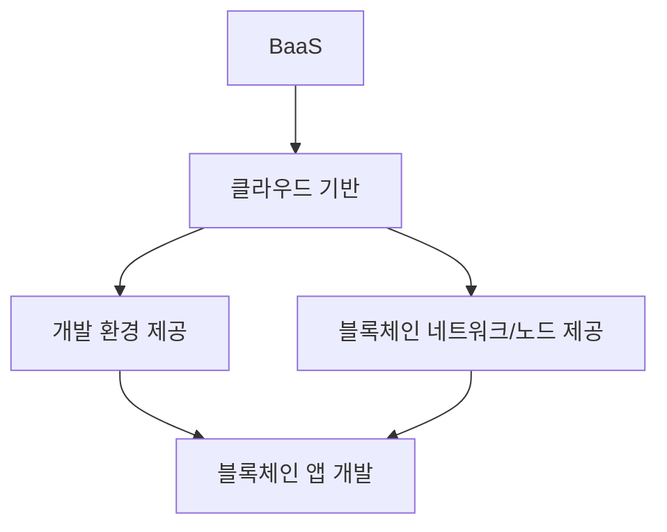

# 274 서비스형 블록체인(BaaS)

작성 기준일: 2026-06-01
검색/보강일: 2026-06-04
기준 PDF: `/Users/nes0903/Documents/study/정보처리기사/핵심요약집_2026_정보처리기사필기핵심요약.pdf`
PDF 확인 위치: 39페이지 `274 서비스형 블록체인(BaaS)`

## 한 줄 요약

- BaaS는 블록체인 앱 개발과 운영에 필요한 환경을 클라우드 기반 서비스로 제공하는 모델이다.

## 한눈에 보는 구조

## PDF 기준 핵심

- 블록체인(Blockchain) 앱의 개발 환경을 클라우드 기반으로 제공하는 서비스이다.
- `블록체인 앱`, `개발 환경`, `클라우드 기반`이 핵심 단서이다.

## 개념 설명

- BaaS(Blockchain as a Service)는 사용자가 직접 블록체인 인프라를 구축하지 않고 클라우드에서 제공되는 환경을 이용하게 한다.
- 노드 구성, 네트워크 설정, 모니터링, 확장 같은 운영 부담을 줄일 수 있다.
- IBM Blockchain Platform 자료도 클라우드 기반 서비스로 블록체인 네트워크 구성과 배포를 지원하는 형태를 설명한다.
- PaaS가 일반 애플리케이션 플랫폼이면, BaaS는 블록체인 애플리케이션과 네트워크에 특화된 서비스이다.

## 시험 포인트

- BaaS는 `Blockchain as a Service`이다.
- 클라우드 기반 개발 환경 제공이라는 PDF 문구가 핵심이다.
- SaaS와 혼동하지 않는다. BaaS는 완성 앱 사용보다 블록체인 앱 개발·운영 환경에 초점이 있다.
- 스마트 계약, 노드, 블록체인 네트워크 단서와 함께 나올 수 있다.

## 헷갈리는 비교

| 구분 | PaaS | BaaS |
|---|---|---|
| 대상 | 일반 애플리케이션 개발 플랫폼 | 블록체인 앱/네트워크 개발 환경 |
| 기반 | 클라우드 플랫폼 | 클라우드 + 블록체인 |
| 시험 단서 | Platform | Blockchain |

## 예시 또는 암기 포인트

- 클라우드에서 블록체인 네트워크를 만들고 스마트 계약을 배포하는 관리형 서비스가 BaaS이다.
- 암기식: `BaaS = Blockchain을 Service로`.

## 빠른 복습

- BaaS의 전체 의미는? Blockchain as a Service.
- 제공하는 것은? 블록체인 앱 개발 환경.
- 제공 방식은? 클라우드 기반.

## 상세 보강

- BaaS는 Blockchain as a Service로, 블록체인 앱 개발과 운영에 필요한 환경을 클라우드 기반으로 제공하는 서비스이다.
- 사용자는 블록체인 인프라를 직접 구축하지 않고 스마트 계약, 노드, 네트워크 관리 기능을 서비스로 이용할 수 있다.
- PDF의 핵심은 `블록체인 앱의 개발 환경`, `클라우드 기반 제공`이다.
- SaaS가 완성 애플리케이션 사용에 가깝다면 BaaS는 블록체인 개발·운영 플랫폼 제공에 가깝다.
- 시험에서는 BaaS를 백엔드 서비스(BaaS, Backend as a Service)와 혼동하지 않도록 `Blockchain` 단서를 확인한다.

| 구분 | BaaS | PaaS |
|---|---|---|
| 대상 | 블록체인 앱/네트워크 | 일반 애플리케이션 개발 플랫폼 |
| 핵심 | 노드, 체인, 스마트 계약 환경 | 런타임, 미들웨어, 배포 환경 |
| 공통점 | 클라우드 기반 서비스 모델 | 클라우드 기반 플랫폼 |

## 참고 링크

- [IBM Developer - IBM Blockchain Platform](https://developer.ibm.com/tutorials/quick-start-guide-for-ibm-blockchain-platform/)
