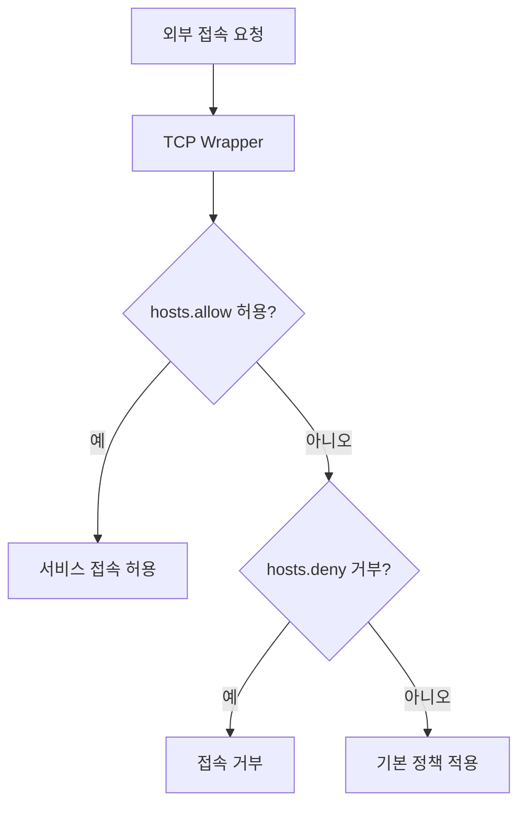
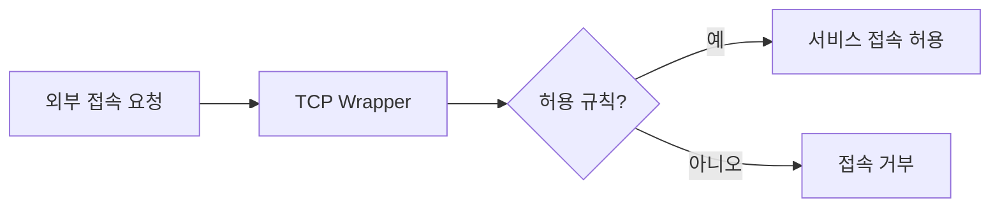

# 275 TCP 래퍼(TCP Wrapper)

작성 기준일: 2026-06-01
검색/보강일: 2026-06-04
기준 PDF: `/Users/nes0903/Documents/study/정보처리기사/핵심요약집_2026_정보처리기사필기핵심요약.pdf`
PDF 확인 위치: 39페이지 `275 TCP 래퍼(TCP Wrapper)`

## 한 줄 요약

- TCP Wrapper는 외부 컴퓨터의 접속 인가 여부를 확인해 서비스 접속을 허용하거나 거부하는 보안 도구이다.

## 한눈에 보는 구조

## PDF 기준 핵심

- 외부 컴퓨터의 접속 인가 여부를 점검한다.
- 접속을 허용 및 거부하는 보안용 도구이다.
- `접속 인가`, `허용`, `거부`, `보안 도구`가 핵심 단서이다.

## 개념 설명

- TCP Wrapper는 네트워크 서비스 앞에서 접근 제어를 수행하는 래퍼 프로그램/라이브러리이다.
- 전통적으로 `/etc/hosts.allow`, `/etc/hosts.deny` 파일을 사용해 호스트별 접근 허용과 거부를 설정한다.
- Red Hat 문서도 TCP Wrapper가 `hosts.allow`, `hosts.deny` 규칙에 따라 접근 제어를 수행한다고 설명한다.
- 패킷 내용을 깊게 분석하는 DPI와 달리, TCP Wrapper는 접속 허용 여부 통제가 중심이다.

## 시험 포인트

- `외부 컴퓨터 접속 인가 여부 점검`이라는 PDF 문구를 그대로 기억한다.
- 허용/거부 제어가 핵심이며, 침입 탐지 시스템과 구분한다.
- TCP Wrapper는 호스트 기반 접근 제어와 연결된다.
- `/etc/hosts.allow`, `/etc/hosts.deny`가 함께 나오면 TCP Wrapper 단서이다.

## 헷갈리는 비교

| 구분 | TCP Wrapper | DPI | IDS |
|---|---|---|---|
| 초점 | 접속 허용/거부 | 패킷 내부 검사 | 비정상 행위 탐지 |
| 단서 | hosts.allow/deny | Deep Packet | Intrusion Detection |
| 성격 | 접근 제어 도구 | 분석 기술 | 탐지 시스템 |

## 예시 또는 암기 포인트

- 특정 IP에서 SSH 접속을 못 하도록 `hosts.deny`에 차단 규칙을 두는 방식이 TCP Wrapper 맥락이다.
- 암기식: `Wrapper는 서비스 앞에서 감싸고 검사`.

## 빠른 복습

- TCP Wrapper의 역할은? 외부 접속 인가 여부 점검과 허용/거부.
- 주로 쓰는 설정 파일은? hosts.allow, hosts.deny.
- DPI와 차이는? DPI는 패킷 내부 콘텐츠를 분석한다.

## 상세 보강

- TCP 래퍼는 네트워크 서비스에 들어오는 외부 접속을 검사해 허용 또는 거부하는 보안 도구이다.
- 전통적으로 `hosts.allow`, `hosts.deny` 같은 접근 제어 파일과 연결해 설명된다.
- 방화벽이 네트워크 경계의 패킷 필터링에 가깝다면, TCP 래퍼는 서비스 접근 요청 단위의 허용/거부 제어로 이해하면 쉽다.
- PDF의 `외부 컴퓨터의 접속 인가 여부`, `허용 및 거부`가 핵심이다.
- 시험에서는 TCP 래퍼를 암호화 프로토콜이나 IDS로 착각하지 않는다. 목적은 접속 통제이다.

| 구분 | TCP Wrapper | IDS | 방화벽 |
|---|---|---|
| 목적 | 서비스 접속 허용/거부 | 침입 탐지 | 네트워크 접근 제어 |
| 단서 | 접속 인가 여부 | 비정상 사용 탐지 | 패킷/포트 정책 |

## 참고 링크

- [Red Hat Docs - TCP Wrappers Configuration Files](https://docs.redhat.com/en/documentation/red_hat_enterprise_linux/6/html/security_guide/sect-security_guide-tcp_wrappers_and_xinetd-tcp_wrappers_configuration_files)

<!-- study-links:start -->
## 관련 문서

- `침입 탐지 시스템`: [[정보처리기사/5과목 정보시스템 구축 관리/322 침입 탐지 시스템(IDS; Intrusion Detection System)/322 침입 탐지 시스템(IDS; Intrusion Detection System)|322 침입 탐지 시스템(IDS; Intrusion Detection System)]]
- `dpi`: [[정보처리기사/5과목 정보시스템 구축 관리/276 DPI(Deep Packet Inspection)/276 DPI(Deep Packet Inspection)|276 DPI(Deep Packet Inspection)]]
- `ssh`: [[정보처리기사/5과목 정보시스템 구축 관리/324 SSH(Secure SHell, 시큐어 셸)/324 SSH(Secure SHell, 시큐어 셸)|324 SSH(Secure SHell, 시큐어 셸)]]
<!-- study-links:end -->
