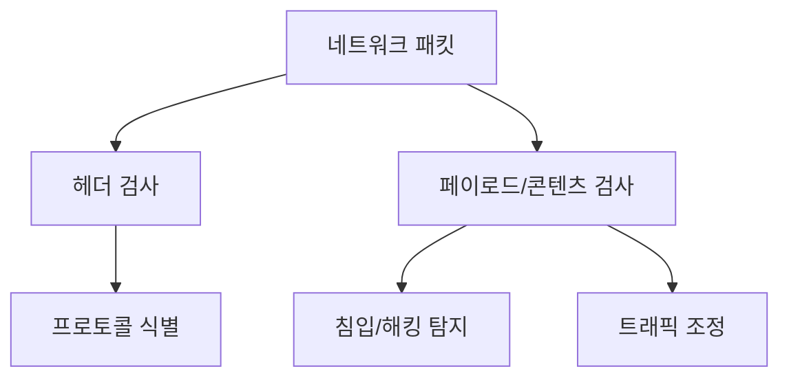
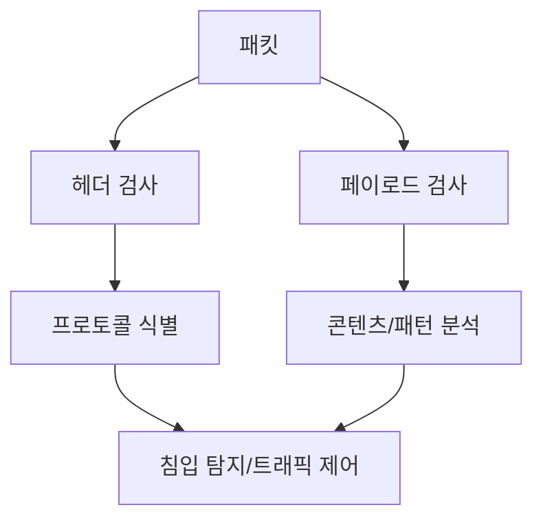

# 276 DPI(Deep Packet Inspection)

작성 기준일: 2026-06-01
검색/보강일: 2026-06-04
기준 PDF: `/Users/nes0903/Documents/study/정보처리기사/핵심요약집_2026_정보처리기사필기핵심요약.pdf`
PDF 확인 위치: 39페이지 `276 DPI(Deep Packet Inspection)`

## 한 줄 요약

- DPI는 패킷의 헤더뿐 아니라 내부 콘텐츠까지 깊게 분석해 침입 탐지와 트래픽 제어에 활용하는 기술이다.

## 한눈에 보는 구조

## PDF 기준 핵심

- OSI 7 Layer 전 계층의 프로토콜과 패킷 내부의 콘텐츠를 파악한다.
- 침입 시도, 해킹 등을 탐지한다.
- 트래픽을 조정하기 위한 패킷 분석 기술이다.
- `패킷 내부`, `콘텐츠`, `침입 탐지`, `트래픽 조정`이 핵심 단서이다.

## 개념 설명

- 일반적인 패킷 필터링은 주로 IP, 포트, 프로토콜 같은 헤더 정보를 본다.
- DPI는 패킷의 내용까지 검사해 애플리케이션, 악성코드, 정책 위반 트래픽을 식별할 수 있다.
- NVIDIA 문서도 DPI를 모니터링 지점에서 지나가는 데이터 패킷의 전체 내용을 검사하는 방법으로 설명한다.
- 보안 장비, 침입 탐지/방지, 트래픽 관리, 데이터 유출 방지에서 사용된다.

## 시험 포인트

- `Deep`은 패킷 내부 콘텐츠까지 본다는 뜻이다.
- TCP Wrapper가 접속 허용/거부라면, DPI는 패킷 분석 기술이다.
- IDS/IPS와 함께 쓰일 수 있지만, DPI 자체는 분석 기술로 이해한다.
- OSI 7계층 전 계층 프로토콜과 콘텐츠를 파악한다는 PDF 문구가 중요하다.

## 헷갈리는 비교

| 구분 | 일반 패킷 필터링 | DPI |
|---|---|---|
| 검사 범위 | 헤더 중심 | 헤더 + 내부 콘텐츠 |
| 목적 | 기본 접근 제어 | 침입 탐지, 트래픽 조정 |
| 단서 | IP, Port | Deep, Payload |
| 깊이 | 얕음 | 깊음 |

## 예시 또는 암기 포인트

- 포트 80으로 지나가는 트래픽 안에 악성 스크립트가 포함되었는지 검사하면 DPI에 가깝다.
- 암기식: `DPI = Packet 안쪽까지 Deep하게`.

## 빠른 복습

- DPI는 무엇을 검사하는가? 패킷 내부 콘텐츠까지 검사한다.
- 활용 목적은? 침입 탐지, 해킹 탐지, 트래픽 조정.
- TCP Wrapper와 차이는? TCP Wrapper는 접속 허용/거부 중심이다.

## 상세 보강

- DPI는 패킷의 헤더뿐 아니라 내부 콘텐츠까지 깊게 검사하는 패킷 분석 기술이다.
- 단순 포트 번호만 보는 것이 아니라 애플리케이션 계층의 프로토콜, 내용, 패턴까지 분석할 수 있다.
- 침입 시도 탐지, 악성 트래픽 식별, 서비스 품질 관리, 트래픽 조정 등에 활용된다.
- PDF의 `OSI 7 Layer 전 계층`, `패킷 내부 콘텐츠`, `침입 시도·해킹 탐지`, `트래픽 조정`이 핵심이다.
- 시험에서는 일반 패킷 필터링보다 더 깊게 검사한다는 `Deep` 단서를 잡는다.

| 구분 | 패킷 필터링 | DPI |
|---|---|---|
| 검사 범위 | 주로 헤더, IP/포트 | 헤더와 내용까지 |
| 판단 기준 | 규칙 기반 접근 제어 | 프로토콜/콘텐츠 분석 |
| 활용 | 방화벽 정책 | 침입 탐지, 트래픽 관리 |

## 참고 링크

- [NVIDIA Docs - Deep Packet Inspection](https://docs.nvidia.com/networking/display/BlueFieldDPUBSPv422/Deep%2BPacket%2BInspection)
- [TechTarget - Deep Packet Inspection](https://www.techtarget.com/searchnetworking/definition/deep-packet-inspection-DPI)

<!-- study-links:start -->
## 관련 문서

- `osi 7계층`: [[정보처리기사/4과목 프로그래밍 언어 활용/209 OSI 7계층 - 데이터 링크 계층(Data Link Layer)/209 OSI 7계층 - 데이터 링크 계층(Data Link Layer)|209 OSI 7계층 - 데이터 링크 계층(Data Link Layer)]]
- `osi`: [[정보처리기사/4과목 프로그래밍 언어 활용/210 OSI 7계층 - 네트워크 계층(Network Layer)/210 OSI 7계층 - 네트워크 계층(Network Layer)|210 OSI 7계층 - 네트워크 계층(Network Layer)]]
<!-- study-links:end -->
