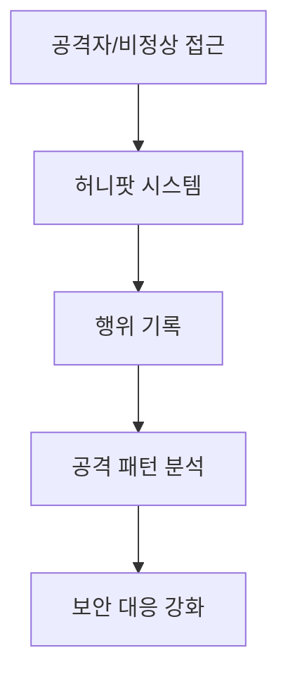
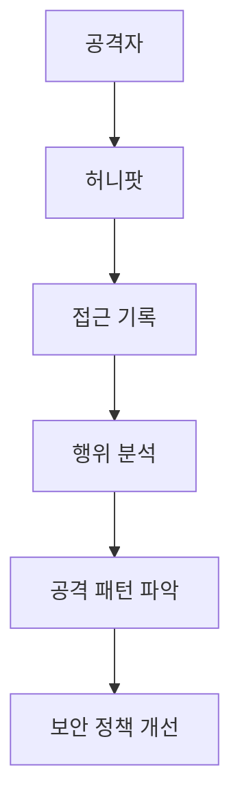

# 277 허니팟(Honeypot)

작성 기준일: 2026-06-01
검색/보강일: 2026-06-04
기준 PDF: `/Users/nes0903/Documents/study/정보처리기사/핵심요약집_2026_정보처리기사필기핵심요약.pdf`
PDF 확인 위치: 39페이지 `277 허니팟(Honeypot)`

## 한 줄 요약

- 허니팟은 비정상 접근과 공격 행위를 탐지하기 위해 의도적으로 설치해 둔 유인 시스템이다.

## 한눈에 보는 구조

## PDF 기준 핵심

- 비정상적인 접근의 탐지를 위해 의도적으로 설치해 둔 시스템이다.
- `의도적 설치`, `비정상 접근 탐지`가 핵심 단서이다.

## 개념 설명

- 허니팟은 실제 중요 시스템처럼 보이도록 만들어 공격자를 유도한다.
- 공격자가 허니팟에 접근하면 접근 경로, 명령, 악성코드, 시도 패턴을 관찰할 수 있다.
- TechTarget은 허니팟을 공격자를 유인하고 공격을 식별·방어하는 데 쓰는 보안 자원으로 설명한다.
- 운영 시 허니팟이 다른 시스템 공격의 발판이 되지 않도록 격리와 모니터링이 필요하다.

## 시험 포인트

- `일부러 설치한 시스템`이라는 점이 중요하다.
- 허니팟은 방화벽처럼 직접 차단하는 장비가 아니라 유인과 탐지 목적이 강하다.
- 비정상 접근 탐지, 공격 분석, 침입 유도 단서와 연결한다.
- 실제 운영 시스템과 혼동하지 않는다.

## 헷갈리는 비교

| 구분 | 허니팟 | IDS | 방화벽 |
|---|---|---|
| 목적 | 공격 유인과 분석 | 침입 탐지 | 접근 차단 |
| 위치 | 유인용 시스템 | 네트워크/호스트 감시 | 경계 통제 |
| 단서 | 의도적으로 설치 | 탐지 시스템 | 허용/차단 정책 |

## 예시 또는 암기 포인트

- 사용하지 않는 서버처럼 보이게 만들어 공격자가 접속하면 모든 명령을 기록하는 시스템이 허니팟이다.
- 암기식: `허니팟은 달콤한 미끼 시스템`.

## 빠른 복습

- 허니팟의 목적은? 비정상 접근 탐지.
- 설치 방식은? 의도적으로 설치.
- 방화벽과 차이는? 차단보다 유인과 분석이 중심이다.

## 상세 보강

- 허니팟은 실제 중요한 시스템처럼 보이게 만든 유인용 시스템이다.
- 공격자가 접근하면 명령, 악성 파일, 접속 경로, 취약점 탐색 과정을 기록해 분석할 수 있다.
- 목적은 공격을 직접 차단하는 것보다 공격 행위를 탐지하고 정보를 수집하는 것이다.
- 운영 시 허니팟이 다른 시스템 공격의 발판이 되지 않도록 격리해야 한다.
- 시험에서는 `의도적으로 설치`, `비정상 접근 탐지`, `유인`이 핵심 단서이다.

| 구분 | 허니팟 | IDS |
|---|---|---|
| 방식 | 공격자를 유인 | 실제 트래픽/호스트 감시 |
| 목적 | 행위 관찰과 분석 | 침입 탐지와 알림 |
| 단서 | 일부러 만든 미끼 시스템 | 오용/이상 탐지 |

## 참고 링크

- [TechTarget - Honeypot](https://www.techtarget.com/searchsecurity/definition/honey-pot)
