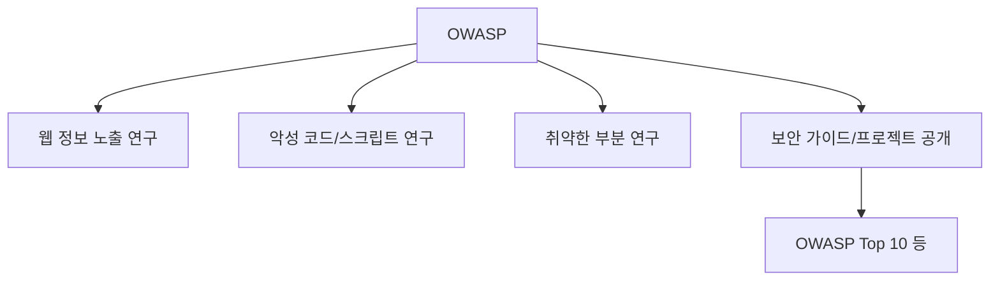
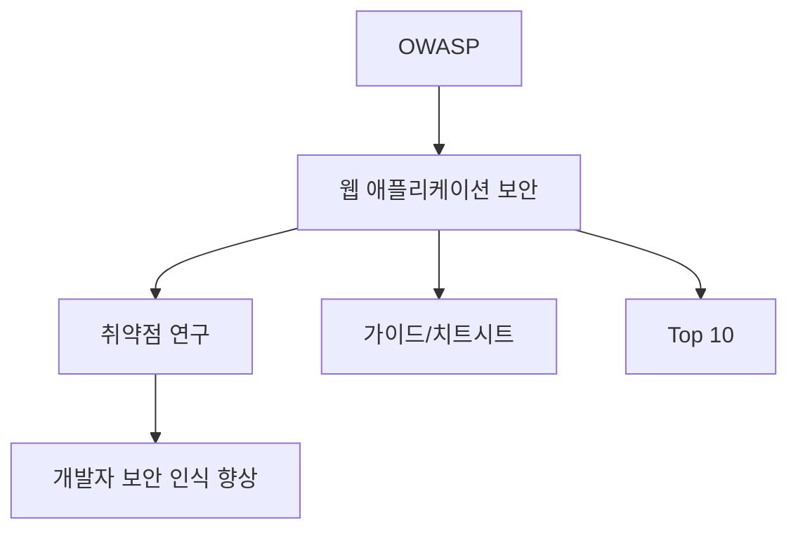

# 278 OWASP(오픈 웹 애플리케이션 보안 프로젝트)

작성 기준일: 2026-06-01
검색/보강일: 2026-06-04
기준 PDF: `/Users/nes0903/Documents/study/정보처리기사/핵심요약집_2026_정보처리기사필기핵심요약.pdf`
PDF 확인 위치: 40페이지 `278 OWASP(오픈 웹 애플리케이션 보안 프로젝트)`

## 한 줄 요약

- OWASP는 웹 애플리케이션 보안 취약점과 안전한 개발 지침을 연구·공유하는 비영리 보안 커뮤니티이다.

## 한눈에 보는 구조

## PDF 기준 핵심

- 웹 정보 노출이나 악성 코드, 스크립트, 보안이 취약한 부분을 연구하는 비영리 단체이다.
- PDF에서는 `오픈 웹 애플리케이션 보안 프로젝트`로 표기한다.
- `웹 애플리케이션 보안`, `취약점 연구`, `비영리 단체`가 핵심 단서이다.

## 개념 설명

- OWASP는 애플리케이션 보안을 개선하기 위한 프로젝트, 문서, 도구, 교육 자료를 공개한다.
- OWASP Top 10은 웹 애플리케이션의 대표 보안 위험을 정리한 자료로 매우 널리 알려져 있다.
- OWASP 공식 사이트는 오픈소스 애플리케이션 보안 프로젝트와 커뮤니티를 운영한다.
- 시험에서는 최신 명칭 변화보다 PDF 표현인 Open Web Application Security Project와 웹 보안 취약점 연구 단서를 우선한다.

## 시험 포인트

- OWASP는 공격 기법 자체가 아니라 보안 연구와 가이드 제공 단체이다.
- SQL Injection, XSS 같은 웹 취약점과 함께 자주 연결된다.
- 비영리 단체라는 PDF 문구를 기억한다.
- 웹 애플리케이션 보안 전반을 다루며, 단일 도구 이름으로만 보지 않는다.

## 헷갈리는 비교

| 구분 | OWASP | DPI | 허니팟 |
|---|---|---|---|
| 성격 | 비영리 보안 프로젝트/단체 | 패킷 분석 기술 | 유인 시스템 |
| 초점 | 웹 애플리케이션 보안 | 네트워크 패킷 내용 | 비정상 접근 탐지 |
| 시험 단서 | Top 10, 웹 취약점 | Deep Packet | 의도적 설치 |

## 예시 또는 암기 포인트

- SQL Injection과 XSS 같은 취약점 목록과 대응 지침을 OWASP Top 10에서 확인하는 흐름을 떠올린다.
- 암기식: `OWASP = 웹 앱 보안의 공개 지식창고`.

## 빠른 복습

- OWASP의 성격은? 웹 애플리케이션 보안을 연구하는 비영리 단체.
- PDF의 연구 대상은? 웹 정보 노출, 악성 코드, 스크립트, 취약한 부분.
- 대표 자료는? OWASP Top 10.

## 상세 보강

- OWASP는 웹 애플리케이션 보안 향상을 위한 비영리 커뮤니티·프로젝트이다.
- OWASP Top 10은 웹 애플리케이션에서 자주 중요하게 다뤄지는 보안 위험을 정리한 대표 자료이다.
- SQL Injection, XSS, 취약한 인증, 접근 제어 실패 같은 개념을 학습할 때 자주 연결된다.
- PDF의 `웹 정보 노출`, `악성 코드`, `스크립트`, `취약한 부분 연구`, `비영리 단체`가 핵심이다.
- 시험에서는 OWASP를 보안 제품이나 공격 기법이 아니라 보안 프로젝트/단체로 구분한다.

| 구분 | OWASP |
|---|---|
| 성격 | 비영리 웹 애플리케이션 보안 프로젝트 |
| 대표 산출물 | Top 10, Cheat Sheet, Testing Guide |
| 관련 약점 | SQL Injection, XSS 등 |
| 시험 단서 | 웹 취약점 연구 단체 |

## 참고 링크

- [OWASP Foundation](https://owasp.org/)
- [OWASP Projects](https://owasp.org/projects/)
