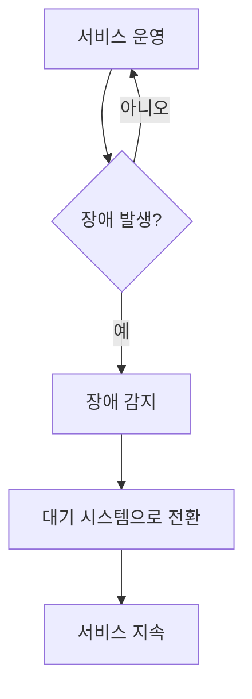
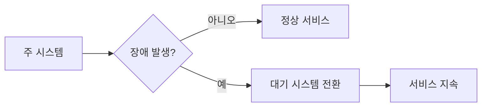

# 279 고가용성 솔루션(HACMP)

작성 기준일: 2026-06-01
검색/보강일: 2026-06-04
기준 PDF: `/Users/nes0903/Documents/study/정보처리기사/핵심요약집_2026_정보처리기사필기핵심요약.pdf`
PDF 확인 위치: 40페이지 `279 고가용성 솔루션(HACMP)`

## 한 줄 요약

- HACMP는 장애가 발생하면 다른 시스템으로 신속히 대체해 서비스를 계속 제공하도록 하는 고가용성 클러스터 솔루션이다.

## 한눈에 보는 구조

## PDF 기준 핵심

- 긴 시간 동안 안정적인 서비스 운영을 위해 사용한다.
- 장애 발생 시 즉시 다른 시스템으로 대체 가능한 환경을 구축하는 메커니즘을 의미한다.
- `고가용성`, `장애 발생`, `다른 시스템으로 대체`가 핵심 단서이다.

## 개념 설명

- HACMP는 High Availability Cluster Multi-Processing의 약자로 알려진 IBM 계열 고가용성 클러스터 솔루션이다.
- 현재 IBM PowerHA SystemMirror 계열과 연결되어 설명되는 경우가 많다.
- 고가용성은 장애가 전혀 없다는 뜻이 아니라, 장애가 나도 서비스 중단 시간을 최소화하는 능력이다.
- 핵심은 이중화, 장애 감지, 페일오버, 복구 절차이다.

## 시험 포인트

- `긴 시간 안정적 서비스`, `장애 시 다른 시스템 대체`가 HACMP 단서이다.
- 백업은 데이터를 보존하는 개념이고, 고가용성은 서비스 지속성이 핵심이다.
- DR은 재해 복구 범위까지 확장될 수 있고, HA는 장애 시 빠른 서비스 연속성에 초점을 둔다.
- HACMP는 IBM 고가용성 클러스터 용어와 연결된다.

## 헷갈리는 비교

| 구분 | HA/HACMP | 백업 | DR |
|---|---|---|---|
| 초점 | 서비스 지속 | 데이터 복사 | 재해 후 복구 |
| 핵심 | 페일오버 | 보관/복원 | 복구 사이트/절차 |
| 시험 단서 | 즉시 다른 시스템 대체 | backup | disaster recovery |

## 예시 또는 암기 포인트

- 운영 서버 장애 시 대기 서버가 IP와 서비스를 이어받아 사용자가 계속 접속하게 하는 구조가 고가용성이다.
- 암기식: `HACMP = 장애 나도 바로 다른 시스템`.

## 빠른 복습

- HACMP의 목적은? 안정적인 서비스 운영과 장애 시 대체.
- 핵심 메커니즘은? 고가용성 클러스터와 페일오버.
- 백업과 차이는? 백업은 데이터 보존, HA는 서비스 지속이다.

## 상세 보강

- 고가용성은 장애가 발생해도 서비스를 가능한 오래 지속하도록 시스템을 구성하는 개념이다.
- HACMP는 장애 발생 시 다른 시스템으로 즉시 대체할 수 있는 클러스터링/페일오버 환경과 연결해 이해한다.
- 핵심은 장애를 없애는 것이 아니라 장애가 나도 서비스 중단 시간을 최소화하는 것이다.
- PDF의 `긴 시간 동안 안정적인 서비스`, `장애 발생 시 즉시 다른 시스템으로 대체 가능`이 핵심이다.
- 시험에서는 백업과 고가용성을 구분한다. 백업은 데이터 복구, 고가용성은 서비스 연속성에 초점이 있다.

| 구분 | 고가용성 | 백업 |
|---|---|---|
| 목적 | 서비스 중단 최소화 | 데이터 복구 |
| 방식 | 이중화, 클러스터, 페일오버 | 사본 저장 |
| 단서 | 즉시 대체 가능한 환경 | 복원, 보관 |

## 참고 링크

- [IBM - High Availability Cluster Multi-Processing](https://www.ibm.com/docs/en/power6?topic=partitions-high-availability-cluster-multi-processing)
- [IBM Developer - Introduction to PowerHA](https://developer.ibm.com/articles/au-powerhaintro/)
