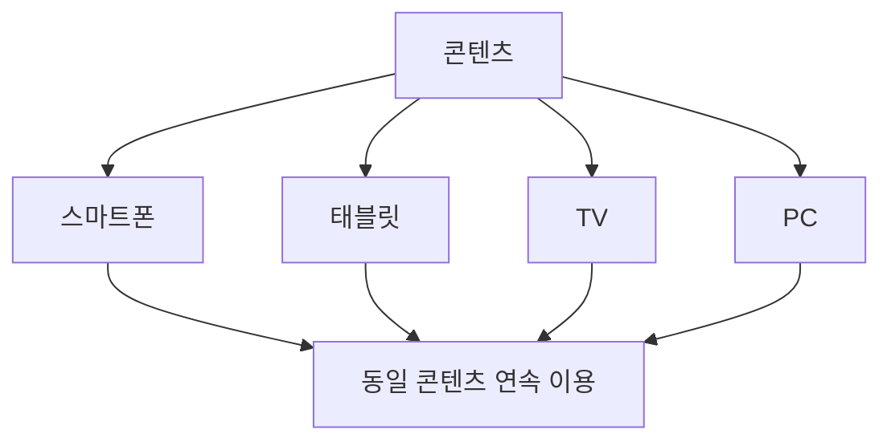
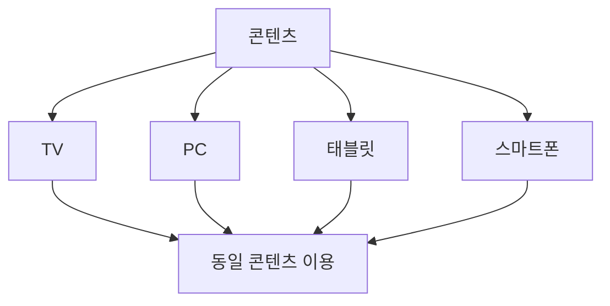

# 280 앤 스크린(N-Screen)

작성 기준일: 2026-06-01
검색/보강일: 2026-06-04
기준 PDF: `/Users/nes0903/Documents/study/정보처리기사/핵심요약집_2026_정보처리기사필기핵심요약.pdf`
PDF 확인 위치: 40페이지 `280 앤 스크린(N-Screen)`

## 한 줄 요약

- N-Screen은 여러 종류의 단말기에서 동일한 콘텐츠를 자유롭게 이용할 수 있게 하는 서비스 개념이다.

## 한눈에 보는 구조

## PDF 기준 핵심

- N개의 서로 다른 단말기에서 동일한 콘텐츠를 자유롭게 이용할 수 있는 서비스이다.
- `N개 단말기`, `동일 콘텐츠`, `자유롭게 이용`이 핵심 단서이다.

## 개념 설명

- N-Screen은 콘텐츠를 특정 기기 하나에 묶지 않고 여러 화면에서 이어 보거나 접근하게 하는 서비스이다.
- 클라우드 저장, 계정 동기화, 스트리밍, 적응형 전송 기술과 연결된다.
- 스마트폰에서 보던 영상을 TV에서 이어 보거나, PC에서 보던 문서를 태블릿에서 계속 보는 경험이 대표적이다.
- 시험에서는 세부 구현보다 `다기기 동일 콘텐츠 이용` 정의가 중요하다.

## 시험 포인트

- `N`은 여러 개의 화면 또는 단말을 의미한다.
- 멀티미디어 스트리밍, 클라우드 동기화, 연속 시청 단서와 함께 나올 수 있다.
- SSO가 여러 서비스에 한 번 로그인하는 개념이라면, N-Screen은 여러 단말에서 같은 콘텐츠를 쓰는 개념이다.
- 단순 화면 복제만이 아니라 콘텐츠 이용 연속성까지 포함해 이해한다.

## 헷갈리는 비교

| 구분 | N-Screen | SSO |
|---|---|---|
| 대상 | 단말/화면 | 인증/로그인 |
| 핵심 | 동일 콘텐츠 다기기 이용 | 한 번 로그인으로 여러 서비스 |
| 단서 | TV, PC, 스마트폰 | Identity Provider |

## 예시 또는 암기 포인트

- 스마트폰에서 보던 드라마를 집에 와서 TV로 이어 보는 서비스가 N-Screen이다.
- 암기식: `N개의 Screen에서 같은 콘텐츠`.

## 빠른 복습

- N-Screen의 핵심은? 여러 단말에서 동일 콘텐츠 이용.
- N은 무엇을 뜻하는가? 여러 개의 화면/단말.
- SSO와 차이는? SSO는 로그인 통합이다.

## 상세 보강

- N-Screen은 여러 단말에서 동일한 콘텐츠를 이어서 또는 자유롭게 이용하게 하는 서비스 개념이다.
- `N`은 특정 숫자가 아니라 여러 종류의 화면과 단말을 의미한다.
- 클라우드 저장, 스트리밍, 계정 동기화, DRM 같은 기술과 결합될 수 있다.
- PDF의 핵심은 `N개의 서로 다른 단말기`, `동일한 콘텐츠`, `자유롭게 이용`이다.
- 시험에서는 멀티미디어 서비스 개념으로 보고, 단순 화면 분할 기능과 혼동하지 않는다.

| 구분 | N-Screen |
|---|---|
| 대상 | 여러 단말 |
| 콘텐츠 | 동일 콘텐츠 |
| 목적 | 끊김 없는 이용 경험 |
| 예 | TV에서 보던 영상을 스마트폰에서 이어 보기 |

## 참고 링크

- [N-Screen Service and Cloud Computing](https://www.koreascience.or.kr/article/JAKO201215734995055.page)
