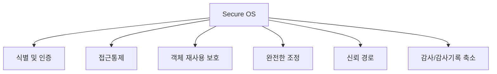
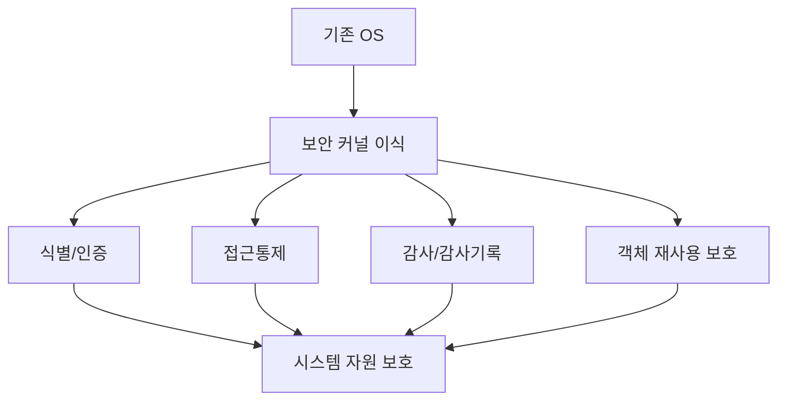

# 281 Secure OS

작성 기준일: 2026-06-01
검색/보강일: 2026-06-04
기준 PDF: `/Users/nes0903/Documents/study/정보처리기사/핵심요약집_2026_정보처리기사필기핵심요약.pdf`
PDF 확인 위치: 40페이지 `281 Secure OS`

## 한 줄 요약

- Secure OS는 기존 운영체제에 보안 기능을 갖춘 커널을 이식해 시스템 자원을 보호하는 운영체제이다.

## 한눈에 보는 구조

## PDF 기준 핵심

- 기존 운영체제(OS)에 보안 기능을 갖춘 커널을 이식하여 시스템 자원을 보호하는 운영체제이다.
- Secure OS의 보안 기능: 식별 및 인증, 임의적/강제적 접근통제, 객체 재사용 보호, 완전한 조정, 신뢰 경로, 감사 및 감사기록 축소 등.

## 개념 설명

- Secure OS는 운영체제 수준에서 접근 통제와 감사 기능을 강화한다.
- 임의적 접근통제(DAC)는 소유자가 권한을 정하는 방식이고, 강제적 접근통제(MAC)는 보안 정책이 권한을 강제하는 방식이다.
- IBM은 시스템 무결성을 운영체제가 자신을 비인가 접근으로부터 보호하고 보안 통제가 훼손되지 않도록 설계·유지되는 성질로 설명한다.
- 보안 커널, 참조 모니터, 감사 로그와 연결해 이해하면 좋다.

## 시험 포인트

- `기존 OS + 보안 커널 이식 + 시스템 자원 보호`가 핵심 정의이다.
- 보안 기능 목록을 PDF 그대로 외운다.
- `임의적/강제적 접근통제`는 Secure OS 단서로 자주 나온다.
- 감사와 신뢰 경로도 보기에서 빠지기 쉬운 항목이다.

## 헷갈리는 비교

| 보안 기능 | 의미 | 시험 단서 |
|---|---|---|
| 식별 및 인증 | 사용자가 누구인지 확인 | ID, password |
| 접근통제 | 자원 접근 제한 | DAC/MAC |
| 객체 재사용 보호 | 잔여 정보 노출 방지 | reuse |
| 신뢰 경로 | 안전한 사용자-시스템 경로 | trusted path |
| 감사 | 보안 행위 기록 | audit |

## 예시 또는 암기 포인트

- 일반 OS에 강제적 접근통제와 감사 기능을 추가해 민감 파일 접근을 엄격히 통제하면 Secure OS 개념에 가깝다.
- 암기식: `Secure OS = OS 커널 차원의 보안 강화`.

## 빠른 복습

- Secure OS의 목적은? 시스템 자원 보호.
- 핵심 구현 방식은? 보안 기능을 갖춘 커널 이식.
- 접근통제 종류는? 임의적 접근통제와 강제적 접근통제.

## 상세 보강

- Secure OS는 운영체제 수준에서 보안 기능을 강화해 시스템 자원을 보호하는 OS이다.
- 일반 애플리케이션 보안보다 낮은 계층에서 접근 제어와 감사 기능을 제공한다.
- PDF의 보안 기능은 목록으로 외워야 한다: 식별 및 인증, 임의적/강제적 접근통제, 객체 재사용 보호, 완전한 조정, 신뢰 경로, 감사 및 감사기록 축소.
- 임의적 접근통제(DAC)는 소유자 중심 권한 관리, 강제적 접근통제(MAC)는 보안 등급·정책 기반 통제로 이해한다.
- 시험에서는 Secure OS를 백신이나 방화벽이 아니라 OS 커널 기반 보안 강화로 구분한다.

| 기능 | 의미 |
|---|---|
| 식별/인증 | 사용자를 확인 |
| 접근통제 | 자원 접근 허용/차단 |
| 객체 재사용 보호 | 이전 데이터 잔류 방지 |
| 감사 | 보안 관련 행위 기록 |
| 신뢰 경로 | 사용자와 보안 기능 간 안전한 통로 |

## 참고 링크

- [IBM z/OS - System integrity](https://www.ibm.com/docs/en/zos/3.2.0?topic=aapmss-system-integrity)

<!-- study-links:start -->
## 관련 문서

- `무결성`: [[정보처리기사/3과목 데이터베이스 구축/115 무결성/115 무결성|115 무결성]]
<!-- study-links:end -->
