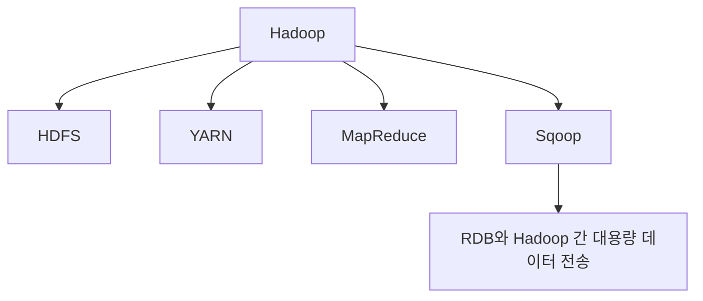
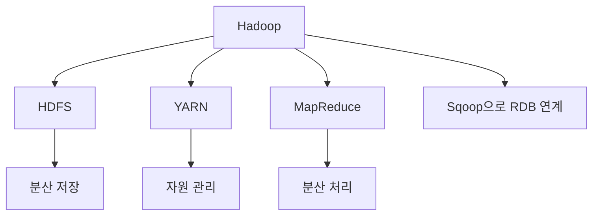

# 282 하둡(Hadoop)

작성 기준일: 2026-06-01
검색/보강일: 2026-06-04
기준 PDF: `/Users/nes0903/Documents/study/정보처리기사/핵심요약집_2026_정보처리기사필기핵심요약.pdf`
PDF 확인 위치: 40페이지 `282 하둡(Hadoop)`

## 한 줄 요약

- Hadoop은 오픈소스 기반 분산 컴퓨팅 플랫폼으로, 대용량 데이터를 저장하고 처리하는 생태계의 기반 기술이다.

## 한눈에 보는 구조

## PDF 기준 핵심

- 오픈 소스를 기반으로 한 분산 컴퓨팅 플랫폼이다.
- 하둡과 관계형 데이터베이스(RDB) 간 대용량 데이터를 전송할 때 스쿱(Sqoop)이라는 도구를 이용한다.

## 개념 설명

- Hadoop은 여러 대의 서버를 묶어 대용량 데이터를 분산 저장하고 병렬 처리하는 플랫폼이다.
- HDFS는 분산 파일 시스템, MapReduce는 분산 처리 모델, YARN은 자원 관리 계층으로 이해한다.
- Apache Hadoop 문서도 HDFS와 MapReduce를 함께 사용해 데이터가 저장된 서버 근처에서 작업을 실행하는 구조를 설명한다.
- Sqoop은 RDBMS와 Hadoop 사이의 대용량 데이터 이동을 지원하는 도구로 시험에 함께 나온다.

## 시험 포인트

- `오픈소스`, `분산 컴퓨팅`, `대용량 데이터`가 Hadoop 단서이다.
- `RDB와 Hadoop 간 전송 = Sqoop`을 반드시 기억한다.
- MapReduce는 Hadoop 위에서 동작하는 대표 분산 처리 모델이다.
- Docker처럼 컨테이너 기술이 아니라 빅데이터 분산 처리 플랫폼이다.

## 헷갈리는 비교

| 구분 | Hadoop | MapReduce | Sqoop |
|---|---|---|---|
| 성격 | 분산 컴퓨팅 플랫폼 | 분산 처리 모델 | 데이터 전송 도구 |
| 역할 | 저장/처리 기반 | Map과 Reduce 처리 | RDB-Hadoop 이동 |
| 시험 단서 | 오픈소스, 분산 | 대용량 분산 처리 | RDB, 전송 |

## 예시 또는 암기 포인트

- 로그 수 TB를 여러 서버에 분산 저장하고 배치 분석하는 환경은 Hadoop과 연결된다.
- 암기식: `Hadoop은 빅데이터 분산 플랫폼, Sqoop은 RDB 다리`.

## 빠른 복습

- Hadoop의 성격은? 오픈소스 분산 컴퓨팅 플랫폼.
- RDB와 Hadoop 간 전송 도구는? Sqoop.
- Hadoop의 처리 모델로 연결되는 것은? MapReduce.

## 상세 보강

- 하둡은 대용량 데이터를 여러 서버에 분산 저장하고 처리하기 위한 오픈소스 분산 컴퓨팅 플랫폼이다.
- HDFS는 데이터를 여러 노드에 나누어 저장하고, MapReduce는 데이터를 분산 처리하는 프로그래밍 모델이다.
- YARN은 하둡 클러스터의 자원 관리와 작업 스케줄링을 담당한다.
- PDF는 RDB와 하둡 사이 대용량 데이터 전송 도구로 Sqoop을 언급하므로 같이 기억한다.
- 시험에서는 Hadoop을 단순 데이터베이스가 아니라 분산 저장·처리 플랫폼으로 구분한다.

| 구성 | 역할 |
|---|---|
| HDFS | 분산 파일 시스템 |
| MapReduce | 분산 처리 모델 |
| YARN | 자원 관리 |
| Sqoop | RDB와 Hadoop 간 데이터 전송 |

## 참고 링크

- [Apache Hadoop - MapReduce](https://cwiki.apache.org/confluence/display/HADOOP2/MapReduce)
- [Apache Hadoop MapReduce Tutorial](https://hadoop.apache.org/docs/r3.3.6/hadoop-mapreduce-client/hadoop-mapreduce-client-core/MapReduceTutorial.html)
