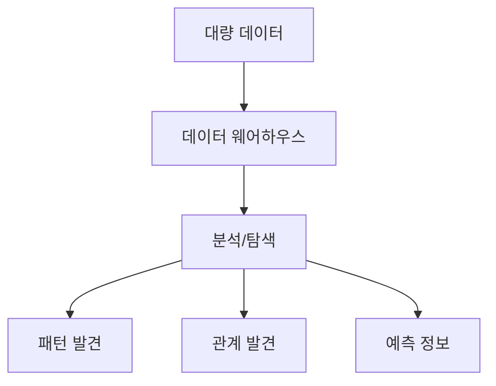
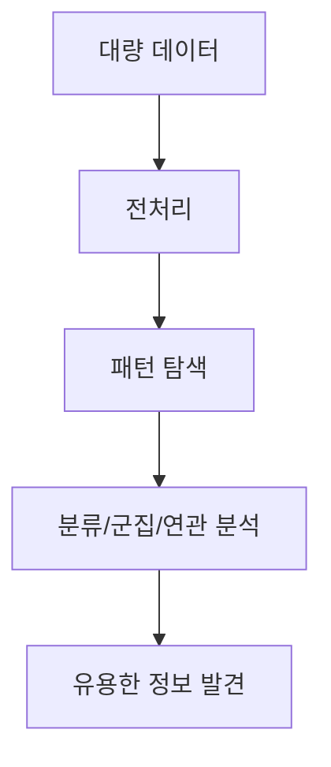

# 284 데이터 마이닝(Data Mining)

작성 기준일: 2026-06-01
검색/보강일: 2026-06-04
기준 PDF: `/Users/nes0903/Documents/study/정보처리기사/핵심요약집_2026_정보처리기사필기핵심요약.pdf`
PDF 확인 위치: 40페이지 `284 데이터 마이닝(Data Mining)`

## 한 줄 요약

- 데이터 마이닝은 데이터 웨어하우스의 대량 데이터에서 유용하고 가능성 있는 정보를 발견하는 기법이다.

## 한눈에 보는 구조

## PDF 기준 핵심

- 데이터 웨어하우스에 저장된 대량의 데이터 집합에서 수행한다.
- 사용자의 요구에 따라 유용하고 가능성 있는 정보를 발견하기 위한 기법이다.
- `대량 데이터`, `데이터 웨어하우스`, `유용한 정보 발견`이 핵심 단서이다.

## 개념 설명

- 데이터 마이닝은 통계, 머신러닝, 패턴 인식 기법을 활용해 데이터 속 숨은 규칙을 찾는다.
- 장바구니 분석, 고객 이탈 예측, 이상 거래 탐지, 추천 시스템 등에 쓰인다.
- NIST Big Data 문서도 데이터 마이닝을 관계를 식별하는 유용한 형태의 정보를 얻는 활동과 연결한다.
- OLAP이 사용자가 다차원 데이터를 빠르게 분석하는 방식이라면, 데이터 마이닝은 숨은 패턴과 예측 정보를 찾아내는 성격이 강하다.

## 시험 포인트

- `정보 발견`이라는 표현이 데이터 마이닝의 핵심이다.
- 데이터 웨어하우스는 분석용 데이터를 모아 놓은 저장소이고, 데이터 마이닝은 그 안에서 패턴을 찾는 기법이다.
- OLAP과 함께 BI 영역으로 묶여 출제될 수 있다.
- 단순 조회나 보고서 작성만으로 보지 않는다.

## 헷갈리는 비교

| 구분 | 데이터 마이닝 | OLAP |
|---|---|---|
| 초점 | 숨은 패턴/지식 발견 | 다차원 요약 분석 |
| 방식 | 알고리즘, 모델 | Cube 연산 |
| 결과 | 예측, 분류, 연관 | 집계, 드릴다운 |
| 시험 단서 | Mining, 발견 | Roll-up, Pivot |

## 예시 또는 암기 포인트

- 고객 구매 데이터에서 `기저귀를 사는 고객이 맥주도 함께 산다`는 연관 규칙을 찾는 것이 데이터 마이닝 예이다.
- 암기식: `Mining = 데이터 속 금맥 찾기`.

## 빠른 복습

- 데이터 마이닝의 대상은? 데이터 웨어하우스의 대량 데이터.
- 목적은? 유용하고 가능성 있는 정보 발견.
- OLAP과 차이는? OLAP은 다차원 요약 분석 중심이다.

## 상세 보강

- 데이터 마이닝은 대량 데이터에서 의미 있는 패턴, 규칙, 관계, 예측 정보를 찾아내는 기법이다.
- 데이터 웨어하우스에 저장된 데이터를 분석해 의사결정에 활용할 수 있는 지식을 얻는 데 초점이 있다.
- 대표 기법으로 분류, 군집화, 연관 규칙, 예측, 이상 탐지가 있다.
- PDF의 `대량의 데이터 집합`, `사용자의 요구`, `유용하고 가능성 있는 정보 발견`이 핵심이다.
- OLAP이 다차원 분석과 빠른 질의에 초점을 둔다면, 데이터 마이닝은 숨은 패턴과 지식 발견에 초점을 둔다.

| 구분 | 데이터 마이닝 | OLAP |
|---|---|---|
| 목적 | 숨은 패턴 발견 | 다차원 요약 분석 |
| 방식 | 알고리즘 기반 탐색 | 큐브/차원 기반 질의 |
| 결과 | 규칙, 예측, 군집 | 집계, 피벗, 드릴다운 |

## 참고 링크

- [NIST Big Data Interoperability Framework Vol. 5](https://nvlpubs.nist.gov/nistpubs/SpecialPublications/NIST.SP.1500-5.pdf)
- [NIST CSRC Glossary - Data Mining](https://csrc.nist.gov/glossary/term/data_mining)
