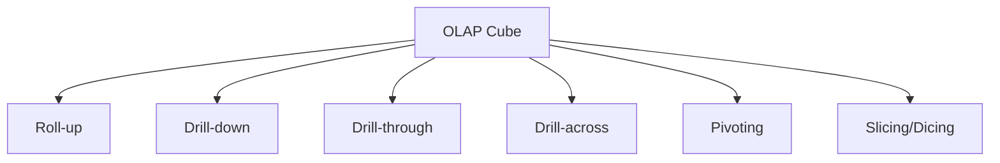
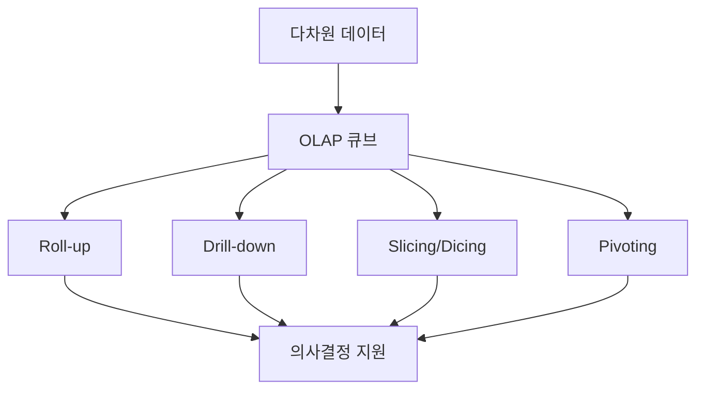

# 285 OLAP(Online Analytical Processing)

작성 기준일: 2026-06-01
검색/보강일: 2026-06-04
기준 PDF: `/Users/nes0903/Documents/study/정보처리기사/핵심요약집_2026_정보처리기사필기핵심요약.pdf`
PDF 확인 위치: 40페이지 `285 OLAP(Online Analytical Processing)`

## 한 줄 요약

- OLAP은 다차원 데이터에서 통계적 요약 정보를 분석해 의사결정에 활용하는 방식이다.

## 한눈에 보는 구조

## PDF 기준 핵심

- 다차원으로 이루어진 데이터로부터 통계적인 요약 정보를 분석한다.
- 의사결정에 활용하는 방식이다.
- OLAP 연산: Roll-up, Drill-down, Drill-through, Drill-across, Pivoting, Slicing, Dicing.

## 개념 설명

- OLAP은 시간, 지역, 제품, 고객 같은 여러 차원으로 데이터를 분석한다.
- Roll-up은 상위 수준으로 집계하고, Drill-down은 더 세부 수준으로 내려간다.
- Slice는 한 차원을 고정해 부분 데이터를 보고, Dice는 여러 조건으로 하위 큐브를 만든다.
- IBM은 OLAP을 다차원 데이터 분석과 빠른 집계·탐색 방식으로 설명한다.

## 시험 포인트

- OLAP의 목적은 의사결정 지원이다.
- PDF의 연산 7가지를 목록으로 외운다.
- Roll-up과 Drill-down은 방향이 반대이다.
- Slicing과 Dicing은 부분 데이터 선택 연산으로 함께 기억한다.

## 헷갈리는 비교

| 연산 | 의미 | 시험 단서 |
|---|---|---|
| Roll-up | 상위 수준 집계 | 요약, 상향 |
| Drill-down | 세부 수준 분석 | 상세, 하향 |
| Drill-through | 상세 원천 데이터 접근 | 원본까지 |
| Drill-across | 다른 큐브/팩트 간 분석 | 가로 확장 |
| Pivoting | 축 회전 | 관점 변경 |
| Slicing | 한 차원 선택 | 잘라 보기 |
| Dicing | 여러 조건 선택 | 조각내기 |

## 예시 또는 암기 포인트

- 전국 매출을 지역별, 월별, 제품군별로 돌려 보며 분석하는 것이 OLAP이다.
- 암기식: `OLAP = 의사결정용 다차원 분석`.

## 빠른 복습

- OLAP의 데이터 구조는? 다차원 데이터.
- 대표 목적은? 의사결정 활용.
- Roll-up의 반대는? Drill-down.

## 상세 보강

- OLAP은 데이터 웨어하우스나 데이터 저장소의 데이터를 다차원 관점으로 빠르게 분석하는 방식이다.
- Roll-up은 더 상위 수준으로 요약하고, Drill-down은 더 상세 수준으로 내려가는 연산이다.
- Slicing은 한 차원의 특정 값을 잘라 보는 것이고, Dicing은 여러 차원의 조건으로 부분 큐브를 보는 것이다.
- Pivoting은 행과 열, 차원의 배치를 바꾸어 다른 관점에서 보는 연산이다.
- 시험에서는 OLAP 연산 이름을 영어 그대로 묻는 경우가 있으므로 PDF 목록을 그대로 암기한다.

| 연산 | 의미 |
|---|---|
| Roll-up | 상위 수준으로 집계 |
| Drill-down | 하위 상세로 분석 |
| Drill-through | 상세 원천 데이터로 이동 |
| Drill-across | 관련 큐브/테이블 간 분석 |
| Pivoting | 차원 회전 |
| Slicing | 한 조건으로 절단 |
| Dicing | 여러 조건으로 부분 집합 분석 |

## 참고 링크

- [IBM - What is OLAP?](https://www.ibm.com/topics/olap)
