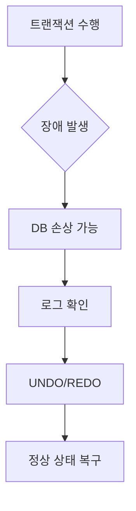
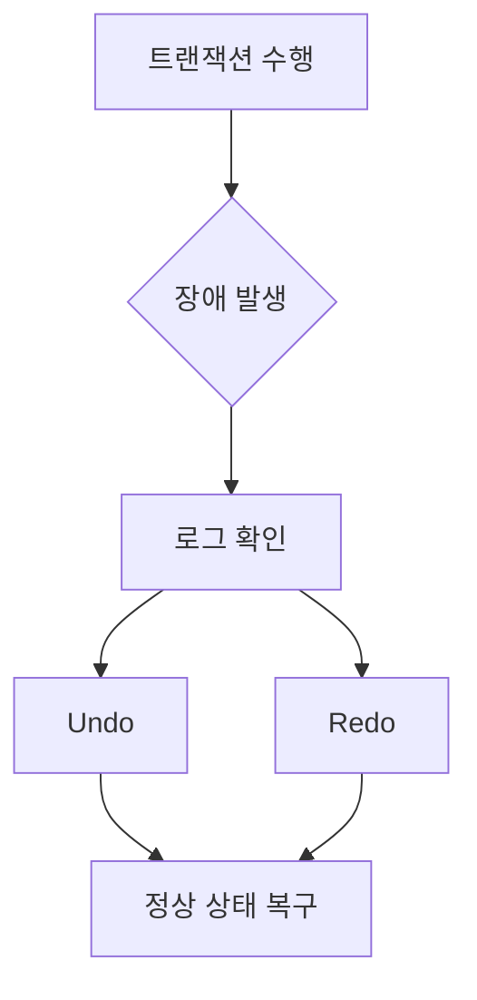

# 286 회복(Recovery)

작성 기준일: 2026-06-01
검색/보강일: 2026-06-04
기준 PDF: `/Users/nes0903/Documents/study/정보처리기사/핵심요약집_2026_정보처리기사필기핵심요약.pdf`
PDF 확인 위치: 40페이지 `286 회복(Recovery)`

## 한 줄 요약

- 회복은 트랜잭션 수행 중 장애로 손상된 데이터베이스를 장애 이전의 정상 상태로 복구하는 작업이다.

## 한눈에 보는 구조

## PDF 기준 핵심

- 트랜잭션들을 수행하는 도중 장애가 발생한다.
- 데이터베이스가 손상되었을 때 손상되기 이전의 정상 상태로 복구하는 작업이다.
- `트랜잭션`, `장애`, `정상 상태 복구`가 핵심 단서이다.

## 개념 설명

- 데이터베이스 회복은 원자성과 지속성을 보장하기 위한 핵심 기능이다.
- 로그는 트랜잭션이 어떤 변경을 했는지 기록해 장애 후 복구 판단에 사용된다.
- UNDO는 완료되지 않은 변경을 되돌리고, REDO는 완료된 변경이 반영되지 않았을 때 다시 적용한다.
- PostgreSQL도 WAL(Write-Ahead Log)을 회복과 복제에 사용한다.

## 시험 포인트

- 회복의 대상은 데이터베이스이고, 원인은 트랜잭션 수행 중 장애이다.
- `정상 상태로 복구`라는 표현이 핵심이다.
- 즉각 갱신 기법은 로그를 이용해 UNDO/REDO를 수행할 수 있다.
- 병행제어와 회복은 모두 트랜잭션의 일관성을 지키는 주제이다.

## 헷갈리는 비교

| 구분 | 회복 | 병행제어 |
|---|---|---|
| 목적 | 장애 후 정상 상태 복구 | 동시 실행 일관성 보장 |
| 단서 | 장애, 로그, UNDO/REDO | 로킹, 타임스탬프 |
| 시점 | 장애 발생 후 | 트랜잭션 실행 중 |

## 예시 또는 암기 포인트

- 계좌 이체 중 장애가 나서 출금만 반영되고 입금이 안 된 상태를 로그로 되돌리거나 다시 적용하는 것이 회복이다.
- 암기식: `Recovery = 장애 후 정상으로 되돌림`.

## 빠른 복습

- 회복의 원인은? 트랜잭션 수행 중 장애.
- 회복의 목표는? 손상 이전 정상 상태로 복구.
- 로그와 연결되는 작업은? UNDO와 REDO.

## 상세 보강

- 데이터베이스 회복은 장애로 손상된 데이터베이스를 장애 이전의 일관된 상태로 되돌리는 작업이다.
- 트랜잭션의 원자성과 지속성을 보장하기 위해 로그를 이용해 Undo와 Redo를 수행한다.
- Undo는 완료되지 않은 트랜잭션의 변경을 취소하고, Redo는 완료된 트랜잭션의 결과를 다시 반영한다.
- 회복은 백업 복원만을 뜻하지 않는다. 로그 기반 회복, 체크포인트, 즉각/지연 갱신 기법과 함께 이해해야 한다.
- 시험에서는 `장애`, `손상 이전 정상 상태`, `트랜잭션`, `복구`가 핵심 단서이다.

| 작업 | 의미 | 대상 |
|---|---|---|
| Undo | 변경 취소 | 미완료 트랜잭션 |
| Redo | 변경 재반영 | 완료 트랜잭션 |
| Checkpoint | 회복 시작 범위 축소 | 로그와 DB 상태 기준점 |

## 참고 링크

- [PostgreSQL Documentation - Write Ahead Log](https://www.postgresql.org/docs/15/runtime-config-wal.html)
