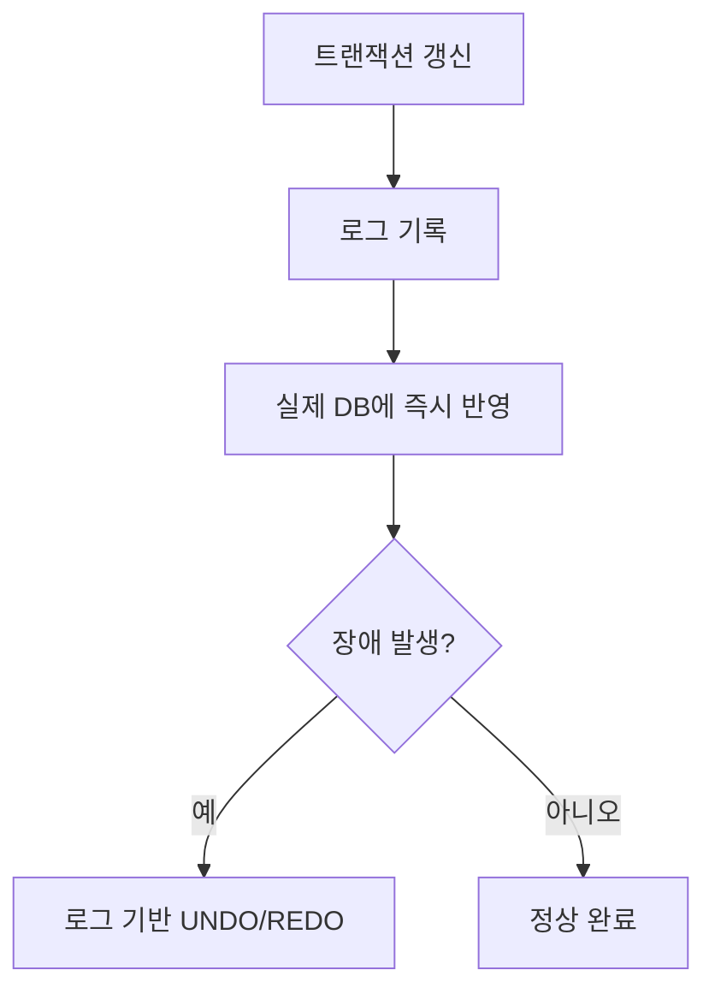
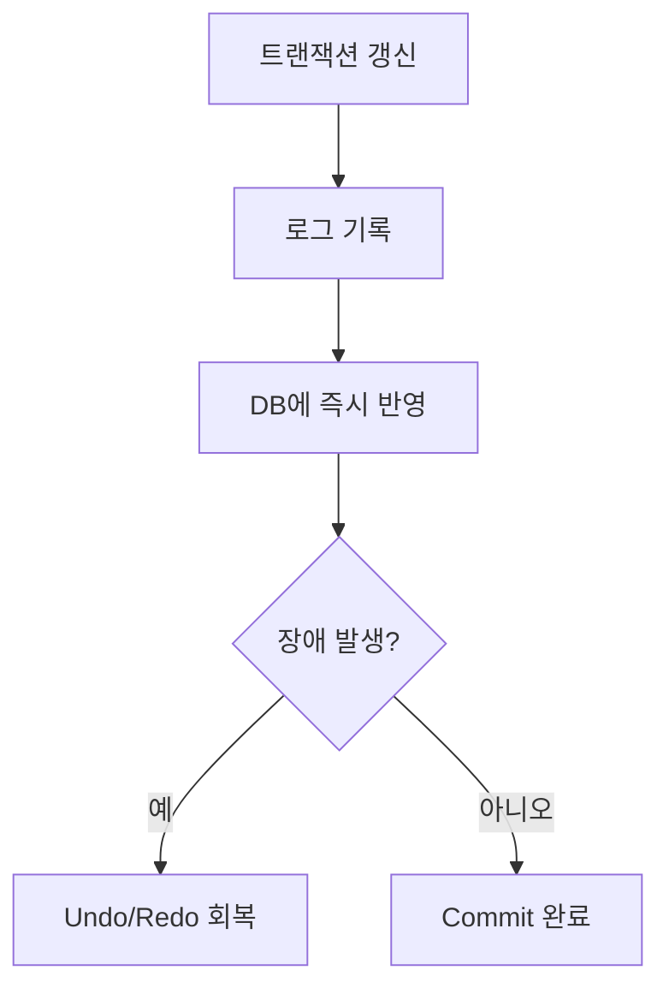

# 287 즉각 갱신 기법(Immediate Update)

작성 기준일: 2026-06-01
검색/보강일: 2026-06-04
기준 PDF: `/Users/nes0903/Documents/study/정보처리기사/핵심요약집_2026_정보처리기사필기핵심요약.pdf`
PDF 확인 위치: 40페이지 `287 즉각 갱신 기법(Immediate Update)`

## 한 줄 요약

- 즉각 갱신 기법은 트랜잭션이 부분 완료되기 전이라도 갱신 내용을 실제 데이터베이스에 반영하고, 회복을 위해 로그를 보관하는 방식이다.

## 한눈에 보는 구조

## PDF 기준 핵심

- 트랜잭션이 데이터를 갱신하면 트랜잭션이 부분 완료되기 전이라도 즉시 실제 데이터베이스에 반영한다.
- 장애가 발생하여 회복 작업할 경우를 대비하여 갱신된 내용들은 Log에 보관시킨다.
- `즉시 반영`, `부분 완료 전`, `Log 보관`이 핵심 단서이다.

## 개념 설명

- 즉각 갱신은 변경 내용을 실제 DB에 빠르게 반영하므로 장애 시 되돌릴 정보가 필요하다.
- 완료되지 않은 트랜잭션이 반영한 내용은 UNDO 대상이 될 수 있다.
- 완료된 트랜잭션의 변경이 디스크에 완전히 반영되지 않았다면 REDO가 필요할 수 있다.
- 따라서 로그에는 변경 전 값과 변경 후 값 같은 회복 정보가 포함될 수 있다.

## 시험 포인트

- 지연 갱신은 commit 전 실제 DB 반영을 미루지만, 즉각 갱신은 부분 완료 전에도 반영할 수 있다.
- 즉각 갱신은 로그가 필수 단서이다.
- 장애 회복에서 UNDO와 REDO가 모두 연결될 수 있다.
- `Log`라는 PDF 표기를 놓치지 않는다.

## 헷갈리는 비교

| 구분 | 즉각 갱신 | 지연 갱신 |
|---|---|---|
| DB 반영 시점 | 부분 완료 전에도 가능 | commit 후 반영 |
| 회복 | UNDO/REDO 가능 | 주로 REDO |
| 핵심 단서 | 즉시 실제 DB 반영 | commit 전 지연 |
| 로그 | 중요 | 중요 |

## 예시 또는 암기 포인트

- 트랜잭션이 상품 재고를 줄이자마자 DB에 반영하고, 장애 대비 로그를 남기면 즉각 갱신이다.
- 암기식: `Immediate는 바로 쓰고, 로그로 되돌린다`.

## 빠른 복습

- 즉각 갱신의 반영 시점은? 부분 완료 전이라도 실제 DB에 즉시 반영.
- 장애 대비 무엇을 보관하는가? Log.
- 지연 갱신과 차이는? commit 전 실제 DB 반영 여부이다.

## 상세 보강

- 즉각 갱신 기법은 트랜잭션이 완료되기 전이라도 갱신 내용을 실제 데이터베이스에 반영할 수 있는 방식이다.
- 완료 전 변경이 DB에 들어갈 수 있으므로 장애 발생 시 Undo가 필요할 수 있다.
- 완료된 트랜잭션 결과가 디스크에 완전히 반영되지 않았을 수 있으므로 Redo도 필요할 수 있다.
- 그래서 즉각 갱신은 로그 기록이 필수이다.
- 시험에서는 `부분 완료 전`, `즉시 실제 DB 반영`, `Log 보관`을 핵심으로 기억한다.

| 구분 | 즉각 갱신 | 지연 갱신 |
|---|---|---|
| DB 반영 시점 | 부분 완료 전 가능 | Commit 후 반영 |
| 회복 | Undo와 Redo 필요 가능 | 주로 Redo |
| 핵심 단서 | 즉시 반영, 로그 보관 | 지연 반영 |

## 참고 링크

- [PostgreSQL Documentation - Write Ahead Log](https://www.postgresql.org/docs/15/runtime-config-wal.html)

<!-- study-links:start -->
## 관련 문서

- `트랜잭션`: [[ACID-트랜잭션/ACID-트랜잭션|ACID 트랜잭션 상세 정리]]
- `회복`: [[정보처리기사/5과목 정보시스템 구축 관리/286 회복(Recovery)/286 회복(Recovery)|286 회복(Recovery)]]
<!-- study-links:end -->
