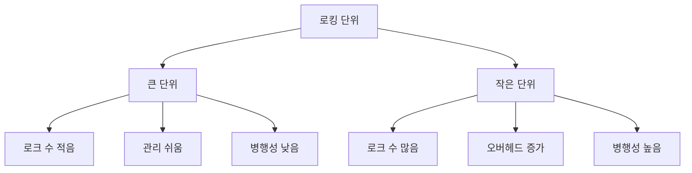
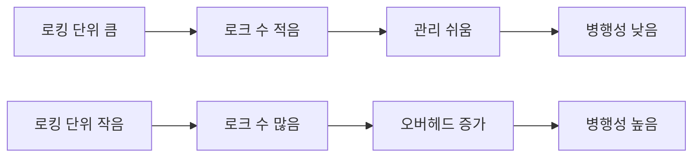

# 288 로킹 단위(Locking Granularity)

작성 기준일: 2026-06-01
검색/보강일: 2026-06-04
기준 PDF: `/Users/nes0903/Documents/study/정보처리기사/핵심요약집_2026_정보처리기사필기핵심요약.pdf`
PDF 확인 위치: 41페이지 `288 로킹 단위(Locking Granularity)`

## 한 줄 요약

- 로킹 단위는 병행제어에서 한 번에 잠글 수 있는 객체의 크기이며, 단위가 크면 관리가 쉽고 단위가 작으면 병행성이 높다.

## 한눈에 보는 구조

## PDF 기준 핵심

- 병행제어에서 한꺼번에 로킹할 수 있는 객체의 크기를 의미한다.
- 로킹 단위가 크면 로크 수가 작아 관리하기 쉽지만 병행성 수준이 낮아진다.
- 로킹 단위가 작으면 로크 수가 많아 관리하기 복잡해 오버헤드가 증가하지만 병행성 수준이 높아진다.

## 개념 설명

- 로킹은 동시에 실행되는 트랜잭션이 같은 데이터를 충돌 없이 사용하도록 잠금을 거는 방식이다.
- 로킹 단위는 데이터베이스, 테이블, 페이지, 레코드, 필드처럼 다양할 수 있다.
- 큰 단위 잠금은 단순하지만 다른 트랜잭션을 많이 막는다.
- 작은 단위 잠금은 더 많은 트랜잭션이 동시에 실행될 수 있지만 잠금 관리 비용이 증가한다.

## 시험 포인트

- `큰 단위 = 로크 수 적음, 관리 쉬움, 병행성 낮음`.
- `작은 단위 = 로크 수 많음, 관리 복잡, 오버헤드 증가, 병행성 높음`.
- 병행성과 오버헤드는 트레이드오프 관계이다.
- 로킹 단위 문제는 크고 작음의 효과를 반대로 내기 쉽다.

## 헷갈리는 비교

| 로킹 단위 | 로크 수 | 관리 | 오버헤드 | 병행성 |
|---|---|---|---|---|
| 큼 | 적음 | 쉬움 | 낮음 | 낮음 |
| 작음 | 많음 | 복잡 | 높음 | 높음 |

## 예시 또는 암기 포인트

- 테이블 전체를 잠그면 관리할 로크는 적지만 다른 사용자의 행 수정이 모두 막힌다.
- 행 단위로 잠그면 여러 사용자가 서로 다른 행을 동시에 수정할 수 있지만 로크 관리가 복잡하다.
- 암기식: `작게 잠그면 많이 동시에, 크게 잠그면 관리 쉽게`.

## 빠른 복습

- 로킹 단위가 크면 병행성은? 낮아진다.
- 로킹 단위가 작으면 오버헤드는? 증가한다.
- 로킹 단위의 의미는? 한꺼번에 로킹할 수 있는 객체의 크기.

## 상세 보강

- 로킹 단위는 한 번에 잠그는 데이터 객체의 크기이다. 데이터베이스, 파일, 페이지, 레코드, 필드 등으로 생각할 수 있다.
- 단위가 크면 잠금 관리가 단순하지만 다른 트랜잭션이 동시에 접근할 수 있는 범위가 줄어 병행성이 낮다.
- 단위가 작으면 여러 트랜잭션이 더 세밀하게 동시에 작업할 수 있지만 로크 수가 많아져 관리 오버헤드가 커진다.
- PDF의 세 문장은 그대로 시험에 자주 나온다. `크면 관리 쉬움/병행성 낮음`, `작으면 관리 복잡/병행성 높음`.
- 병행성과 오버헤드는 반대 방향으로 움직인다고 기억한다.

| 로킹 단위 | 로크 수 | 관리 | 오버헤드 | 병행성 |
|---|---:|---|---|---|
| 큼 | 적음 | 쉬움 | 낮음 | 낮음 |
| 작음 | 많음 | 복잡 | 높음 | 높음 |

## 참고 링크

- [PostgreSQL Documentation - Transaction Isolation](https://www.postgresql.org/docs/17/transaction-iso.html)
- [Database System Concepts - Recovery slides](https://www.db-book.com/Previous-editions/db4/slide-dir/ch17.pdf)

<!-- study-links:start -->
## 관련 문서

- `트랜잭션`: [[ACID-트랜잭션/ACID-트랜잭션|ACID 트랜잭션 상세 정리]]
<!-- study-links:end -->
