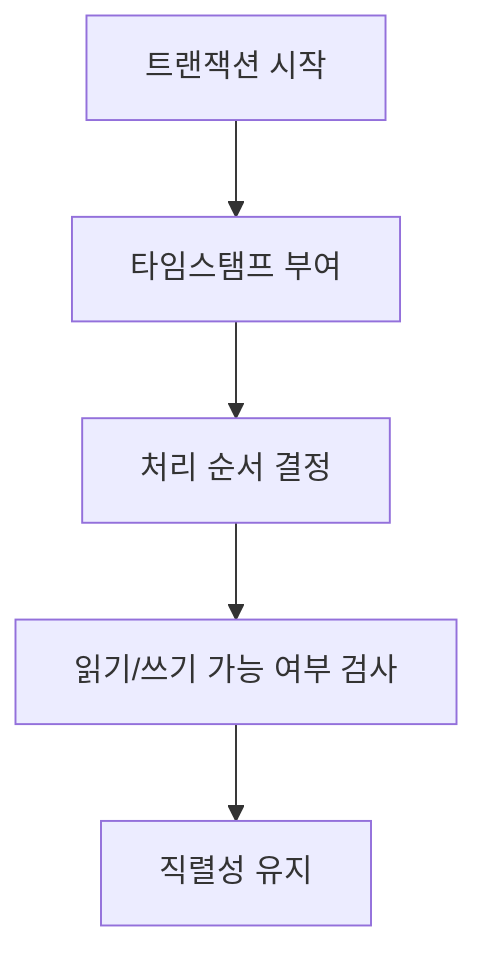
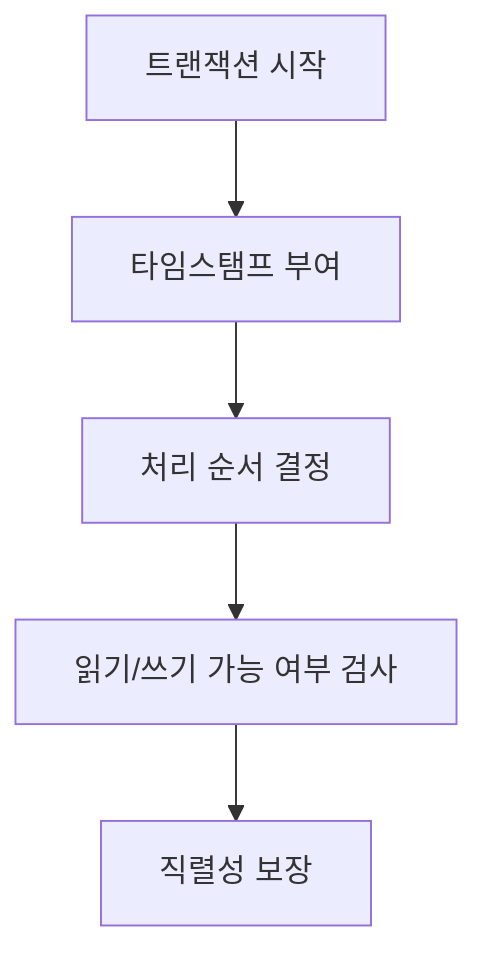

# 289 타임 스탬프 순서(Time Stamp Ordering)

작성 기준일: 2026-06-01
검색/보강일: 2026-06-04
기준 PDF: `/Users/nes0903/Documents/study/정보처리기사/핵심요약집_2026_정보처리기사필기핵심요약.pdf`
PDF 확인 위치: 41페이지 `289 타임 스탬프 순서(Time Stamp Ordering)`

## 한 줄 요약

- 타임스탬프 순서는 트랜잭션마다 부여한 시간표를 기준으로 직렬화 순서를 미리 정해 병행제어를 수행하는 기법이다.

## 한눈에 보는 구조

## PDF 기준 핵심

- 직렬성 순서를 결정하기 위해 트랜잭션 간의 처리 순서를 미리 선택하는 기법들 중 가장 보편적인 방법이다.
- `직렬성`, `처리 순서`, `미리 선택`, `타임스탬프`가 핵심 단서이다.

## 개념 설명

- 각 트랜잭션에 고유한 타임스탬프를 부여하고, 이 순서대로 실행된 것처럼 보이도록 읽기와 쓰기를 제어한다.
- 타임스탬프가 빠른 트랜잭션이 논리적으로 먼저 실행된 것으로 취급된다.
- 충돌이 직렬화 순서를 깨뜨리면 해당 연산을 거부하거나 트랜잭션을 재시작할 수 있다.
- 로킹 방식과 달리 잠금 대기보다 순서 검사를 중심으로 병행성을 통제한다.

## 시험 포인트

- `직렬성 순서 결정`이라는 PDF 문구가 핵심이다.
- 로킹은 자원 잠금, 타임스탬프는 시간 순서 부여로 구분한다.
- 트랜잭션 순서를 미리 선택한다는 표현을 놓치지 않는다.
- 병행제어 기법으로 로킹, 타임스탬프, 검증 기법과 함께 출제될 수 있다.

## 헷갈리는 비교

| 구분 | 로킹 | 타임스탬프 순서 |
|---|---|---|
| 기준 | 잠금 획득 | 시간표 순서 |
| 목적 | 충돌 접근 차단 | 직렬성 순서 보장 |
| 단서 | Lock | Timestamp |
| 위험 | 교착상태 가능 | 재시작 가능 |

## 예시 또는 암기 포인트

- T1이 10시, T2가 10시 1분 타임스탬프를 받았다면 시스템은 T1이 T2보다 먼저 실행된 것처럼 직렬성을 유지하려 한다.
- 암기식: `타임스탬프는 트랜잭션 줄 세우기`.

## 빠른 복습

- 타임스탬프 순서의 목적은? 직렬성 순서 결정.
- 기준은? 트랜잭션에 부여한 타임스탬프.
- 로킹과 차이는? 잠금보다 순서 검사를 중심으로 한다.

## 상세 보강

- 타임스탬프 순서 기법은 트랜잭션에 시간표를 부여하고 그 순서에 맞게 충돌을 제어하는 병행제어 기법이다.
- 락을 기다리는 방식과 달리 미리 정한 순서를 기준으로 연산 허용 여부를 판단한다.
- 목적은 여러 트랜잭션이 동시에 실행되어도 결과가 어떤 직렬 실행 순서와 같도록 보장하는 것이다.
- PDF의 `직렬성 순서 결정`, `트랜잭션 간 처리 순서 미리 선택`, `가장 보편적인 방법`이 핵심이다.
- 시험에서는 타임스탬프가 로그 시간이 아니라 병행제어에서의 순서 결정 기준이라는 점을 주의한다.

| 구분 | 타임스탬프 순서 | 로킹 |
|---|---|---|
| 기준 | 시간표 순서 | 데이터 잠금 |
| 목적 | 직렬성 보장 | 충돌 방지 |
| 단서 | 처리 순서 미리 선택 | 로크, 병행성 |

## 참고 링크

- [CMU Database Systems - Timestamp Ordering Concurrency Control](https://15445.courses.cs.cmu.edu/fall2025/slides/19-timestampordering.pdf)
