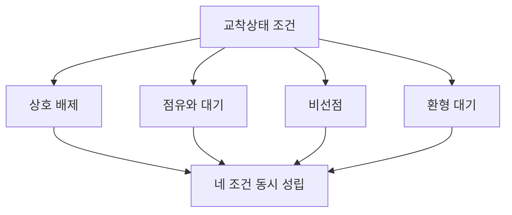
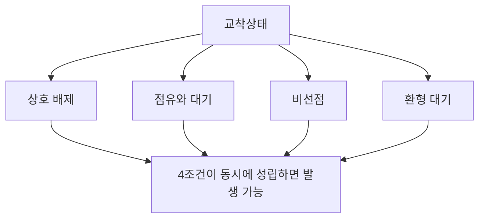

# 290 교착상태 발생의 필요 충분 조건 4가지

작성 기준일: 2026-06-01
검색/보강일: 2026-06-04
기준 PDF: `/Users/nes0903/Documents/study/정보처리기사/핵심요약집_2026_정보처리기사필기핵심요약.pdf`
PDF 확인 위치: 41페이지 `290 교착상태 발생의 필요 충분 조건 4가지`

## 한 줄 요약

- 교착상태는 상호 배제, 점유와 대기, 비선점, 환형 대기 네 조건이 동시에 성립할 때 발생할 수 있다.

## 한눈에 보는 구조

## PDF 기준 핵심

- 상호 배제(Mutual Exclusion).
- 점유와 대기(Hold and Wait).
- 비선점(Non-preemption).
- 환형 대기(Circular Wait).

## 개념 설명

- 상호 배제는 한 번에 하나의 프로세스만 사용할 수 있는 자원이 있다는 뜻이다.
- 점유와 대기는 프로세스가 이미 자원을 가진 채 다른 자원을 기다리는 상태이다.
- 비선점은 다른 프로세스가 점유한 자원을 강제로 빼앗을 수 없다는 뜻이다.
- 환형 대기는 프로세스들이 원형으로 서로의 자원을 기다리는 상태이다.
- 이 네 조건을 Coffman 조건이라고도 부른다.

## 시험 포인트

- 4조건 이름과 영어를 함께 외운다.
- 하나라도 깨지면 교착상태 발생을 방지할 수 있다.
- `환형 대기`를 단순 대기와 혼동하지 않는다. 원형 관계가 핵심이다.
- 회피 기법의 은행원 알고리즘은 교착상태 조건을 무조건 제거하지 않고 안전 상태를 유지한다.

## 헷갈리는 비교

| 조건 | 의미 | 시험 단서 |
|---|---|---|
| 상호 배제 | 자원을 동시에 공유 불가 | 한 번에 하나 |
| 점유와 대기 | 가진 채 다른 자원 대기 | hold |
| 비선점 | 강제 회수 불가 | no preemption |
| 환형 대기 | 원형 대기 관계 | circular |

## 예시 또는 암기 포인트

- P1은 프린터를 잡고 스캐너를 기다리고, P2는 스캐너를 잡고 프린터를 기다리면 환형 대기 구조가 된다.
- 암기식: `상점비환`.

## 빠른 복습

- 교착상태 4조건은? 상호 배제, 점유와 대기, 비선점, 환형 대기.
- Circular Wait의 한글은? 환형 대기.
- 조건 중 하나를 제거하면? 교착상태 방지 가능성이 생긴다.

## 상세 보강

- 교착상태는 둘 이상의 프로세스나 트랜잭션이 서로가 가진 자원을 기다리며 무한 대기하는 상태이다.
- 상호 배제는 한 자원을 한 번에 하나의 프로세스만 사용할 수 있는 조건이다.
- 점유와 대기는 이미 자원을 가진 상태에서 다른 자원을 추가로 기다리는 조건이다.
- 비선점은 다른 프로세스가 가진 자원을 강제로 빼앗을 수 없다는 조건이다.
- 환형 대기는 프로세스들이 원형으로 서로의 자원을 기다리는 조건이다.

| 조건 | 의미 | 제거 전략 예 |
|---|---|---|
| 상호 배제 | 자원 독점 사용 | 공유 가능 자원 설계 |
| 점유와 대기 | 보유하면서 추가 요청 | 모든 자원 선점 요청 |
| 비선점 | 강제 회수 불가 | 선점 허용 |
| 환형 대기 | 원형 대기 | 자원 요청 순서 부여 |

## 참고 링크

- [UC Davis - Four Necessary and Sufficient Conditions for Deadlock](https://nob.cs.ucdavis.edu/classes/ecs150-1999-02/dl-cond.html)
- [Duke - Four Preconditions for Deadlock](https://courses.cs.duke.edu/cps110/spring01/slides/deadlock/tsld010.htm)

<!-- study-links:start -->
## 관련 문서

- `회피 기법`: [[정보처리기사/5과목 정보시스템 구축 관리/291 회피 기법(Avoidance)/291 회피 기법(Avoidance)|291 회피 기법(Avoidance)]]
- `트랜잭션`: [[ACID-트랜잭션/ACID-트랜잭션|ACID 트랜잭션 상세 정리]]
<!-- study-links:end -->
