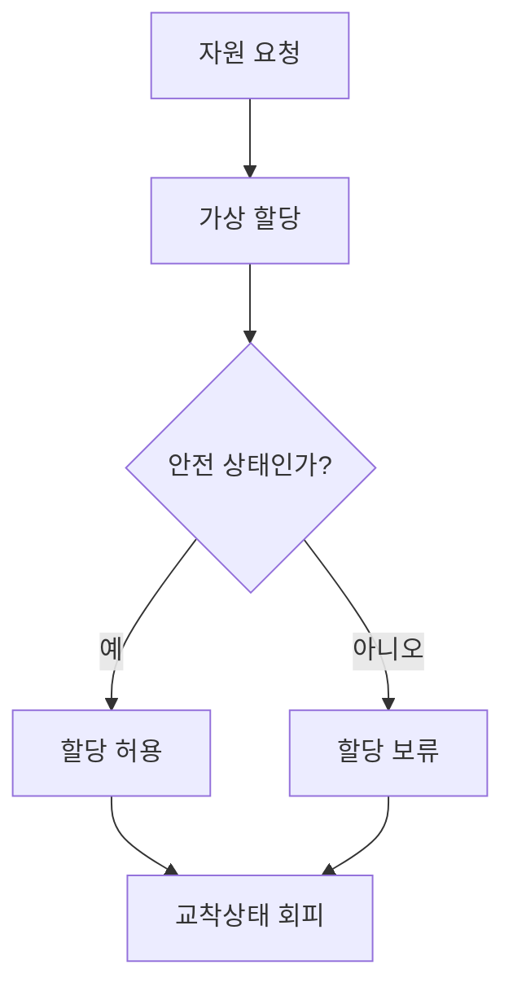
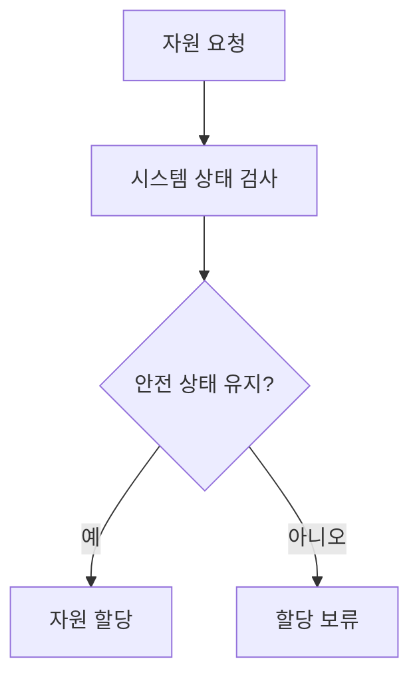

# 291 회피 기법(Avoidance)

작성 기준일: 2026-06-01
검색/보강일: 2026-06-04
기준 PDF: `/Users/nes0903/Documents/study/정보처리기사/핵심요약집_2026_정보처리기사필기핵심요약.pdf`
PDF 확인 위치: 41페이지 `291 회피 기법(Avoidance)`

## 한 줄 요약

- 교착상태 회피는 교착상태 가능성을 완전히 배제하지 않고, 자원 할당 전 안전 상태 여부를 확인해 위험한 상태를 피하는 기법이다.

## 한눈에 보는 구조

## PDF 기준 핵심

- 교착상태가 발생할 가능성을 배제하지 않는다.
- 교착상태가 발생하면 적절히 피해 나가는 방법이다.
- 주로 은행원 알고리즘(Banker’s Algorithm)이 사용된다.
- 은행원 알고리즘은 E. J. Dijkstra가 제안했으며, 은행에서 모든 고객의 요구가 충족되도록 현금을 할당하는 데서 유래했다.

## 개념 설명

- 회피는 시스템이 안전 상태를 유지하도록 자원 할당을 결정한다.
- 은행원 알고리즘은 각 프로세스의 최대 자원 요구량을 알고 있다고 가정하고, 요청을 승인해도 모든 프로세스가 완료 가능한지 검사한다.
- 안전 상태이면 자원을 할당하고, 불안전 상태가 되면 할당을 보류한다.
- 방지는 조건 자체를 깨는 방식이고, 회피는 위험한 할당을 피하는 방식이다.

## 시험 포인트

- `회피 = 은행원 알고리즘`을 바로 연결한다.
- Dijkstra 이름과 유래가 PDF에 나온다.
- 교착상태 가능성을 배제하지 않는다는 표현이 회피 기법의 특징이다.
- 안전 상태와 불안전 상태 개념을 함께 기억한다.

## 헷갈리는 비교

| 구분 | 방지(Prevention) | 회피(Avoidance) | 탐지/회복 |
|---|---|---|---|
| 방식 | 조건 중 하나 제거 | 안전 상태 유지 | 발생 후 탐지·처리 |
| 대표 | 상호 배제 등 조건 제거 | 은행원 알고리즘 | 자원 회수, 종료 |
| 단서 | 발생 못 하게 | 위험한 할당 피함 | 발생 후 조치 |

## 예시 또는 암기 포인트

- 은행이 모든 고객에게 최대 대출 가능성을 고려해 파산하지 않을 만큼만 대출을 승인하는 비유로 이해한다.
- 암기식: `Avoidance = Banker가 안전하면 빌려줌`.

## 빠른 복습

- 교착상태 회피 대표 알고리즘은? 은행원 알고리즘.
- 제안자는? E. J. Dijkstra.
- 핵심 판단 기준은? 안전 상태 여부.

## 상세 보강

- 교착상태 회피는 교착상태가 생길 가능성을 인정하고, 자원을 할당하기 전에 안전 상태인지 검사해 위험한 할당을 피하는 방식이다.
- 은행원 알고리즘은 각 프로세스의 최대 요구량, 현재 할당량, 가용 자원을 기준으로 안전 순서가 존재하는지 확인한다.
- 안전 상태는 모든 프로세스가 어떤 순서로든 정상 완료될 수 있는 상태이다.
- PDF의 `발생 가능성을 배제하지 않음`, `발생하면 적절히 피해 나감`, `은행원 알고리즘`이 핵심이다.
- 예방은 교착상태 4조건 중 하나를 사전에 깨는 방식이고, 회피는 매 요청마다 안전성을 검사하는 방식이다.

| 구분 | 예방 | 회피 |
|---|---|---|
| 접근 | 발생 조건을 미리 제거 | 안전 상태인지 검사 |
| 대표 | 4조건 중 하나 제거 | 은행원 알고리즘 |
| 특징 | 보수적일 수 있음 | 최대 요구량 정보 필요 |

## 참고 링크

- [Duke - Banker's Algorithm](https://courses.cs.duke.edu/spring00/cps110/slides/deadlock/tsld019.htm)
