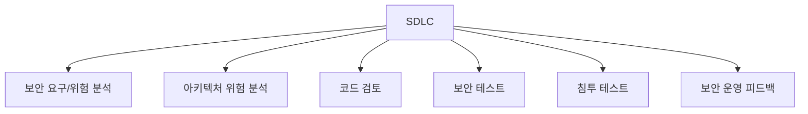
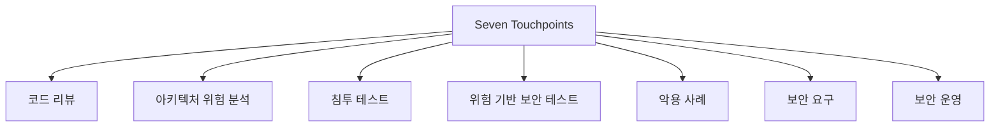

# 292 Seven Touchpoints

작성 기준일: 2026-06-01
검색/보강일: 2026-06-04
기준 PDF: `/Users/nes0903/Documents/study/정보처리기사/핵심요약집_2026_정보처리기사필기핵심요약.pdf`
PDF 확인 위치: 41페이지 `292 Seven Touchpoints`

## 한 줄 요약

- Seven Touchpoints는 소프트웨어 보안 모범사례를 SDLC에 통합하는 방법론이다.

## 한눈에 보는 구조

## PDF 기준 핵심

- 소프트웨어 보안의 모범사례를 SDLC에 통합한 방법론이다.
- `보안`, `모범사례`, `SDLC 통합`이 핵심 단서이다.

## 개념 설명

- Seven Touchpoints는 Gary McGraw가 제시한 소프트웨어 보안 활동 체계로 알려져 있다.
- 보안을 개발 마지막에 검사하는 것이 아니라 요구사항, 설계, 구현, 테스트, 운영 전반에 연결한다.
- Building Security In 자료는 위험 분석, 코드 리뷰, 보안 테스트, 침투 테스트 등 보안 활동을 SDLC 접점에 배치한다.
- 정보처리기사에서는 세부 7개 항목보다 `SDLC에 보안 모범사례 통합`이라는 정의가 우선이다.

## 시험 포인트

- `SDLC 통합`이라는 표현이 나오면 Seven Touchpoints를 떠올린다.
- OWASP가 웹 애플리케이션 보안 프로젝트라면, Seven Touchpoints는 개발 생명주기 보안 방법론이다.
- Seven이라는 숫자 때문에 보안 3요소와 혼동하지 않는다.
- 보안은 요구사항부터 테스트까지 전 과정에 들어간다는 관점이 핵심이다.

## 헷갈리는 비교

| 구분 | Seven Touchpoints | OWASP |
|---|---|---|
| 성격 | 보안 모범사례를 SDLC에 통합하는 방법론 | 웹 애플리케이션 보안 프로젝트/단체 |
| 초점 | 개발 생명주기 보안 | 웹 취약점과 가이드 |
| 단서 | Gary McGraw, touchpoint | Top 10 |

## 예시 또는 암기 포인트

- 설계 단계에서 아키텍처 위험 분석을 하고, 구현 단계에서 정적 분석과 코드 리뷰를 하는 흐름이 Seven Touchpoints 관점이다.
- 암기식: `Touchpoints = SDLC 곳곳에 보안 접점`.

## 빠른 복습

- Seven Touchpoints의 목적은? 보안 모범사례를 SDLC에 통합.
- 어떤 관점인가? 개발 전 과정 보안.
- OWASP와 차이는? OWASP는 웹 보안 프로젝트/단체이다.

## 상세 보강

- Seven Touchpoints는 소프트웨어 보안 활동을 SDLC 전체에 통합하기 위한 실천 프레임워크로 이해한다.
- 핵심 사고는 보안을 개발 마지막 테스트 단계에만 붙이지 않고 요구사항, 설계, 구현, 테스트, 운영 전반에 배치하는 것이다.
- 대표 활동은 코드 리뷰, 아키텍처 위험 분석, 침투 테스트, 위험 기반 보안 테스트, 악용 사례 작성, 보안 요구 도출, 보안 운영이다.
- PDF의 핵심은 `소프트웨어 보안의 모범사례`와 `SDLC에 통합`이다.
- 시험에서는 Seven Touchpoints를 특정 공격기법이 아니라 보안 개발 방법론/실천 모음으로 구분한다.

| 활동 | 목적 |
|---|---|
| 코드 리뷰 | 구현 취약점 발견 |
| 아키텍처 위험 분석 | 설계 수준 위험 식별 |
| 침투 테스트 | 실제 공격 관점 검증 |
| 보안 요구 | 초기에 보안 목표 반영 |
| 보안 운영 | 배포 후 모니터링과 대응 |

## 참고 링크

- [Building Security In - Seven Touchpoints for Software Security](https://www.buildingsecurityin.com/concepts/touchpoints/)
- [CyBOK - Secure Software Lifecycle](https://cybok.org/media/downloads/Secure_Software_Lifecycle_v1.0.2.pdf)
