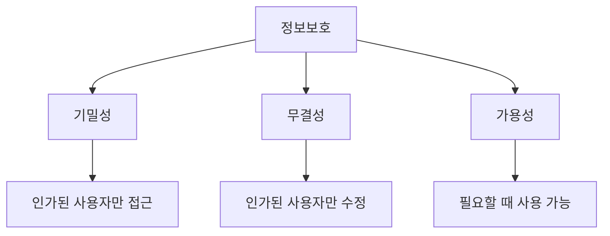
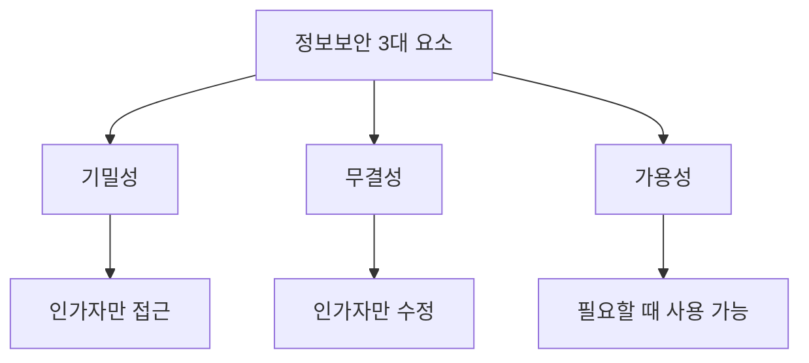

# 293 보안 3대 요소

작성 기준일: 2026-06-01
검색/보강일: 2026-06-04
기준 PDF: `/Users/nes0903/Documents/study/정보처리기사/핵심요약집_2026_정보처리기사필기핵심요약.pdf`
PDF 확인 위치: 41페이지 `293 보안 3대 요소`

## 한 줄 요약

- 보안 3대 요소는 기밀성, 무결성, 가용성이며 정보보호의 기본 목표이다.

## 한눈에 보는 구조

## PDF 기준 핵심

- 기밀성: 시스템 내의 정보와 자원은 인가된 사용자에게만 접근이 허용되며, 정보가 전송 중에 노출되더라도 데이터를 읽을 수 없음.
- 무결성: 시스템 내의 정보는 오직 인가된 사용자만 수정할 수 있음.
- 가용성: 인가받은 사용자는 언제라도 사용할 수 있음.

## 개념 설명

- 기밀성(Confidentiality)은 정보가 허가받지 않은 사람에게 노출되지 않게 하는 성질이다.
- 무결성(Integrity)은 정보가 허가 없이 변경되지 않고 정확한 상태를 유지하는 성질이다.
- 가용성(Availability)은 허가된 사용자가 필요한 때 서비스를 사용할 수 있는 성질이다.
- NIST CSRC도 CIA를 Confidentiality, Integrity, Availability 보장으로 정리한다.

## 시험 포인트

- CIA는 미국 정보기관이 아니라 보안 3요소의 영문 약자이다.
- 암호화는 기밀성, 해시/전자서명은 무결성, 이중화/백업/HA는 가용성과 연결된다.
- 가용성은 단순 접근 허가가 아니라 사용할 수 있는 상태를 뜻한다.
- PDF 표현처럼 `인가된 사용자`가 세 요소 모두에서 중요하다.

## 헷갈리는 비교

| 요소 | 핵심 질문 | 대표 대응 |
|---|---|---|
| 기밀성 | 누가 읽을 수 있는가 | 암호화, 접근통제 |
| 무결성 | 누가 바꿀 수 있는가 | 해시, 서명, 변경 통제 |
| 가용성 | 언제 사용할 수 있는가 | 이중화, 백업, 장애 대응 |

## 예시 또는 암기 포인트

- 고객 DB가 유출되면 기밀성 침해, 금액이 몰래 바뀌면 무결성 침해, 서비스가 DDoS로 중단되면 가용성 침해이다.
- 암기식: `CIA = Confidentiality, Integrity, Availability`.

## 빠른 복습

- 보안 3요소는? 기밀성, 무결성, 가용성.
- 데이터를 읽지 못하게 하는 것은? 기밀성.
- 필요한 때 서비스를 쓰게 하는 것은? 가용성.

## 상세 보강

- 보안 3대 요소는 CIA Triad로 자주 불리며, 보안 목표를 분류하는 가장 기본적인 틀이다.
- 기밀성은 허가받지 않은 공개와 열람을 막는 것이다. 암호화와 접근 제어가 대표 통제이다.
- 무결성은 데이터가 허가 없이 변경되지 않도록 보장하는 것이다. 해시, 전자서명, 변경 통제가 연결된다.
- 가용성은 인가된 사용자가 필요한 때 서비스를 사용할 수 있게 하는 것이다. 이중화, 백업, DDoS 방어가 연결된다.
- 시험에서는 공격의 피해가 어느 요소를 침해하는지 묻는 경우가 많다.

| 요소 | 침해 예 | 대응 예 |
|---|---|---|
| 기밀성 | 개인정보 유출 | 암호화, 접근 제어 |
| 무결성 | DB 변조 | 해시, 전자서명 |
| 가용성 | 서비스 거부 | 이중화, 용량 관리 |

## 참고 링크

- [NIST CSRC Glossary - Confidentiality, Integrity, Availability](https://csrc.nist.gov/glossary/term/confidentiality_integrity_availability)

<!-- study-links:start -->
## 관련 문서

- `무결성`: [[정보처리기사/3과목 데이터베이스 구축/115 무결성/115 무결성|115 무결성]]
- `해시`: [[정보처리기사/5과목 정보시스템 구축 관리/304 해시(Hash)/304 해시(Hash)|304 해시(Hash)]]
<!-- study-links:end -->
