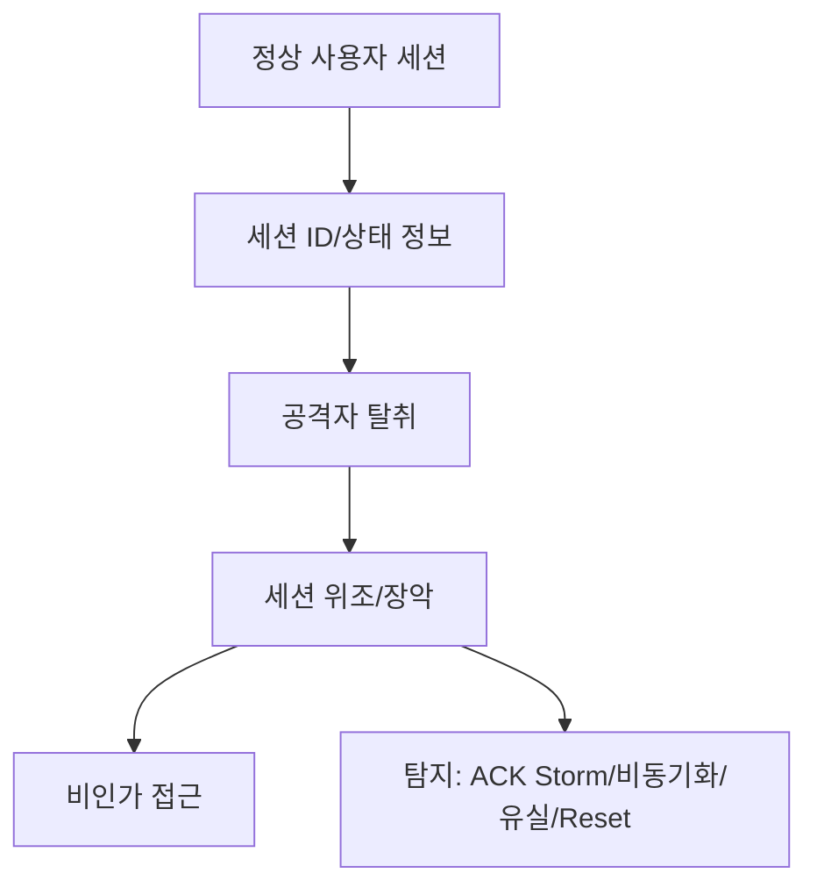
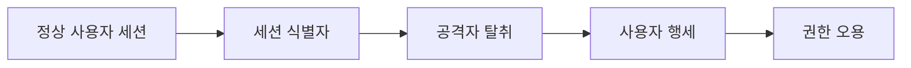

# 294 세션 하이재킹(Session Hijacking)

작성 기준일: 2026-06-01
검색/보강일: 2026-06-04
기준 PDF: `/Users/nes0903/Documents/study/정보처리기사/핵심요약집_2026_정보처리기사필기핵심요약.pdf`
PDF 확인 위치: 41페이지 `294 세션 하이재킹(Session Hijacking)`

## 한 줄 요약

- 세션 하이재킹은 서버에 접속 중인 클라이언트의 세션 정보를 가로채 정상 사용자처럼 세션을 장악하는 공격이다.

## 한눈에 보는 구조

## PDF 기준 핵심

- 서버에 접속하고 있는 클라이언트들의 세션 정보를 가로채는 공격기법이다.
- 세션 가로채기라고도 한다.
- 탐지 방법: 비동기화 상태 탐지, ACK Storm 탐지, 패킷의 유실 탐지, 예상치 못한 접속의 리셋 탐지 등.

## 개념 설명

- 세션은 로그인 후 서버와 클라이언트가 상태를 유지하기 위해 사용하는 논리적 연결 정보이다.
- 공격자가 세션 ID나 쿠키를 훔치면 인증된 사용자처럼 요청을 보낼 수 있다.
- TCP 세션을 노리는 경우 순서 번호 예측, 패킷 삽입, 연결 리셋과 같은 네트워크 이상 징후가 나타날 수 있다.
- 웹에서는 HTTPS, Secure/HttpOnly 쿠키, 세션 만료, 재인증이 대응책으로 쓰인다.

## 시험 포인트

- `세션 정보 가로채기`가 핵심이다.
- 탐지 방법 4개를 PDF 그대로 외운다.
- SQL Injection이나 XSS처럼 입력값 삽입이 핵심인 공격과 구분한다.
- 세션 하이재킹은 인증 이후 상태를 탈취한다는 점이 중요하다.

## 헷갈리는 비교

| 공격 | 핵심 | 시험 단서 |
|---|---|---|
| 세션 하이재킹 | 세션 정보 탈취 | ACK Storm, Reset |
| SQL Injection | SQL 삽입 | DB 유출/변조 |
| XSS | 스크립트 삽입 | 방문자 정보 탈취 |

## 예시 또는 암기 포인트

- 카페 Wi-Fi에서 공격자가 세션 쿠키를 훔쳐 사용자의 로그인 상태를 그대로 사용하는 공격을 떠올린다.
- 암기식: `Hijacking = 로그인 이후 세션 납치`.

## 빠른 복습

- 세션 하이재킹은 무엇을 가로채는가? 세션 정보.
- 다른 이름은? 세션 가로채기.
- PDF 탐지 방법 중 하나는? ACK Storm 탐지.

## 상세 보강

- 세션 하이재킹은 이미 인증된 사용자와 서버 사이의 세션 정보를 가로채거나 조작해 공격자가 사용자처럼 행동하는 공격이다.
- 세션 쿠키 탈취, 네트워크 스니핑, XSS를 통한 세션 정보 탈취 등과 연결될 수 있다.
- 탐지 단서로 PDF는 비동기화 상태, ACK Storm, 패킷 유실, 예상치 못한 RST를 제시한다.
- 대응은 HTTPS 적용, 안전한 쿠키 속성, 세션 ID 재발급, 짧은 세션 만료, 이상 행위 탐지 등이다.
- 시험에서는 `세션 가로채기`, `세션 정보`, `ACK Storm`이 나오면 세션 하이재킹을 떠올린다.

| 구분 | 세션 하이재킹 | 스푸핑 |
|---|---|---|
| 초점 | 인증 후 세션 탈취 | 신원/주소 위장 |
| 대상 | 세션 ID, 쿠키, 연결 상태 | IP, DNS, MAC 등 |
| 피해 | 사용자 권한 오용 | 잘못된 신뢰 유도 |

## 참고 링크

- [OWASP Session Management Cheat Sheet](https://cheatsheetseries.owasp.org/cheatsheets/Session_Management_Cheat_Sheet.html)

<!-- study-links:start -->
## 관련 문서

- `sql 삽입`: [[정보처리기사/5과목 정보시스템 구축 관리/295 SQL 삽입(SQL Injection)/295 SQL 삽입(SQL Injection)|295 SQL 삽입(SQL Injection)]]
- `owasp`: [[정보처리기사/5과목 정보시스템 구축 관리/278 OWASP(오픈 웹 애플리케이션 보안 프로젝트)/278 OWASP(오픈 웹 애플리케이션 보안 프로젝트)|278 OWASP(오픈 웹 애플리케이션 보안 프로젝트)]]
- `dns`: [[DNS/DNS|DNS 상세 정리]]
- `sql`: [[sql-query/sql-query|반드시 알아둬야 할 SQL 쿼리 정리]]
<!-- study-links:end -->
