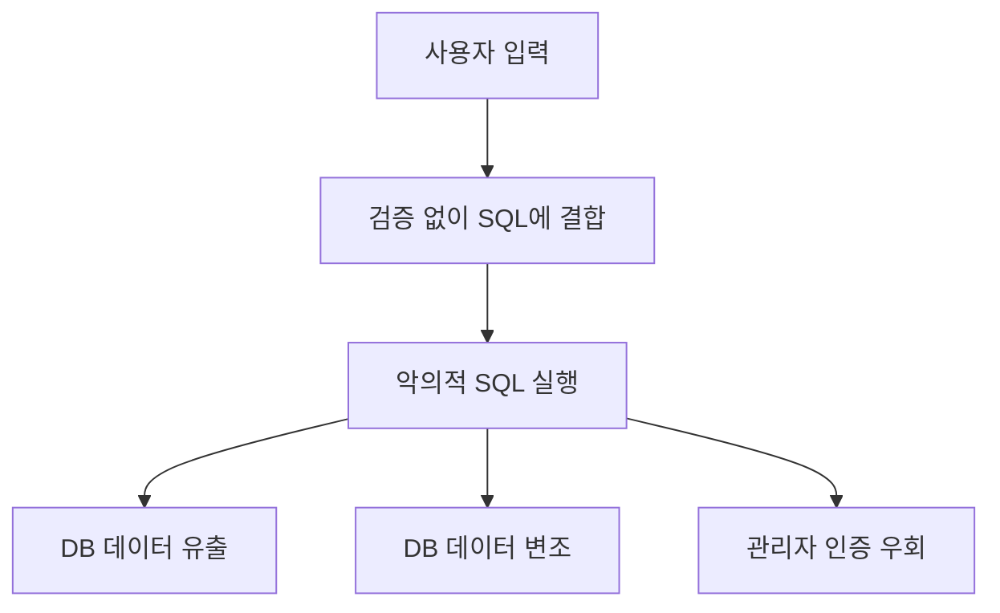
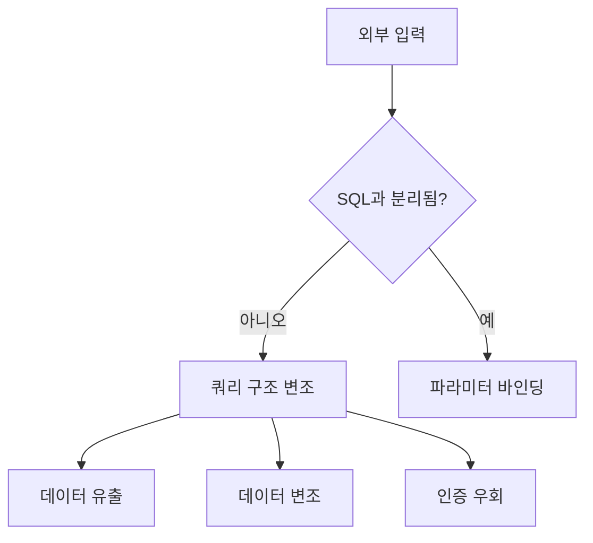

# 295 SQL 삽입(SQL Injection)

작성 기준일: 2026-06-01
검색/보강일: 2026-06-04
기준 PDF: `/Users/nes0903/Documents/study/정보처리기사/핵심요약집_2026_정보처리기사필기핵심요약.pdf`
PDF 확인 위치: 41페이지 `295 SQL 삽입(SQL Injection)`

## 한 줄 요약

- SQL 삽입은 웹 응용 프로그램 입력값에 SQL을 끼워 넣어 DB 데이터를 유출·변조하거나 인증을 우회하는 보안 약점이다.

## 한눈에 보는 구조

## PDF 기준 핵심

- 웹 응용 프로그램에 SQL을 삽입한다.
- 내부 데이터베이스(DB) 서버의 데이터를 유출 및 변조한다.
- 관리자 인증을 우회하는 보안 약점이다.

## 개념 설명

- 애플리케이션이 입력값을 검증하지 않고 SQL 문자열에 그대로 붙이면 공격자가 조건식을 조작할 수 있다.
- 예를 들어 로그인 쿼리의 조건을 항상 참으로 만들거나, UNION을 이용해 다른 테이블 데이터를 조회할 수 있다.
- OWASP는 SQL Injection을 공격자가 애플리케이션 쿼리에 SQL 명령을 삽입하는 공격으로 다룬다.
- 대응은 Prepared Statement, 파라미터 바인딩, 입력 검증, 최소 권한 DB 계정 사용이다.

## 시험 포인트

- `SQL`, `DB`, `유출/변조`, `인증 우회`가 핵심 단서이다.
- XSS는 브라우저에서 스크립트 실행, SQL Injection은 DB 쿼리 조작이다.
- 단순히 SQL 오류가 나는 것이 아니라 공격자가 의도한 SQL이 실행되는 것이 문제이다.
- 관리자 인증 우회가 PDF에 명시되어 있다.

## 헷갈리는 비교

| 구분 | SQL Injection | XSS |
|---|---|---|
| 삽입 대상 | SQL 쿼리 | 웹 페이지 스크립트 |
| 피해 | DB 유출/변조, 인증 우회 | 방문자 정보 탈취, 비정상 기능 |
| 대응 | 파라미터 바인딩 | 출력 인코딩, CSP |
| 시험 단서 | DB 서버 | 악성 스크립트 |

## 예시 또는 암기 포인트

- 로그인 ID에 `' OR '1'='1` 같은 값을 넣어 조건식을 조작하는 예가 SQL Injection의 전형이다.
- 암기식: `SQLi = 입력값이 SQL이 되어 DB를 건드림`.

## 빠른 복습

- SQL Injection이 노리는 대상은? DB 쿼리.
- PDF의 피해 3가지는? DB 유출, DB 변조, 관리자 인증 우회.
- 대표 대응은? Prepared Statement와 파라미터 바인딩.

## 상세 보강

- SQL Injection의 본질은 입력값이 데이터로 처리되지 않고 SQL 명령 구조의 일부가 되는 것이다.
- 단순 입력 검증만으로는 부족할 수 있으며, Prepared Statement와 파라미터 바인딩이 핵심 방어이다.
- 최소 권한 DB 계정을 사용하면 취약점이 발생해도 피해 범위를 줄일 수 있다.
- 오류 메시지에 쿼리 구조나 테이블명이 노출되면 공격자가 추론하기 쉬워진다.
- 시험에서는 XSS와 비교한다. SQL Injection은 DB 쿼리 조작, XSS는 브라우저에서 스크립트 실행이다.

| 방어 | 효과 |
|---|---|
| Prepared Statement | 입력값을 SQL 구조와 분리 |
| 입력 검증 | 예상 범위 밖 값 차단 |
| 최소 권한 | DB 피해 범위 제한 |
| 오류 메시지 통제 | 내부 구조 노출 감소 |

## 참고 링크

- [OWASP - SQL Injection](https://owasp.org/www-community/attacks/SQL_Injection)
- [OWASP Injection Prevention Cheat Sheet](https://cheatsheetseries.owasp.org/cheatsheets/Injection_Prevention_Cheat_Sheet.html)

<!-- study-links:start -->
## 관련 문서

- `owasp`: [[정보처리기사/5과목 정보시스템 구축 관리/278 OWASP(오픈 웹 애플리케이션 보안 프로젝트)/278 OWASP(오픈 웹 애플리케이션 보안 프로젝트)|278 OWASP(오픈 웹 애플리케이션 보안 프로젝트)]]
- `sql`: [[sql-query/sql-query|반드시 알아둬야 할 SQL 쿼리 정리]]
<!-- study-links:end -->
