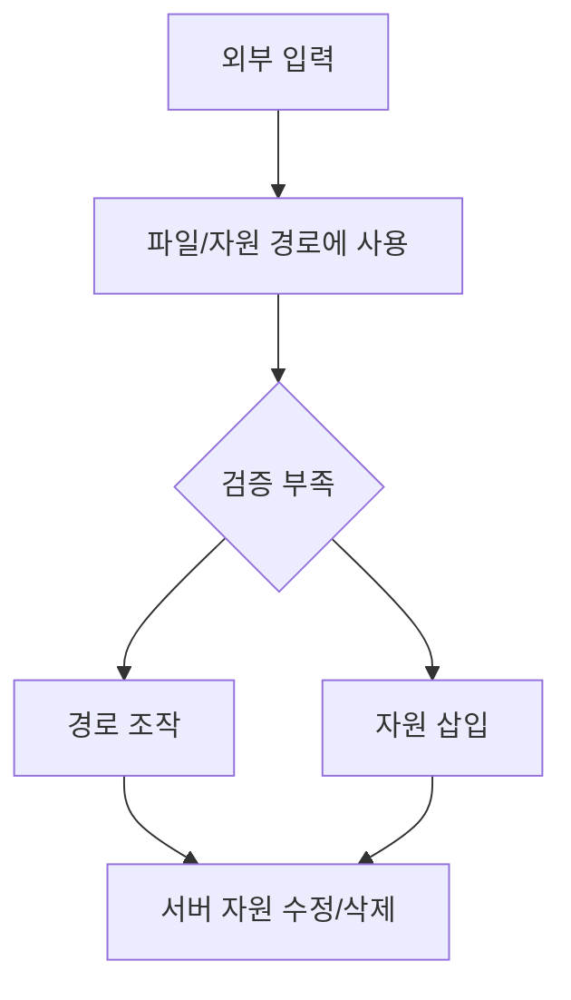
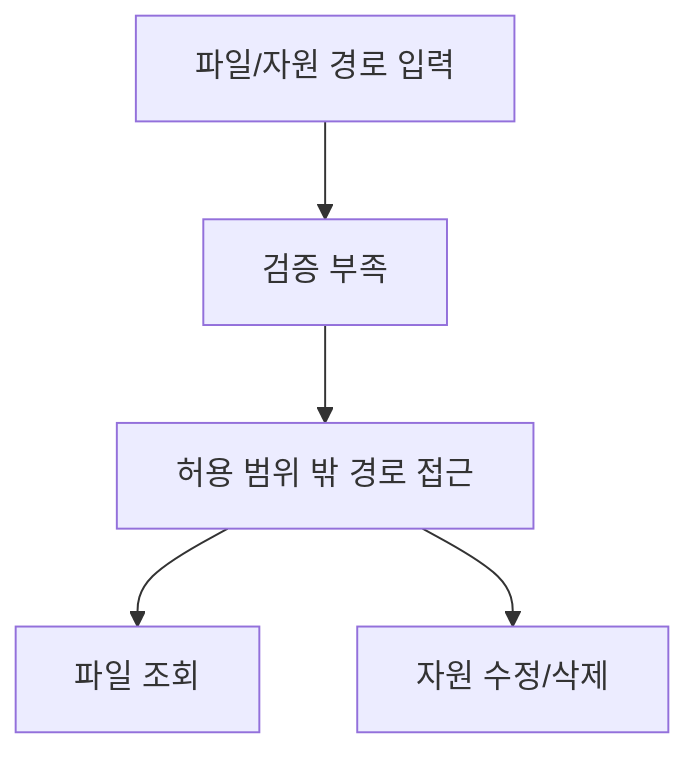

# 296 경로 조작 및 자원 삽입

작성 기준일: 2026-06-01
검색/보강일: 2026-06-04
기준 PDF: `/Users/nes0903/Documents/study/정보처리기사/핵심요약집_2026_정보처리기사필기핵심요약.pdf`
PDF 확인 위치: 41페이지 `296 경로 조작 및 자원 삽입`

## 한 줄 요약

- 경로 조작 및 자원 삽입은 입력값으로 파일·자원 경로를 조작해 서버 자원을 수정하거나 삭제하게 만드는 보안 약점이다.

## 한눈에 보는 구조

## PDF 기준 핵심

- 데이터 입출력 경로를 조작한다.
- 서버 자원을 수정·삭제할 수 있는 보안 약점이다.
- `경로 조작`, `서버 자원`, `수정·삭제`가 핵심 단서이다.

## 개념 설명

- 사용자가 입력한 파일명이나 경로를 검증 없이 사용하면 공격자가 `../` 같은 경로 이동 문자열을 넣어 의도하지 않은 파일에 접근할 수 있다.
- 자원 삽입은 외부 입력이 파일, URL, 명령, 템플릿 같은 자원 참조에 섞여 들어가 의도하지 않은 자원을 사용하게 되는 문제로 이해한다.
- OWASP Web Security Testing Guide는 디렉터리 탐색과 파일 포함 취약점을 입력 지점과 파일 경로 조작 관점에서 테스트한다.
- 대응은 허용 목록, 경로 정규화, 권한 제한, 사용자 입력의 직접 경로 사용 금지이다.

## 시험 포인트

- SQL Injection은 DB 쿼리 조작, 경로 조작은 파일/자원 경로 조작이다.
- `서버 자원 수정·삭제`라는 PDF 문구가 중요하다.
- Path Traversal, Directory Traversal, File Inclusion 단서와 연결된다.
- 파일 다운로드, 업로드, 템플릿 선택 기능에서 자주 발생한다.

## 헷갈리는 비교

| 취약점 | 조작 대상 | 피해 |
|---|---|---|
| 경로 조작 | 파일/자원 경로 | 서버 파일 접근, 수정, 삭제 |
| SQL Injection | SQL 쿼리 | DB 유출/변조 |
| XSS | 웹 페이지 출력 | 사용자 브라우저 스크립트 실행 |

## 예시 또는 암기 포인트

- 다운로드 파일명 파라미터에 `../../etc/passwd`를 넣어 의도하지 않은 파일을 읽게 하면 경로 조작이다.
- 암기식: `경로 조작 = 길을 바꿔 서버 자원에 접근`.

## 빠른 복습

- 경로 조작의 대상은? 데이터 입출력 경로.
- PDF의 피해는? 서버 자원 수정·삭제.
- 대표 대응은? 허용 목록과 경로 정규화.

## 상세 보강

- 경로 조작은 사용자가 입력한 파일명이나 경로를 검증하지 않아 의도하지 않은 디렉터리나 자원에 접근하게 되는 취약점이다.
- 자원 삽입은 외부 입력이 파일, URL, 라이브러리, 명령 자원 참조에 끼어들어 서버 자원을 조작하게 되는 상황과 연결된다.
- 방어는 허용 목록 기반 파일명 검증, 경로 정규화, 기준 디렉터리 밖 접근 차단, OS 권한 최소화이다.
- PDF의 `데이터 입출력 경로 조작`, `서버 자원 수정·삭제`가 핵심이다.
- 시험에서는 SQL Injection처럼 DB 쿼리가 아니라 파일/경로/자원 접근이 대상이라는 점을 구분한다.

| 구분 | 경로 조작 | SQL Injection |
|---|---|---|
| 대상 | 파일 경로, 서버 자원 | DB 쿼리 |
| 피해 | 파일 조회/수정/삭제 | DB 유출/변조 |
| 방어 | 경로 정규화, 허용 목록 | 파라미터 바인딩 |

## 참고 링크

- [OWASP WSTG - Testing Directory Traversal File Include](https://owasp.org/www-project-web-security-testing-guide/latest/4-Web_Application_Security_Testing/05-Authorization_Testing/01-Testing_Directory_Traversal_File_Include)
- [OWASP - Path Traversal](https://owasp.org/www-community/attacks/Path_Traversal)

<!-- study-links:start -->
## 관련 문서

- `owasp`: [[정보처리기사/5과목 정보시스템 구축 관리/278 OWASP(오픈 웹 애플리케이션 보안 프로젝트)/278 OWASP(오픈 웹 애플리케이션 보안 프로젝트)|278 OWASP(오픈 웹 애플리케이션 보안 프로젝트)]]
- `sql`: [[sql-query/sql-query|반드시 알아둬야 할 SQL 쿼리 정리]]
- `정규화`: [[정보처리기사/3과목 데이터베이스 구축/123 정규화(Normalization)/123 정규화(Normalization)|123 정규화(Normalization)]]
<!-- study-links:end -->
