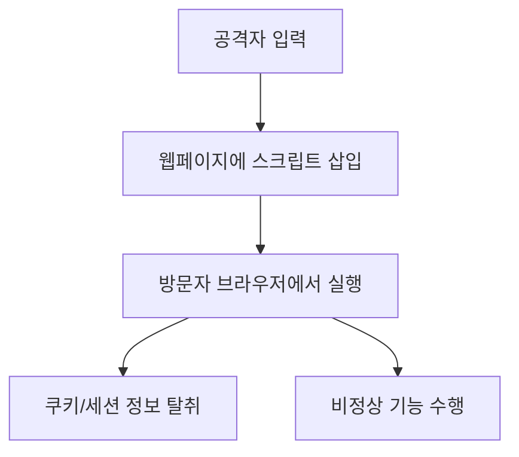
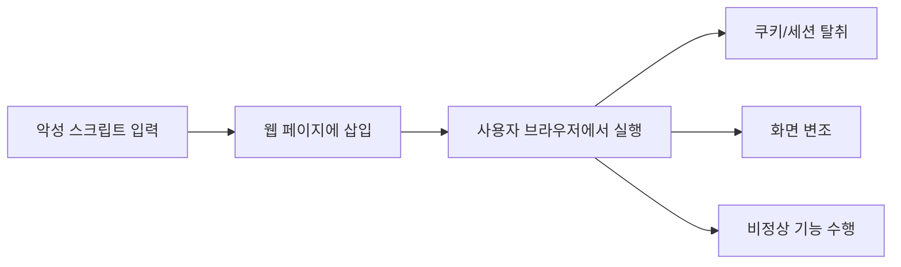

# 297 크로스사이트 스크립팅(XSS; Cross Site Scripting)

작성 기준일: 2026-06-01
검색/보강일: 2026-06-04
기준 PDF: `/Users/nes0903/Documents/study/정보처리기사/핵심요약집_2026_정보처리기사필기핵심요약.pdf`
PDF 확인 위치: 42페이지 `297 크로스사이트 스크립팅(XSS; Cross Site Scripting)`

## 한 줄 요약

- XSS는 웹페이지에 악성 스크립트를 삽입해 방문자의 정보를 탈취하거나 비정상 동작을 유발하는 보안 약점이다.

## 한눈에 보는 구조

## PDF 기준 핵심

- 웹페이지에 악의적인 스크립트를 삽입한다.
- 방문자들의 정보를 탈취한다.
- 비정상적인 기능 수행을 유발하는 보안 약점이다.

## 개념 설명

- XSS는 서버나 DB 자체보다 사용자의 브라우저 실행 환경을 노린다.
- 입력값이 HTML/JavaScript 문맥에 안전하게 처리되지 않으면 공격 스크립트가 페이지에 포함될 수 있다.
- OWASP는 XSS를 공격자가 악성 스크립트를 다른 사용자의 브라우저에서 실행하게 하는 공격으로 설명한다.
- 대응은 출력 인코딩, 콘텐츠 보안 정책(CSP), 입력 검증, 쿠키의 HttpOnly/Secure 설정이다.

## 시험 포인트

- `악성 스크립트`, `방문자 정보 탈취`, `비정상 기능 수행`이 핵심 단서이다.
- SQL Injection은 DB 쿼리 조작, XSS는 브라우저 스크립트 실행이다.
- Stored XSS, Reflected XSS, DOM 기반 XSS로 나뉠 수 있다.
- 세션 쿠키 탈취와 세션 하이재킹으로 이어질 수 있다.

## 헷갈리는 비교

| 구분 | XSS | SQL Injection |
|---|---|---|
| 실행 위치 | 사용자 브라우저 | DB 서버 쿼리 |
| 삽입 대상 | 스크립트 | SQL |
| 피해 | 세션/개인정보 탈취 | DB 유출/변조 |
| 대응 | 출력 인코딩 | 파라미터 바인딩 |

## 예시 또는 암기 포인트

- 게시판 댓글에 `<script>`가 저장되어 다른 사용자가 글을 볼 때 실행되면 저장형 XSS이다.
- 암기식: `XSS = eXtra Script가 Site에 삽입`.

## 빠른 복습

- XSS의 삽입 대상은? 악성 스크립트.
- 실행 위치는? 방문자 브라우저.
- 대표 피해는? 정보 탈취와 비정상 기능 수행.

## 상세 보강

- XSS는 공격자의 스크립트가 피해자의 브라우저에서 실행되도록 만드는 웹 취약점이다.
- 피해 대상은 서버 DB보다 사용자의 브라우저, 세션, 쿠키, 화면 상호작용에 가깝다.
- 방어는 출력 인코딩, HTML Sanitization, 안전한 템플릿 사용, CSP, 쿠키 보호 속성 적용 등이 있다.
- Stored XSS는 서버에 저장된 스크립트가 여러 사용자에게 실행되는 형태이고, Reflected XSS는 요청에 포함된 스크립트가 응답에 반사되는 형태이다.
- 시험에서는 `악성 스크립트`, `방문자 정보 탈취`, `웹 페이지 삽입`이 핵심 단서이다.

| 구분 | XSS | SQL Injection |
|---|---|---|
| 실행 위치 | 브라우저 | 데이터베이스 |
| 삽입 대상 | 스크립트/HTML | SQL |
| 피해 | 세션 탈취, 화면 변조 | DB 유출/변조 |
| 대표 방어 | 출력 인코딩 | 파라미터 바인딩 |

## 참고 링크

- [OWASP - Cross Site Scripting](https://owasp.org/www-community/attacks/xss/)
- [OWASP XSS Prevention Cheat Sheet](https://cheatsheetseries.owasp.org/cheatsheets/Cross_Site_Scripting_Prevention_Cheat_Sheet.html)
