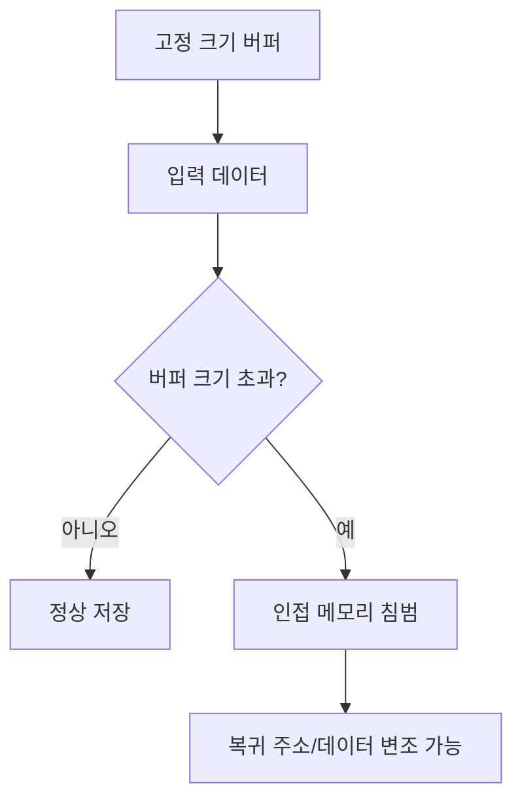
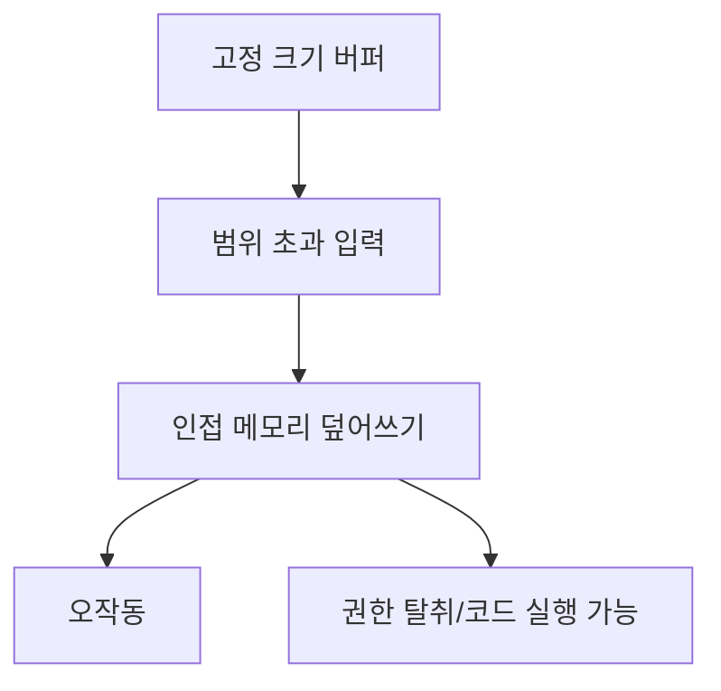

# 298 메모리 버퍼 오버플로

작성 기준일: 2026-06-01
검색/보강일: 2026-06-04
기준 PDF: `/Users/nes0903/Documents/study/정보처리기사/핵심요약집_2026_정보처리기사필기핵심요약.pdf`
PDF 확인 위치: 42페이지 `298 메모리 버퍼 오버플로`

## 한 줄 요약

- 메모리 버퍼 오버플로는 할당된 메모리 범위를 넘어 데이터를 읽거나 쓰려 할 때 발생하는 보안 약점이다.

## 한눈에 보는 구조

## PDF 기준 핵심

- 할당된 메모리의 범위를 넘어선 위치에서 자료를 읽거나 쓰려고 할 때 발생한다.
- 보안 약점이다.
- `할당 범위 초과`, `읽기/쓰기`, `메모리`가 핵심 단서이다.

## 개념 설명

- 버퍼는 데이터를 잠시 저장하기 위해 할당한 메모리 공간이다.
- 버퍼 크기를 확인하지 않고 데이터를 복사하면 인접 메모리가 덮어써질 수 있다.
- 공격자는 이를 이용해 프로그램 흐름을 바꾸거나 악성 코드를 실행하려 할 수 있다.
- OWASP도 Buffer Overflow를 메모리 경계를 넘어 데이터가 쓰이는 취약점으로 다룬다.

## 시험 포인트

- `할당된 메모리 범위 초과`가 정의의 핵심이다.
- 스택 가드는 버퍼 오버플로 대응 기술로 다음 주제와 연결된다.
- C/C++처럼 수동 메모리 관리와 경계 검사 부족이 있는 언어에서 자주 설명된다.
- XSS나 SQL Injection처럼 문자열이 다른 언어 문맥에 삽입되는 공격과 구분한다.

## 헷갈리는 비교

| 구분 | 버퍼 오버플로 | XSS | SQL Injection |
|---|---|---|---|
| 침범 대상 | 메모리 경계 | 브라우저 스크립트 | DB 쿼리 |
| 핵심 원인 | 버퍼 크기 검증 부족 | 출력 인코딩 부족 | 입력값 쿼리 결합 |
| 대표 대응 | 경계 검사, 스택 가드 | 출력 인코딩 | 파라미터 바인딩 |

## 예시 또는 암기 포인트

- 10바이트 버퍼에 100바이트 문자열을 복사하려 하면 버퍼 오버플로가 발생할 수 있다.
- 암기식: `Overflow = 그릇보다 많이 부어 넘침`.

## 빠른 복습

- 버퍼 오버플로의 핵심 원인은? 할당된 메모리 범위 초과 접근.
- 다음 주제와 연결되는 대응 기술은? 스택 가드.
- 주된 침범 대상은? 메모리.

## 상세 보강

- 버퍼 오버플로는 프로그램이 할당된 메모리 경계를 확인하지 않고 데이터를 읽거나 쓰면서 발생한다.
- C/C++처럼 메모리 경계 검사를 개발자가 직접 신경 써야 하는 환경에서 대표적으로 문제가 된다.
- 공격자는 반환 주소나 제어 데이터를 덮어써 비정상 실행 흐름을 유도할 수 있다.
- 방어는 경계 검사, 안전한 함수 사용, 스택 가드, ASLR, DEP/NX, 메모리 안전 언어 사용 등이 있다.
- 시험에서는 `할당된 메모리 범위 초과`, `읽기/쓰기`, `보안 약점`이 핵심이다.

| 관련 개념 | 의미 |
|---|---|
| 버퍼 | 데이터를 잠시 저장하는 메모리 영역 |
| 오버플로 | 정해진 범위를 넘음 |
| 스택 가드 | 반환 주소 변조 탐지 |
| ASLR/DEP | 실행 악용 난이도 증가 |

## 참고 링크

- [OWASP - Buffer Overflow Attack](https://owasp.org/www-community/attacks/Buffer_overflow_attack)
