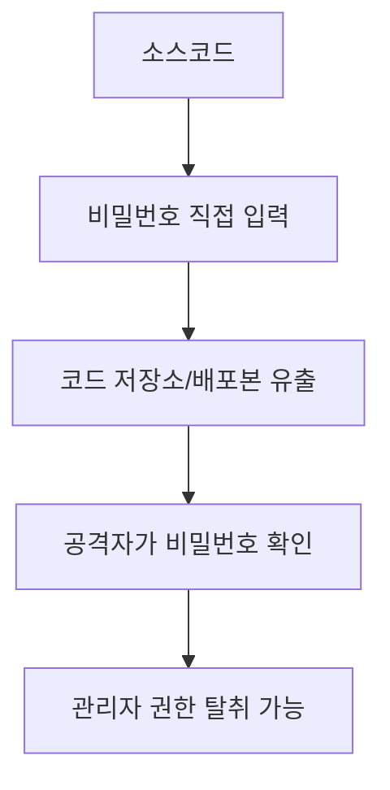
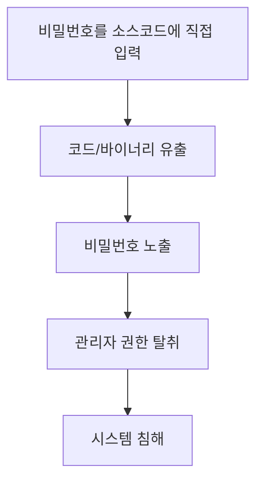

# 299 하드코드된 비밀번호

작성 기준일: 2026-06-01
검색/보강일: 2026-06-04
기준 PDF: `/Users/nes0903/Documents/study/정보처리기사/핵심요약집_2026_정보처리기사필기핵심요약.pdf`
PDF 확인 위치: 42페이지 `299 하드코드된 비밀번호`

## 한 줄 요약

- 하드코드된 비밀번호는 소스코드 안에 비밀번호를 직접 넣어 두어 코드 유출 시 관리자 권한 탈취로 이어질 수 있는 보안 약점이다.

## 한눈에 보는 구조

## PDF 기준 핵심

- 소스코드 유출 시 내부에 하드코드된 패스워드를 이용하여 관리자 권한을 탈취할 수 있다.
- 하드코드: 데이터를 코드 내부에 직접 입력하여 프로그래밍하는 방식이다.
- `소스코드`, `직접 입력`, `패스워드`, `관리자 권한 탈취`가 핵심 단서이다.

## 개념 설명

- 하드코딩은 설정값, 키, 비밀번호 등을 코드 내부 문자열로 고정하는 방식이다.
- 비밀번호가 코드에 있으면 Git 저장소, 빌드 산출물, 로그, 디컴파일 결과를 통해 노출될 수 있다.
- OWASP는 하드코드된 비밀값과 자격 증명을 대표적인 보안 취약 요소로 다룬다.
- 대응은 환경 변수, 시크릿 매니저, 키 관리 시스템, 권한 분리, 비밀값 주기적 교체이다.

## 시험 포인트

- `소스코드 유출 → 비밀번호 노출 → 관리자 권한 탈취` 흐름을 기억한다.
- 하드코딩은 비밀번호뿐 아니라 API 키, 토큰, 암호화 키에도 위험하다.
- 비밀번호를 암호화해 코드에 넣는 것도 안전한 방식이 아니다.
- 민감 정보는 코드와 분리해 안전한 저장소에서 관리한다.

## 헷갈리는 비교

| 구분 | 하드코딩 | 안전한 비밀 관리 |
|---|---|---|
| 위치 | 소스코드 내부 | 시크릿 저장소/환경 변수 |
| 변경 | 코드 수정 필요 | 설정 변경 가능 |
| 유출 위험 | 코드 유출 시 즉시 노출 | 접근 통제 가능 |
| 시험 단서 | 직접 입력 | secret manager |

## 예시 또는 암기 포인트

- `password = "admin1234"`처럼 코드에 비밀번호를 직접 넣으면 하드코드된 비밀번호이다.
- 암기식: `비밀번호는 코드에 박아두지 않는다`.

## 빠른 복습

- 하드코드란? 데이터를 코드 내부에 직접 입력하는 방식.
- PDF의 위험은? 관리자 권한 탈취.
- 대응 방향은? 코드와 비밀값 분리.

## 상세 보강

- 하드코드된 비밀번호는 소스코드, 설정 파일, 바이너리 안에 계정 비밀번호나 API 키를 직접 넣어 두는 보안 약점이다.
- 소스코드 저장소가 유출되거나 바이너리가 역분석되면 인증 정보가 노출될 수 있다.
- 비밀번호 변경이 어렵고, 여러 배포본에 같은 비밀값이 퍼질 수 있다는 점도 위험하다.
- 방어는 환경 변수, 비밀 관리 시스템, 키 관리 서비스, 권한 최소화, 주기적 회전으로 정리한다.
- 시험에서는 `소스코드 유출`, `내부 하드코드 패스워드`, `관리자 권한 탈취`가 핵심이다.

| 구분 | 하드코딩 | 안전한 비밀 관리 |
|---|---|---|
| 저장 위치 | 코드 내부 | 전용 비밀 저장소 |
| 변경 | 배포/수정 필요 | 중앙 관리 가능 |
| 노출 위험 | 코드 유출 시 큼 | 접근 통제로 완화 |

## 참고 링크

- [OWASP - Use of hard-coded password](https://owasp.org/www-community/vulnerabilities/Use_of_hard-coded_password)
- [OWASP Secrets Management Cheat Sheet](https://cheatsheetseries.owasp.org/cheatsheets/Secrets_Management_Cheat_Sheet.html)
