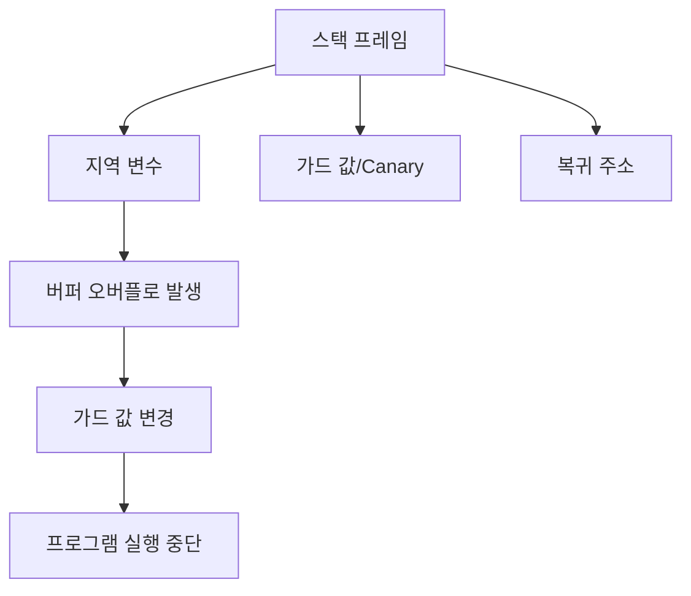
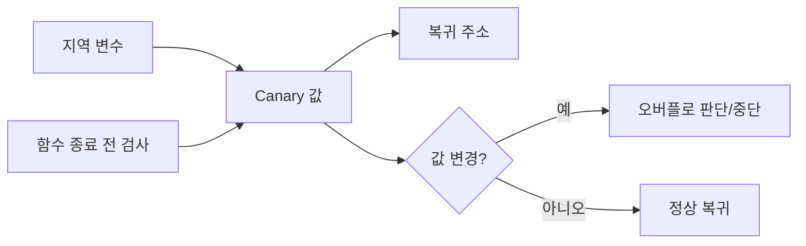

# 300 스택 가드(Stack Guard)

작성 기준일: 2026-06-01
검색/보강일: 2026-06-04
기준 PDF: `/Users/nes0903/Documents/study/정보처리기사/핵심요약집_2026_정보처리기사필기핵심요약.pdf`
PDF 확인 위치: 42페이지 `300 스택 가드(Stack Guard)`

## 한 줄 요약

- 스택 가드는 복귀 주소와 변수 사이에 특수 값을 두고 변경 여부를 검사해 버퍼 오버플로로 인한 잘못된 복귀 주소 호출을 막는 기술이다.

## 한눈에 보는 구조

## PDF 기준 핵심

- 메모리상에서 프로그램의 복귀 주소와 변수 사이에 특정 값을 저장한다.
- 그 값이 변경되었을 경우 오버플로우 상태로 판단한다.
- 프로그램 실행을 중단함으로써 잘못된 복귀 주소의 호출을 막는 기술이다.

## 개념 설명

- 스택 기반 버퍼 오버플로 공격은 지역 변수 영역을 넘어서 복귀 주소를 덮어쓰려는 경우가 많다.
- 스택 가드는 복귀 주소 앞에 canary 값을 두고, 함수 반환 전에 이 값이 바뀌었는지 검사한다.
- 값이 바뀌었다면 버퍼 오버플로 가능성이 있으므로 프로그램을 종료해 공격 흐름을 차단한다.
- 원 논문인 StackGuard는 스택 smashing 공격을 컴파일러 기법으로 막는 접근을 설명한다.

## 시험 포인트

- `복귀 주소와 변수 사이의 특정 값`이 핵심이다.
- 특정 값 변경을 오버플로우로 판단한다.
- 스택 가드는 버퍼 오버플로 대응 기술이다.
- 잘못된 복귀 주소 호출을 막는다는 PDF 문장을 기억한다.

## 헷갈리는 비교

| 구분 | 버퍼 오버플로 | 스택 가드 |
|---|---|---|
| 성격 | 취약점/공격 가능 상태 | 방어 기술 |
| 핵심 | 메모리 범위 초과 | 가드 값 변경 검사 |
| 대상 | 버퍼, 복귀 주소 | 스택 프레임 |
| 시험 단서 | overflow | canary, Stack Guard |

## 예시 또는 암기 포인트

- 함수 종료 직전 canary 값이 원래와 다르면 복귀 주소도 덮였을 가능성이 있어 프로그램을 중단한다.
- 암기식: `스택 가드는 복귀 주소 앞 경비원`.

## 빠른 복습

- 스택 가드는 무엇 사이에 값을 둔다? 복귀 주소와 변수 사이.
- 값이 바뀌면 무엇으로 판단하는가? 오버플로우 상태.
- 막으려는 것은? 잘못된 복귀 주소 호출.

## 상세 보강

- 스택 가드는 스택 버퍼 오버플로로 복귀 주소가 변조되는 것을 탐지하기 위한 보호 기법이다.
- 복귀 주소와 변수 사이에 Canary 같은 특정 값을 넣고, 함수 종료 시 값이 변했는지 검사한다.
- 값이 변했다면 버퍼가 경계를 넘어 인접 메모리를 덮어썼다고 판단해 프로그램 실행을 중단할 수 있다.
- PDF의 `복귀 주소와 변수 사이`, `특정 값 저장`, `값 변경 시 오버플로우 판단`, `실행 중단`이 핵심이다.
- 시험에서는 스택 가드를 공격이 아니라 버퍼 오버플로 대응 기술로 구분한다.

| 구분 | 버퍼 오버플로 | 스택 가드 |
|---|---|---|
| 성격 | 취약점/공격 가능 조건 | 방어 기술 |
| 위치 | 메모리 버퍼 | 스택의 변수와 복귀 주소 사이 |
| 단서 | 범위 초과 쓰기 | 특정 값 변경 검사 |

## 참고 링크

- [StackGuard paper - Automatic Adaptive Detection and Prevention of Buffer-Overflow Attacks](https://www.usenix.org/legacy/publications/library/proceedings/sec98/full_papers/cowan/cowan.pdf)
