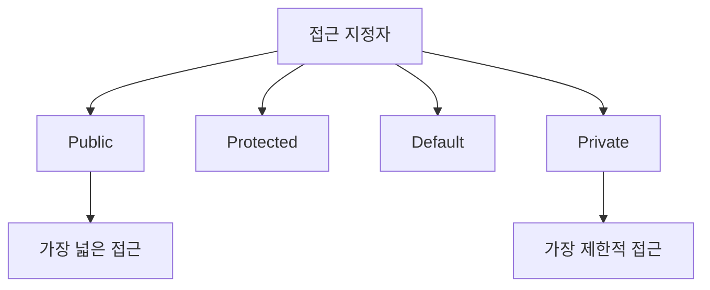
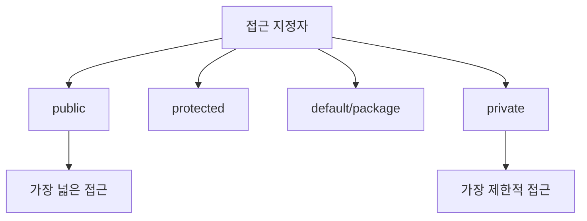

# 301 접근 지정자(접근 제어자)

작성 기준일: 2026-06-01
검색/보강일: 2026-06-04
기준 PDF: `/Users/nes0903/Documents/study/정보처리기사/핵심요약집_2026_정보처리기사필기핵심요약.pdf`
PDF 확인 위치: 42페이지 `301 접근 지정자(접근 제어자)`

## 한 줄 요약

- 접근 지정자는 클래스, 변수, 메서드 같은 개체를 선언할 때 외부 접근 범위를 제한하는 예약어이다.

## 한눈에 보는 구조

## PDF 기준 핵심

- 프로그래밍 언어에서 특정 개체를 선언할 때 외부로부터의 접근을 제한하기 위해 사용되는 예약어이다.
- 종류: Public, Protected, Default, Private.

## 개념 설명

- 접근 지정자는 캡슐화와 정보 은닉을 구현하는 기본 수단이다.
- Public은 어디서든 접근 가능하고, Private은 같은 클래스 내부로 제한된다.
- Protected는 상속 관계나 같은 패키지 범위에서 접근할 수 있는 방식으로 언어별 차이가 있다.
- Java의 기본 접근(Default, package-private)은 접근 지정자를 쓰지 않았을 때 같은 패키지에서 접근 가능한 수준이다.

## 시험 포인트

- 접근 지정자 4종류를 PDF 그대로 외운다.
- `Private`이 가장 제한적이고, `Public`이 가장 공개적이다.
- 접근 제어는 보안 3요소 중 기밀성과 무결성 보호에도 연결된다.
- 언어별 세부 범위가 다를 수 있으므로 정보처리기사 문제에서는 PDF 목록 우선으로 본다.

## 헷갈리는 비교

| 지정자 | 일반적 의미 | 시험 단서 |
|---|---|---|
| Public | 외부 공개 | 누구나 접근 |
| Protected | 상속/같은 범위 제한 | 자식 클래스 |
| Default | 기본 접근 | 지정자 없음 |
| Private | 내부 제한 | 클래스 내부 |

## 예시 또는 암기 포인트

- 계좌 잔액 필드는 `private`으로 숨기고, 입금/출금 메서드만 `public`으로 공개하는 식이 캡슐화이다.
- 암기식: `Public은 공개, Private은 비공개`.

## 빠른 복습

- 접근 지정자의 목적은? 외부 접근 제한.
- PDF에 나온 종류 4가지는? Public, Protected, Default, Private.
- 가장 제한적인 것은? Private.

## 상세 보강

- 접근 지정자는 클래스, 필드, 메서드 같은 프로그램 요소에 외부 접근 범위를 지정하는 예약어이다.
- 캡슐화를 구현해 내부 구현을 숨기고, 필요한 인터페이스만 외부에 공개하는 데 사용된다.
- public은 어디서나 접근 가능하고, private은 같은 클래스 내부에서만 접근 가능하다고 이해하면 쉽다.
- protected는 상속 관계에서, default는 같은 패키지 또는 같은 범위에서 접근하는 개념으로 언어별 세부 차이가 있다.
- 시험에서는 접근 제어자를 보안 장비가 아니라 프로그래밍 언어의 예약어로 구분한다.

| 지정자 | 접근 범위 요약 | 제한 강도 |
|---|---|---|
| public | 외부 전체 | 낮음 |
| protected | 상속/동일 패키지 중심 | 중간 |
| default | 동일 패키지 중심 | 중간 |
| private | 클래스 내부 | 높음 |

## 참고 링크

- [Oracle Java Tutorials - Controlling Access to Members of a Class](https://docs.oracle.com/javase/tutorial/java/javaOO/accesscontrol.html)

<!-- study-links:start -->
## 관련 문서

- `정보 은닉`: [[정보처리기사/1과목 소프트웨어 설계/028 정보 은닉/028 정보 은닉|028 정보 은닉]]
- `캡슐화`: [[정보처리기사/1과목 소프트웨어 설계/033 캡슐화(Encapsulation)/033 캡슐화(Encapsulation)|033 캡슐화(Encapsulation)]]
- `무결성`: [[정보처리기사/3과목 데이터베이스 구축/115 무결성/115 무결성|115 무결성]]
- `상속`: [[정보처리기사/1과목 소프트웨어 설계/034 상속(Inheritance)/034 상속(Inheritance)|034 상속(Inheritance)]]
<!-- study-links:end -->
