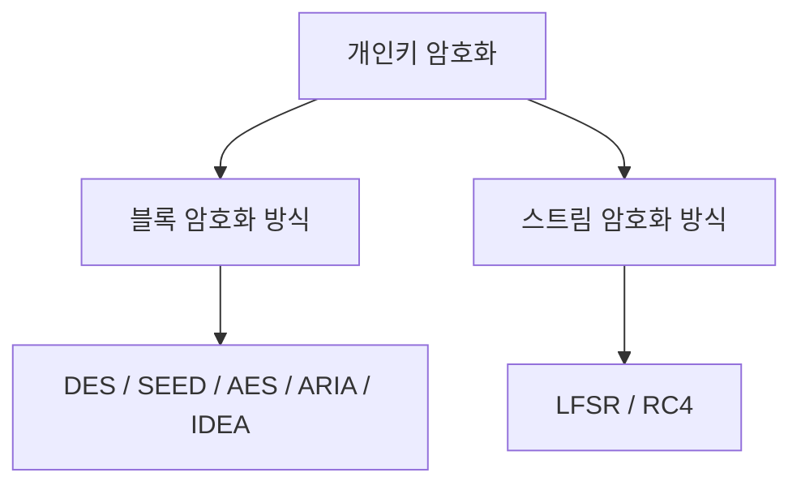
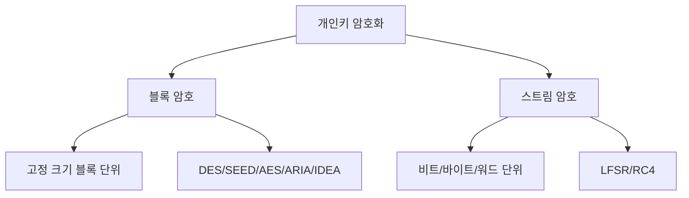

# 303 개인키 암호화 기법의 종류

작성 기준일: 2026-06-01
검색/보강일: 2026-06-04
기준 PDF: `/Users/nes0903/Documents/study/정보처리기사/핵심요약집_2026_정보처리기사필기핵심요약.pdf`
PDF 확인 위치: 42페이지 `303 개인키 암호화 기법의 종류`

## 한 줄 요약

- 개인키 암호화 기법은 일정 크기 블록을 암호화하는 블록 암호와 연속 스트림을 비트/바이트 단위로 암호화하는 스트림 암호로 나뉜다.

## 한눈에 보는 구조

## PDF 기준 핵심

- 블록 암호화 방식: 한 번에 하나의 데이터 블록을 암호화하는 방식.
- 블록 암호화 방식 종류: DES, SEED, AES, ARIA, IDEA 등.
- 스트림 암호화 방식: 평문과 동일한 길이의 스트림을 생성하여 비트/바이트/워드 단위로 암호화하는 방식.
- 스트림 암호화 방식 종류: LFSR, RC4 등.

## 개념 설명

- 블록 암호는 고정 길이 블록 단위로 입력을 나누어 암호화한다.
- AES는 NIST 표준으로 널리 쓰이는 대표 블록 암호이다.
- 스트림 암호는 키 스트림을 생성하고 평문과 결합해 암호문을 만든다.
- RC4는 역사적으로 널리 쓰였지만 현대 보안에서는 취약성이 알려져 사용을 피하는 것이 일반적이다. 시험에서는 PDF 목록 암기를 우선한다.

## 시험 포인트

- `블록 = DES, SEED, AES, ARIA, IDEA`.
- `스트림 = LFSR, RC4`.
- 블록 암호는 한 번에 하나의 데이터 블록, 스트림 암호는 평문과 같은 길이의 스트림이라는 정의가 핵심이다.
- AES와 RSA를 혼동하지 않는다. AES는 개인키/대칭키, RSA는 공개키 암호화이다.

## 헷갈리는 비교

| 구분 | 블록 암호 | 스트림 암호 |
|---|---|---|
| 처리 단위 | 고정 크기 블록 | 비트/바이트/워드 연속 |
| 방식 | 블록별 암호화 | 키 스트림 결합 |
| PDF 예 | DES, SEED, AES, ARIA, IDEA | LFSR, RC4 |
| 암기 단서 | Block | Stream |

## 예시 또는 암기 포인트

- 파일을 일정 크기 블록으로 쪼개 암호화하면 블록 암호 방식이다.
- 암기식: `블록은 DES-SEED-AES-ARIA-IDEA, 스트림은 LFSR-RC4`.

## 빠른 복습

- 블록 암호의 처리 단위는? 데이터 블록.
- 스트림 암호는 무엇을 생성하는가? 평문과 동일한 길이의 스트림.
- AES는 어느 쪽인가? 블록 암호.

## 상세 보강

- 블록 암호는 평문을 일정한 크기의 블록으로 나누어 암호화한다.
- 스트림 암호는 평문과 같은 길이의 키 스트림을 만들어 비트나 바이트 단위로 암호화한다.
- 블록 암호는 운영 모드와 패딩이 중요하고, 스트림 암호는 키 스트림 재사용이 치명적일 수 있다.
- PDF의 종류 목록은 그대로 암기해야 한다: 블록에는 DES, SEED, AES, ARIA, IDEA, 스트림에는 LFSR, RC4.
- 시험에서는 AES와 RSA를 혼동하지 않는다. AES는 대칭키, RSA는 공개키 암호 방식이다.

| 구분 | 블록 암호 | 스트림 암호 |
|---|---|---|
| 처리 단위 | 블록 | 비트/바이트/워드 |
| 예 | DES, SEED, AES, ARIA, IDEA | LFSR, RC4 |
| 단서 | 한 번에 하나의 데이터 블록 | 평문과 같은 길이의 스트림 |

## 참고 링크

- [NIST FIPS 197 - Advanced Encryption Standard](https://csrc.nist.gov/pubs/fips/197/final)
- [NIST SP 800-38A - Block Cipher Modes](https://csrc.nist.gov/pubs/sp/800/38/a/final)

<!-- study-links:start -->
## 관련 문서

- `개인키 암호화 기법`: [[정보처리기사/5과목 정보시스템 구축 관리/302 개인키 암호화(Private Key Encryption) 기법/302 개인키 암호화(Private Key Encryption) 기법|302 개인키 암호화(Private Key Encryption) 기법]]
<!-- study-links:end -->
