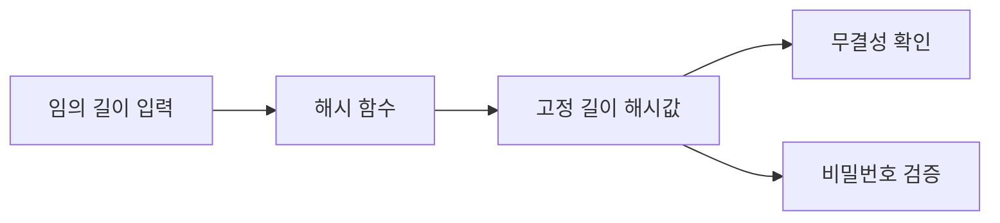

# 304 해시(Hash)

작성 기준일: 2026-06-01
검색/보강일: 2026-06-04
기준 PDF: `/Users/nes0903/Documents/study/정보처리기사/핵심요약집_2026_정보처리기사필기핵심요약.pdf`
PDF 확인 위치: 42페이지 `304 해시(Hash)`

## 한 줄 요약

- 해시는 임의 길이 입력을 고정 길이 값으로 변환하는 일방향 함수로, 원문 복호화가 거의 불가능하다.

## 한눈에 보는 구조

## PDF 기준 핵심

- 임의의 길이의 입력 데이터나 메시지를 고정된 길이의 값이나 키로 변환하는 것을 의미한다.
- 복호화가 거의 불가능한 일방향 함수에 해당한다.
- 해시 함수의 종류: SHA 시리즈, MD4, MD5, N-NASH, SNEFRU 등.

## 개념 설명

- 해시는 암호화와 다르다. 암호화는 복호화를 전제로 하지만, 해시는 원문으로 되돌리는 기능이 없다.
- 같은 입력은 같은 해시값을 만들고, 작은 입력 변화도 다른 해시값을 만들도록 설계된다.
- NIST는 안전한 해시 표준으로 SHA 계열을 다룬다.
- MD4, MD5는 역사적 알고리즘으로 시험 목록에는 나오지만 현대 보안에서는 충돌 취약성 때문에 사용을 피한다.

## 시험 포인트

- `임의 길이 입력 → 고정 길이 값`이 핵심이다.
- `일방향`과 `복호화 거의 불가능`을 암호화와 구분한다.
- SHA, MD4, MD5 등 종류 목록을 외운다.
- 비밀번호 저장에서는 해시만 쓰기보다 솔트와 느린 KDF를 함께 써야 한다.

## 헷갈리는 비교

| 구분 | 해시 | 암호화 |
|---|---|---|
| 방향 | 일방향 | 양방향 |
| 결과 | 고정 길이 값 | 암호문 |
| 복원 | 원칙적으로 불가 | 키로 복호화 |
| 용도 | 무결성, 비밀번호 검증 | 기밀성 |

## 예시 또는 암기 포인트

- 다운로드한 파일의 SHA-256 값이 공식 값과 같으면 파일이 변조되지 않았는지 확인할 수 있다.
- 암기식: `Hash = 길이는 고정, 방향은 한쪽`.

## 빠른 복습

- 해시 입력 길이는? 임의 길이.
- 해시 출력은? 고정 길이 값.
- 해시는 복호화 가능한가? 거의 불가능한 일방향 함수이다.

## 상세 보강

- 해시는 임의 길이 데이터를 고정 길이 값으로 변환하는 일방향 함수이다.
- 복호화가 목적이 아니므로 암호화와 다르다. 해시는 원문 복원보다 동일성·무결성 확인에 초점이 있다.
- 좋은 해시 함수는 같은 입력에는 같은 출력, 조금 다른 입력에는 크게 다른 출력, 원문 역추적과 충돌 찾기가 어려운 특성을 가져야 한다.
- 비밀번호 저장에는 일반 해시만 쓰지 않고 salt와 느린 비밀번호 해시 알고리즘을 함께 사용해야 한다.
- PDF의 `고정된 길이`, `일방향`, `SHA, MD4, MD5, N-NASH, SNEFRU`가 핵심이다.

| 구분 | 해시 | 암호화 |
|---|---|---|
| 방향 | 일방향 | 복호화 가능 |
| 목적 | 무결성, 식별값 | 기밀성 |
| 키 | 일반 해시는 키 없음 | 키 사용 |
| 예 | SHA, MD5 | AES, RSA |

## 참고 링크

- [NIST FIPS 180-4 - Secure Hash Standard](https://csrc.nist.gov/pubs/fips/180-4/upd1/final)
- [NIST CSRC Glossary - Hash Function](https://csrc.nist.gov/glossary/term/hash_function)
